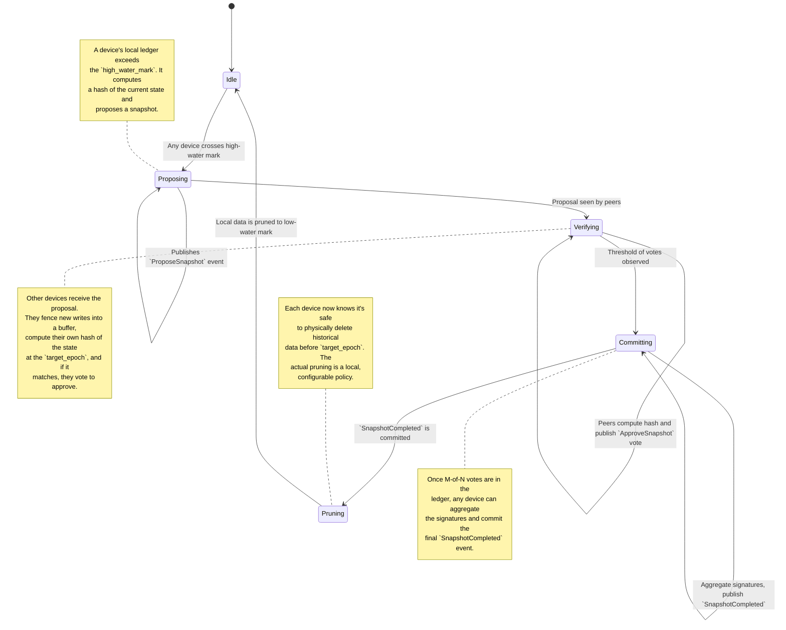

# Garbage Collection and State Compaction

## 1. Overview & Motivation

Aura's architecture relies on a CRDT-based journal (`Journal`) that maintains a complete history of all operations. While this provides robustness and auditability, it also leads to unbounded state growth. Over time, the ledger can become bloated with:

*   Historical CRDT events that are no longer needed to compute the current state.
*   Logically deleted data (tombstones) that still occupies space.
*   Ephemeral data (like SBB envelopes) that has expired.
*   Orphaned data (like storage chunks) that is no longer referenced.

This bloat degrades performance, increases storage costs, and slows down sync times for new devices. This document proposes a decentralized garbage collection (GC) and state compaction protocol to manage state growth without sacrificing safety or consistency.

## 2. Design Goals

The GC system must be:

*   **Safe:** It must be impossible for GC to delete data that is still active or necessary for future state computation. All operations must be coordinated and verifiable.
*   **Decentralized:** The decision to garbage collect must be made by the group's threshold identity, not by a single coordinator.
*   **Configurable:** Different devices have different resources. The protocol should allow nodes to choose their own pruning strategy (e.g., an archival node may never prune, while a mobile device prunes aggressively).
*   **Live:** The GC process must not block or interfere with normal operations.

## 3. Core Concepts

### 3.1. Logical vs. Physical Deletion

*   **Logical Deletion:** When data is "deleted" in Aura (e.g., a member is removed, a capability is revoked), it is marked with a **tombstone** in the CRDT. The data isn't physically removed, allowing the deletion event to propagate correctly to all peers.
*   **Physical Pruning:** This is the actual removal of data from a device's local storage. The GC protocol's main job is to determine when physical pruning is safe.

### 3.2. Threshold-Signed Snapshots

The core of the state compaction system is the **Snapshot**. A Snapshot is a compact, verifiable representation of the entire account state at a specific point in time.

*   A Snapshot is created via a P2P protocol and authorized by a **threshold signature** from the group members.
*   Once a Snapshot is committed to the ledger, it serves as a **safe point in history**. Any data logically deleted *before* this snapshot can be safely pruned.
*   New devices can sync much faster by fetching the latest Snapshot and only replaying the events that occurred *after* it.

### 3.3. High-Water Marks

State compaction is not a continuous process. It is triggered when state size crosses a certain threshold, or "high-water mark."

*   **High-Water Mark:** A configurable state size (e.g., 10,000 CRDT events or 100MB of ledger data) that triggers a GC proposal.
*   **Low-Water Mark:** The target state size after a GC cycle is complete.

### 3.4. Cryptographic Pruning Signals

Certain cryptographic operations, by their nature, render old data obsolete, providing a powerful and immediate signal for garbage collection. This is a form of **event-driven GC** that is loosely coupled with the main snapshotting process.

Examples include:
*   **Key Rotation:** When pairwise SBB keys are rotated, all envelopes encrypted with the old keys become undecipherable and can be pruned.
*   **Capability Revocation:** When a peer's capability to store data is revoked, they are signaled to prune the data they are no longer authorized to hold.
*   **Future: Proxy Re-encryption Triggers:** Key rotation events could trigger proxy re-encryption transformations instead of immediate deletion, enabling gradual migration to new encryption.

### 3.5. Snapshot Materialization Contract

All peers must derive identical hashes for the same logical state. To guarantee this, snapshot generation follows a strict contract:

*   **Canonical Ordering:** Entries are serialized in deterministic order (account metadata, capability sets, journals, storage manifests), using stable sort keys (e.g., UUID bytes ascending).
*   **Encoding Schema:** Snapshots use a versioned, canonical encoding (e.g., `snapshot_v1` CBOR with sorted maps and domain-separated hashes). Future migrations bump the version while retaining backward compatibility.
*   **Redaction Rules:** Ephemeral/cache fields are omitted uniformly; every client uses the shared allowlist so derived hashes do not diverge.
*   **Conformance Vectors:** Each implementation ships golden test vectors (serialized blob + expected hash) to validate compatibility before joining production.

The proposal assumes an implementation cannot emit a `ProposeSnapshot` unless it produces a blob that passes the conformance suite for the active schema version.

## 4. Proposed Architecture

The state compaction system is a P2P choreographic protocol, similar to DKD or Resharing, coordinated via the `Journal` CRDT.

```
┌─────────────────────────────────────────────────────────┐
│ Layer 2: Orchestration (GC Protocol)                    │
│                                                         │
│  GC Protocol Phases:                                    │
│  ├─ Phase 1: Proposal (triggered by watermark)          │
│  │   ├─ Proposer calculates a candidate snapshot hash.  │
│  │   └─ Publishes `ProposeSnapshot` event to CRDT.      │
│  │                                                      │
│  ├─ Phase 2: Verification & Voting                      │
│  │   ├─ Peers verify the snapshot hash independently.   │
│  │   └─ Peers publish `ApproveSnapshot` vote events.    │
│  │                                                      │
│  ├─ Phase 3: Commit                                     │
│  │   ├─ Any peer observes threshold of votes.           │
│  │   ├─ Aggregates signatures.                          │
│  │   └─ Publishes `SnapshotCompleted` event to CRDT.    │
│  │                                                      │
│  └─ Phase 4: Local Pruning (per-device action)          │
│      ├─ Each device observes the committed snapshot.    │
│      └─ Safely prunes local data older than snapshot.   │
└─────────────────────────────────────────────────────────┘
```

### 4.1. New CRDT Events

```rust
pub enum JournalEvent {
    // ... existing events

    /// Proposes a snapshot for garbage collection.
    ProposeSnapshot {
        proposal_id: Uuid,
        proposer_id: DeviceId,
        target_epoch: u64,
        /// Digest of the admin roster used for threshold policy checks.
        roster_digest: [u8; 32],
        /// Digest of the latest committed journal state the proposer observed.
        journal_head_digest: [u8; 32],
        /// Snapshot schema version to keep multi-language clients aligned.
        snapshot_version: u16,
        /// A hash of the complete, serialized account state at the target_epoch.
        state_hash: [u8; 32],
    },

    /// A vote to approve a snapshot proposal.
    ApproveSnapshot {
        proposal_id: Uuid,
        voter_id: DeviceId,
        roster_digest: [u8; 32],
        /// The voter's view of the journal head; must match the proposal.
        journal_head_digest: [u8; 32],
        /// The voter's signature over the proposal's fields.
        signature: Vec<u8>,
    },

    /// Commits a snapshot, making it safe to prune data before this point.
    SnapshotCompleted {
        proposal_id: Uuid,
        target_epoch: u64,
        roster_digest: [u8; 32],
        journal_head_digest: [u8; 32],
        snapshot_version: u16,
        state_hash: [u8; 32],
        /// The full, serialized state. Can be stored off-chain.
        /// For large states, this might just be a CID.
        state_payload_cid: Cid,
        /// K-of-N availability attestations for the snapshot blob.
        availability_proof: Vec<u8>,
        /// Threshold signature from the group, authorizing the snapshot.
        threshold_signature: Vec<u8>,
    },

    /// Records that the keys for a specific SBB relationship have been rotated.
    /// This event acts as a GC signal for old SBB envelopes.
    SbbRelationshipKeyRotated {
        relationship_id: Uuid,
        /// The epoch at which the rotation occurred. All envelopes for this
        /// relationship with an epoch before this are now obsolete.
        rotation_epoch: u64,
        /// Threshold signature from the two parties in the relationship.
        threshold_signature: Vec<u8>,
    },

    // Future: Proxy re-encryption events (Phase 2+)
    // ProxyReencryptionKeyGenerated {
    //     source_key_id: KeyId,
    //     target_key_id: KeyId,
    //     proxy_key_cid: Cid,
    //     transformation_epoch: u64,
    // },

    // Note: Events like `CapabilityRevoked` and `MemberRemoved` also act as
    // implicit GC signals for the affected peers.

    // Future: Explicit RejectSnapshot events let peers abort stalled proposals.
}
```

### 4.2. Write Fencing & Snapshot Epoch Management

`ProposeSnapshot` carries the proposer's last observed journal digest. Peers only approve if their local digest matches, which creates an implicit write barrier: any device that must append new events queues them into a **post-snapshot buffer** until the proposal is either committed or times out. If a writer observes divergent state during verification, it emits a `RejectSnapshot` (future extension) and republishes the buffered events so liveness is restored without silent data loss.

Operators configure retry timers (e.g., abandon after 30s without quorum) and bounded buffer sizes so paused writers never stall indefinitely. Buffered events carry sequence numbers to ensure they are replayed in-order once the snapshot outcome is known.

### 4.3. Threshold & Escalation Policy

Snapshots require an `M-of-N` signature from the current admin roster (`M = 2f + 1` for a group that tolerates `f` Byzantine devices). Each proposal embeds the roster digest used for threshold verification. If quorum cannot be met within a configurable grace window, the group may:

1.   Trigger an **escalation vote** to temporarily lower `M` (never below a simple majority), or
2.   Issue a `MemberRemoved` / `CapabilityRevoked` for stale devices and re-run the proposal with the updated roster digest.

Peers track retry cadence (`max_retries`, `retry_backoff`) to avoid livelock. Archival nodes are encouraged to stay online, but the protocol remains safe because compaction will halt instead of proceeding without quorum.

## 5. Detailed Protocol Flow

The state compaction protocol is a state machine coordinated through the CRDT.



## 6. Garbage Collection Targets

The GC system enables the safe pruning of several types of data.

| Data Type | Pruning Strategy | Safety Mechanism |
| :--- | :--- | :--- |
| **SBB Envelopes** | Prune if **either** of two conditions is met:<br>1. `current_epoch > envelope.created_epoch + envelope.ttl_epochs`<br>2. `envelope.epoch < last_key_rotation_epoch` for that relationship. | The `SbbRelationshipKeyRotated` event provides an immutable, cryptographically-verifiable signal that all prior envelopes for that relationship are obsolete and can be safely pruned, regardless of their individual TTLs. |
| **CRDT Event Log** | After a `SnapshotCompleted` at epoch `E`, a device can delete all local event logs with an epoch `< E`. | The committed `SnapshotCompleted` event contains the full state, so historical events are no longer needed to reconstruct it. New peers can sync from the snapshot. |
| **Revoked Items** | Revoked capabilities, removed devices, etc., can be pruned once a snapshot is committed *after* their revocation. | The snapshot proves that the revocation has been seen by the whole group, so no peer will be left thinking the item is still valid. |
| **Invalidated Replicas** | Prune local data chunks when the capability granting storage permission is revoked or the peer/group relationship is terminated. | The `CapabilityRevoked` or `MemberRemoved` event in the `Journal` is the authoritative signal. A device can safely delete local data when it is no longer authorized to hold it. The data owner is responsible for re-replicating the data elsewhere. |
| **Orphaned Chunks** | (Advanced) Storage chunks not referenced by any `ObjectManifest` in the latest snapshot. | This requires a separate, slower "mark and sweep" process that scans all manifests. This should be considered a separate GC process from the main state compaction. |
| **Future: Transformed Chunks** | (Phase 2+) Chunks encrypted with old keys after proxy re-encryption transformation is complete. | Proxy re-encryption enables gradual migration: old encrypted chunks can be deleted once transformation to new encryption is verified and replicated. |

### 6.1. Snapshot Availability Guarantees

`SnapshotCompleted` is only valid if the proposer can supply a storage availability proof:

*   **Replication Targets:** Snapshots land in the storage mesh with a minimum replica count (`k >= 3`, spanning disjoint providers/regions). Archival nodes pin blobs locally.
*   **Availability Proof:** The event includes aggregated signatures from storage custodians attesting that the CID is pinned and encrypted. Peers verify this proof before pruning.
*   **Audit Jobs:** Background jobs periodically fetch and checksum stored snapshots; if a replica disappears, they republish the blob and emit an alert.
*   **Access Control:** Snapshot payloads are wrapped with the account’s data encryption key (DEK) so only authorized devices can decrypt while retention providers store opaque ciphertext.

If the availability check fails, devices refuse to prune and the proposal expires, ensuring newcomers can always fetch a valid snapshot.

## 7. Safety & New Peer Synchronization

**The most important principle is that GC must not compromise the ability of a new peer to join and fully synchronize.**

When a new device joins an account:
1.  It fetches the **latest `SnapshotCompleted` event**.
2.  It deserializes the `state_payload` from that snapshot to get a fully consistent state up to `target_epoch`.
3.  It then fetches all subsequent events from the `Journal` that occurred *after* `target_epoch` and applies them sequentially.

This ensures the new device is fully caught up without needing to download and process the entire history of the account.

### Pruning vs. Permanent Deletion

The protocol described here is for **local pruning for performance**. A device is free to delete its local copy of historical events. However, the design does not require *all* nodes to delete this history.

*   **Resource-constrained nodes** (e.g., mobile) can prune aggressively to save space.
*   **Archival nodes** (e.g., a desktop or home server) can be configured to never prune, retaining the full, auditable history of the account.

This allows the group as a whole to retain its history while allowing individual devices to manage their resources effectively.

## 8. Implementation Plan

### Phase 1: Snapshot Protocol Foundation (3 weeks)

*   **Events:** Implement the `ProposeSnapshot`, `ApproveSnapshot`, `SnapshotCompleted`, and `SbbRelationshipKeyRotated` events in the `Journal`.
*   **Snapshot Schema:** Define the canonical serialization (`snapshot_version`), ordering rules, and publish cross-language conformance vectors.
*   **Journal Digests:** Add deterministic journal head digests and make snapshot proposals validate against them.
*   **Choreography:** Create the P2P protocol for proposing and agreeing on a snapshot.
*   **State Hashing:** Implement a deterministic hashing function for the entire `AccountLedger` state.
*   **Local Pruning Logic:** Implement the logic for a device to safely delete its local CRDT event log up to the snapshot's epoch.

### Phase 2: Integration and Automation (2 weeks)

*   **Watermarks:** Add the high-water and low-water mark configuration to trigger the state compaction protocol automatically.
*   **Writer Fence:** Implement post-snapshot write buffers, timeout handling, and automatic replay once a proposal succeeds or aborts.
*   **New Peer Sync:** Update the new device synchronization logic to use the snapshot-based flow.
*   **Event-Driven GC for Ephemera:** Implement the GC logic for SBB envelopes and invalidated replicas, which listens for cryptographic trigger events (`SbbRelationshipKeyRotated`, `CapabilityRevoked`, etc.).
*   **Availability Proofs:** Integrate storage mesh attestations and pruning guards so devices confirm snapshot blobs are pinned before deleting local history.

### Phase 3: Advanced GC (Future)

*   **Orphaned Storage Chunks:** Design and implement the "mark and sweep" process for finding and deleting unreferenced storage chunks. This is a more complex process and should be tackled after the core state compaction is proven to be robust.
*   **Proxy Re-encryption Integration:** Add GC support for proxy re-encryption transformations, enabling efficient key rotation without immediate chunk deletion.
*   **Datalog-Powered GC:** Leverage the Datalog query engine (from the distributed DB design) to run complex garbage collection queries. For example, we could write rules to automatically identify orphaned storage chunks, expired capabilities that are no longer referenced, or other complex data relationships that are safe to prune.

## 9. Conclusion

This proposal introduces a decentralized, safe, and configurable garbage collection system for Aura. By using threshold-signed snapshots for state compaction and cryptographic events for pruning ephemera, it allows the system to manage state growth without a central coordinator. This approach improves long-term performance and scalability while ensuring that new peers can join and synchronize efficiently. Furthermore, it establishes a synergistic relationship between security protocols (like key rotation and capability revocation) and performance management, allowing security and policy changes to directly inform and accelerate housekeeping tasks.
