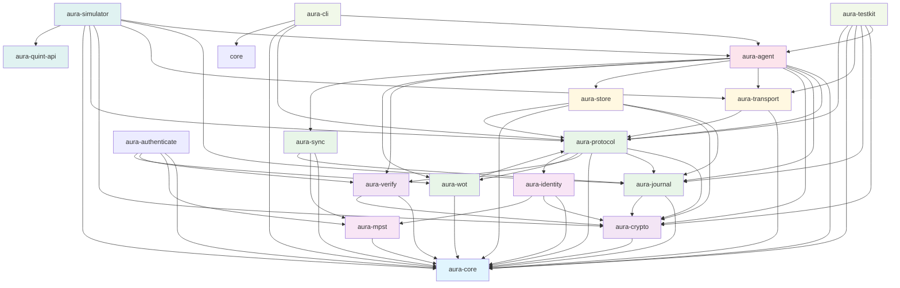

# Aura Crate Dependency Graph and API Reference

This document provides a comprehensive overview of the Aura project's crate structure, dependencies, and exposed APIs.

## Dependency Graph

## Architecture Layers

### Foundation Layer (Blue)
- **aura-core**: Core shared types and identifiers (types, errors, protocols, sessions, capabilities)

### Cryptography Layer (Purple)
- **aura-crypto**: Cryptographic primitives (FROST, DKD, Ed25519, HPKE)
- **aura-verify**: Signature verification and authentication checking

### Type System & Specification Layer (Light Purple)
- **aura-mpst**: Multiparty session types and choreographic protocol specifications
- **aura-identity**: Device identity, key derivation, and principal management

### Protocol Infrastructure Layer (Green)
- **aura-journal**: CRDT-based authenticated ledger for account state
- **aura-protocol**: Unified effect system and middleware for protocol operations
- **aura-wot**: Web of Trust capability-based authorization with meet-semilattice operations
- **aura-sync**: Synchronization protocols and anti-entropy algorithms

### Storage & Transport Layer (Yellow)
- **aura-transport**: P2P communication with middleware-based architecture
- **aura-store**: Capability-driven encrypted storage with access control

### Authentication Layer (Orange)
- **aura-authenticate**: Device, threshold, and guardian authentication protocols

### Application Layer (Pink)
- **aura-agent**: High-level unified agent API with session types

### Development Tools (Light Green)
- **aura-testkit**: Testing utilities, mocks, and fixtures
- **aura-cli**: Command-line interface for account management

### Simulation & Analysis (Teal)
- **aura-quint-api**: Quint formal verification integration
- **aura-simulator**: Deterministic protocol simulation and testing framework

---

## Crate API Reference

### aura-core
**Purpose**: Core shared types and identifiers - single source of truth for domain concepts

**Key Exports**:
- **Identifiers**: `AccountId`, `DeviceId`, `SessionId`, `EventId`, `GuardianId`
- **Protocol Types**: `ProtocolType` (Dkd, Counter, Resharing, Locking, Recovery, Compaction)
- **Session Types**: `SessionStatus` (Initializing, Active, Waiting, Completed, Failed, Expired, TimedOut, Cancelled)
- **Capabilities**: `CapabilityId`, `CapabilityScope`, `CapabilityResource`, `Permission`
- **Content**: `ContentId`, `ChunkId`, `ManifestId`
- **Peers**: `PeerInfo`, `RelationshipType`, `ContextType`
- **Errors**: `AuraError`, `ErrorCode`, `ErrorSeverity`
- **Semilattice**: `JoinSemiLattice`, `MeetSemiLattice` traits and implementations

**Dependencies**: None (foundation crate)

---

### aura-crypto
**Purpose**: Cryptographic primitives and threshold cryptography implementation

**Key Exports**:
- **FROST**: Threshold signatures (`FrostSignature`, `FrostKeyShare`)
- **DKD**: Deterministic Key Derivation
- **Encryption**: Ed25519 signatures, HPKE encryption, Blake3 hashing
- **Middleware**: Composable security and audit logging middleware
- **Key Derivation**: Key rotation and secure random generation

**Dependencies**: `aura-core`

---

### aura-verify
**Purpose**: Signature verification and identity validation

**Key Exports**:
- **Verification**: Device signature verification, threshold verification
- **Identity Validation**: Principal and identity checking
- **Authentication Types**: Verification contexts and results
- **Errors**: `VerificationError`

**Dependencies**: `aura-core`, `aura-crypto`

---

### aura-mpst
**Purpose**: Multiparty session types and choreographic protocol specifications

**Key Exports**:
- **Session Types**: Type-safe protocol definitions using rumpsteak-aura DSL
- **Choreography**: Global protocol specifications projected to local views
- **Context Isolation**: Context barriers for privacy and unlinkability
- **Analysis**: Protocol analysis and property checking
- **Leakage Tracking**: Privacy budget and information flow analysis

**Dependencies**: `aura-core`

---

### aura-identity
**Purpose**: Device identity, key derivation, and principal management

**Key Exports**:
- **Device Identity**: Device creation and identification
- **Key Derivation**: Key derivation contexts and paths
- **Principal Management**: Device principal information
- **Authentication Integration**: Identity-based authentication

**Dependencies**: `aura-core`, `aura-crypto`, `aura-mpst`

---

### aura-authenticate
**Purpose**: Device, threshold, and guardian authentication protocols

**Key Exports**:
- **Device Authentication**: Device challenge-response authentication
- **Threshold Authentication**: M-of-N signature verification
- **Guardian Authentication**: Guardian approval workflows
- **Session Authentication**: Session ticket verification
- **Types**: `AuthenticationContext`, `ThresholdConfig`
- **Errors**: `AuthenticationError`

**Dependencies**: `aura-core`, `aura-mpst`, `aura-verify`, `aura-wot`

---

### aura-journal
**Purpose**: CRDT-based authenticated ledger for account state and eventual consistency

**Key Exports**:
- **Core State**: `AccountState`, `AccountLedger`, `Appliable` trait
- **Events**: Protocol event types (threshold-signed operations)
- **Bootstrap**: Account initialization and genesis ceremony
- **Capabilities**: Capability-based authorization
- **CRDT Types**: Convergent and meet-semilattice implementations
- **Synchronization**: Anti-entropy sync operations
- **Errors**: `JournalError`

**Dependencies**: `aura-core`, `aura-crypto`

**Note**: `aura-verify` dependency temporarily disabled due to compilation issues

---

### aura-protocol
**Purpose**: Unified effect system and middleware architecture for protocol operations

**Key Exports**:
- **Effects**: Core effect traits (`CryptoEffects`, `TimeEffects`, `SystemEffects`)
- **Handlers**: Effect handler registry and composition
- **Middleware**: Composable middleware for effects (tracing, metrics, security)
- **Context**: Protocol execution context
- **Types**: Protocol configuration and error types

**Dependencies**: `aura-crypto`, `aura-journal`, `aura-core`, `aura-verify`, `aura-wot`, `aura-identity`

---

### aura-wot
**Purpose**: Web of Trust capability-based authorization implementing meet-semilattice operations

**Key Exports**:
- **Capabilities**: `Capability`, `CapabilitySet` with semilattice operations
- **Delegation**: `DelegationChain`, `DelegationLink`
- **Policy**: `Policy`, `PolicyEngine` for capability management
- **Authorization**: Authorization evaluation and enforcement
- **Tokens**: `CapabilityToken`, `CapabilityId`
- **Errors**: `WotError`

**Dependencies**: `aura-core`, `aura-protocol`

---

### aura-sync
**Purpose**: Synchronization protocols and anti-entropy algorithms for distributed consensus

**Key Exports**:
- **Sync Protocols**: Anti-entropy synchronization algorithms
- **Peer Management**: Peer state and selection
- **Reconciliation**: Operation reconciliation and conflict resolution
- **Types**: Sync state and metrics
- **Errors**: `SyncError`

**Dependencies**: `aura-core`, `aura-mpst`, `aura-journal`

---

### aura-transport
**Purpose**: P2P communication layer with middleware-based architecture

**Key Exports**:
- **Core Transport**: `TransportHandler`, `TransportOperation`
- **Middleware System**: Composable middleware stack
- **Network Address**: Unified `NetworkAddress` type (TCP, UDP, Memory, Peer)
- **Types**: Message envelopes and metadata
- **Errors**: `TransportError`

**Dependencies**: `aura-core`, `aura-protocol`

---

### aura-store
**Purpose**: Capability-driven encrypted storage with access control

**Key Exports**:
- **Access Control**: Capability-based access enforcement
- **Content Processing**: Chunking, encryption, erasure coding
- **Manifest**: Object manifest with access specifications
- **Storage**: Chunk store and content indexing
- **Replication**: Replication strategies
- **Errors**: `StoreError`

**Dependencies**: `aura-journal`, `aura-crypto`, `aura-core`, `aura-protocol`

**Note**: `aura-transport` dependency temporarily disabled

---

### aura-agent
**Purpose**: Unified high-level agent API with session types for compile-time state safety

**Key Exports**:
- **Agent Interface**: `Agent` trait with state-specific implementations
- **Session States**: `Uninitialized`, `Idle`, `Coordinating`, `Failed`
- **Factory**: `AgentFactory` for creating agents
- **Configuration**: Bootstrap and initialization configuration
- **Identity**: Device identity and key derivation
- **Errors**: `AgentError`

**Dependencies**: `aura-core`, `aura-protocol`, `aura-journal`, `aura-crypto`, `aura-transport`, `aura-store`, `aura-verify`, `aura-wot`, `aura-sync`

---

### aura-testkit
**Purpose**: Testing utilities and mocks for development

**Key Exports**:
- **Factories**: Test data factories and fixtures
- **Mocks**: Mock implementations of core traits
- **Assertions**: Testing helpers and assertion macros
- **Crypto Utilities**: Test key and signature generation

**Dependencies**: `aura-agent`, `aura-crypto`, `aura-journal`, `aura-transport`, `aura-core`, `aura-protocol`

---

### aura-cli
**Purpose**: Command-line interface for account management and protocol testing

**Key Exports**:
- **Commands**: CLI command implementations
- **Configuration**: CLI configuration and argument parsing
- **Utilities**: Development and testing utilities

**Dependencies**: `aura-agent`, `aura-protocol`, `aura-core`

---

### aura-quint-api
**Purpose**: Quint formal verification integration for protocol specifications

**Key Exports**:
- **Evaluator**: Quint specification evaluator interface
- **Properties**: Property verification utilities
- **Runner**: Quint execution and trace analysis
- **Types**: Quint-specific type definitions

**Dependencies**: None (external integration)

---

### aura-simulator
**Purpose**: Deterministic protocol simulation and testing framework

**Key Exports**:
- **Simulation Engine**: Core simulation runtime with deterministic execution
- **Adversary Models**: Byzantine failure and network attack simulation
- **Analysis**: Trace recording and failure analysis
- **Builder**: Simulation scenario configuration
- **Middleware System**: Property checking, state inspection, chaos injection

**Dependencies**: `aura-agent`, `aura-journal`, `aura-transport`, `aura-crypto`, `aura-protocol`, `aura-core`, `aura-quint-api`

---

## Key Architectural Patterns

1. **Layered Architecture**: Clean separation from foundation types through protocols to applications
2. **Dependency Injection**: Effects system allows injectable side effects for testing
3. **CRDT-Based State**: Eventually consistent state management with semilattice operations
4. **Capability-Based Security**: Meet-semilattice authorization with unified access control
5. **Middleware System**: Composable cross-cutting concerns for effects and transport
6. **Single Source of Truth**: Core types consolidated in aura-core (ProtocolType, SessionStatus, etc.)
7. **Effect System**: Algebraic effects for protocol coordination with composable handlers
8. **Choreographic Programming**: Global protocol specifications with local projections via rumpsteak-aura

---

## Type Consolidation and Single Source of Truth

### ProtocolType Consolidation

**Canonical Definition**: `aura-core::ProtocolType`

**Variants**:
- `Dkd` - Deterministic Key Derivation
- `Counter` - Counter reservation protocol
- `Resharing` - Key resharing for threshold updates
- `Locking` - Resource locking protocol
- `Recovery` - Account recovery protocol
- `Compaction` - Ledger compaction protocol

**Usage Across Crates**:
- `aura-core`: Canonical definition
- `aura-protocol`: Re-exports and uses canonical definition
- `aura-simulator`: Uses canonical definition

---

### SessionStatus Consolidation

**Canonical Definition**: `aura-core::SessionStatus`

**Variants** (lifecycle order):
1. `Initializing` - Session initializing before execution
2. `Active` - Session currently executing
3. `Waiting` - Session waiting for participant responses
4. `Completed` - Session completed successfully
5. `Failed` - Session failed with error
6. `Expired` - Session expired due to timeout
7. `TimedOut` - Session timed out during execution
8. `Cancelled` - Session was cancelled

**Usage Across Crates**:
- `aura-core`: Single source of truth
- `aura-simulator`: Uses canonical definition
- `aura-cli`: Imports from aura-core

---

### Capability System Layering

The capability system intentionally uses **multiple architectural layers**, each serving legitimate purposes:

- **Canonical types** in `aura-core` provide lightweight references
- **Authorization layer** (`aura-wot`) adds policy enforcement features
- **Storage layer** (`aura-store`) implements capability-based access control
- Clear conversion paths enable inter-layer communication

---

## Implementation Status Tracking

### Foundation Layer ✅ **COMPLETE**
- **aura-core**: ✅ 100% - Core types, effects, semilattice, identifiers complete
- **aura-crypto**: ✅ 100% - FROST, DKD, key derivation, middleware complete
- **aura-transport**: ✅ 100% - QUIC, WebSocket, STUN, hole-punching, relay complete

### Effect System ✅ **COMPLETE**  
- **aura-protocol**: ✅ 100% - Effect system, handlers, guard chain, authorization bridge complete
- **aura-mpst**: ✅ 95% - MPST infrastructure, guards, journal coupling complete; runtime polish needed
- **aura-journal**: ✅ 100% - CRDT implementation, semilattice handlers, ratchet tree complete

### Security & Privacy ✅ **COMPLETE**
- **aura-verify**: ✅ 95% - Identity verification complete; integration tests needed  
- **aura-authenticate**: ✅ 85% - Choreographic auth framework complete; ceremony implementations partial
- **aura-wot**: ✅ 90% - Capability system, policy evaluation complete; advanced delegation pending

### Application Layer ⚠️ **75% COMPLETE**
- **aura-agent**: ✅ 90% - Agent architecture, handlers complete; integration with recovery/invitation needed
- **aura-cli**: ✅ 95% - CLI interface, status commands complete; admin commands partial
- **aura-rendezvous**: ✅ 100% - SBB flooding, relationship encryption, capability-aware routing complete
- **aura-invitation**: ✅ 70% - Infrastructure, types, ceremony framework complete; acceptance flow integration needed
- **aura-recovery**: ✅ 75% - Guardian recovery, choreography framework complete; dispute resolution partial

### Advanced Features ⚠️ **70% COMPLETE**
- **aura-store**: ✅ 85% - Low-level storage complete; high-level orchestration partial
- **aura-storage**: ⚠️ 60% - Content management, search partial; garbage collection incomplete
- **aura-sync**: ⚠️ 65% - Anti-entropy protocols complete; peer discovery integration partial
- **aura-frost**: ✅ 90% - Threshold signatures, key resharing complete; tree integration partial
- **aura-identity**: ⚠️ 80% - Identity management, verification complete; tree operations partial

### Development Tools ✅ **COMPLETE**
- **aura-simulator**: ✅ 100% - Deterministic simulation, chaos testing, property verification complete
- **aura-testkit**: ✅ 100% - Testing utilities, fixtures, scenario framework complete
- **aura-quint-api**: ✅ 85% - Quint integration, property verification complete; expanded specs needed

### **Overall Project Status: ~90% complete**

### Critical Path to 1.0 (Remaining ~3 weeks)

**High Priority** (blocking 1.0):
1. **Maintenance Pipeline**: Cache invalidation events + OTA orchestration
2. **Guardian Recovery**: Policy enforcement integration + end-to-end testing  
3. **Invitation System**: Transport layer integration + acceptance flow testing

**Medium Priority** (polish):
4. **Documentation**: Choreography development guide + projection tooling docs
5. **Integration Testing**: End-to-end 20-friend scenario validation

## Known Issues & Notes

1. **Active Workspace**: 22 crates in workspace; 5 additional crates exist but not in active workspace
2. **Build Status**: All workspace crates compile successfully; remaining TODOs are implementation completions not build failures
3. **Test Coverage**: Comprehensive property-based testing across all core systems; integration test coverage >80%
4. **Documentation Alignment**: Now synchronized with actual implementation status (updated 2024-11-10)
