# Aura Crate Structure and Dependency Graph

This document provides an overview of the Aura project's crate organization and dependencies.

## 8-Layer Architecture

Aura's codebase is organized into 8 clean architectural layers. Each layer builds on the layers below without circular dependencies.

```
┌─────────────────────────────────────────────┐
│ Layer 8: Testing & Development Tools        │
│         (aura-testkit, aura-quint)          │
├─────────────────────────────────────────────┤
│ Layer 7: User Interface                     │
│         (aura-terminal)                     │
├─────────────────────────────────────────────┤
│ Layer 6: Runtime Composition                │
│    (aura-agent, aura-simulator, aura-app)   │
├─────────────────────────────────────────────┤
│ Layer 5: Feature/Protocol Implementation    │
│    (aura-invitation, etc.)                  │
├─────────────────────────────────────────────┤
│ Layer 4: Orchestration                      │
│         (aura-protocol)                     │
├─────────────────────────────────────────────┤
│ Layer 3: Implementation                     │
│    (aura-effects + aura-composition)        │
├─────────────────────────────────────────────┤
│ Layer 2: Specification                      │
│  (Domain crates + aura-mpst + aura-macros)  │
├─────────────────────────────────────────────┤
│ Layer 1: Foundation                         │
│         (aura-core)                         │
└─────────────────────────────────────────────┘
```

## Layer 1: Foundation — `aura-core`

**Purpose**: Single source of truth for all domain concepts and interfaces.

**Contains**:
- Effect traits for core infrastructure, authentication, storage, network, cryptography, privacy, configuration, and testing
- Domain types: `AuthorityId`, `ContextId`, `SessionId`, `FlowBudget`, `ObserverClass`, `Capability`
- Cryptographic utilities: key derivation, FROST types, merkle trees, Ed25519 helpers
- Semantic traits: `JoinSemilattice`, `MeetSemilattice`, `CvState`, `MvState`
- Error types: `AuraError`, error codes, and guard metadata
- Configuration system with validation and multiple formats
- Causal context types for CRDT ordering
- AMP channel lifecycle effect surface: `aura-core::effects::amp::AmpChannelEffects` (implemented by runtime, simulator, and testkit mocks).

**Key principle**: Interfaces only, no implementations or business logic.

**Exceptions**:

1. **Extension traits** providing convenience methods are allowed (e.g., `LeakageChoreographyExt`, `SimulationEffects`, `AuthorityRelationalEffects`). These blanket implementations extend existing effect traits with domain-specific convenience methods while maintaining interface-only semantics.

2. **Arc<T> blanket implementations** for effect traits are required in aura-core due to Rust's orphan rules. These are *not* "runtime instantiations" - they are purely mechanical delegations that enable `Arc<AuraEffectSystem>` to satisfy trait bounds. Example:
   ```rust
   impl<T: CryptoEffects + ?Sized> CryptoEffects for std::sync::Arc<T> {
       async fn ed25519_sign(&self, msg: &[u8], key: &[u8]) -> Result<Vec<u8>, CryptoError> {
           (**self).ed25519_sign(msg, key).await  // Pure delegation
       }
   }
   ```

   **Why this is architecturally sound**: `Arc` is a language-level primitive (like `Vec`, `Box`, or `&`), not a "runtime" in the architectural sense. These implementations add no behavior or state - they simply say "if T can do X, then Arc<T> can too by asking T." Without these, any handler wrapped in `Arc` would fail to satisfy effect trait bounds, breaking the entire dependency injection pattern.

**Architectural Compliance**: aura-core maintains strict interface-only semantics. Test utilities like MockEffects are provided in aura-testkit (Layer 8) where they architecturally belong.

**Dependencies**: None (foundation crate).

### Commitment Tree Types and Functions

**Location**: `aura-core/src/tree/`

**Contains**:
- Core tree types: `TreeOp`, `AttestedOp`, `Policy`, `LeafNode`, `BranchNode`, `BranchSigningKey`, `TreeCommitment`, `Epoch`
- Commitment functions: `commit_branch()`, `commit_leaf()`, `policy_hash()`, `compute_root_commitment()`
- Policy meet-semilattice implementation for threshold refinement
- Snapshot types: `Snapshot`, `Cut`, `ProposalId`, `Partial`
- Verification module: `verify_attested_op()` (cryptographic), `check_attested_op()` (state consistency), `compute_binding_message()`

**Why Layer 1?**

Commitment tree types MUST remain in `aura-core` because:
1. **Effect traits require them**: `TreeEffects` and `SyncEffects` in `aura-core/src/effects/` use these types in their signatures
2. **FROST primitives depend on them**: `aura-core/src/crypto/tree_signing.rs` implements threshold signing over tree operations
3. **Authority abstraction needs them**: `aura-core/src/authority.rs` uses `Policy`, `AttestedOp`, and `TreeOpKind`
4. **Foundational cryptographic structures**: Commitment trees are merkle trees with threshold policies - core cryptographic primitives, not domain logic

**Layer 2 separation (`aura-journal`) contains**:
- Tree state machine: Full `TreeState` with branches, leaves, topology, and path validation
- Reduction logic: Deterministic state derivation from `OpLog<AttestedOp>`
- Domain validation: Business rules for tree operations (e.g., policy monotonicity, leaf lifecycle)
- Application logic: `apply_verified()`, compaction, garbage collection
- Re-exports: `pub use aura_core::tree::*` for convenience via `aura_journal::commitment_tree`

**Key architectural distinction**:
- **Layer 1 (`aura-core`)**: Tree *types* and *cryptographic commitment functions* (pure primitives)
- **Layer 2 (`aura-journal`)**: Tree *state machine*, *CRDT semantics*, and *validation rules* (domain implementation)

This separation allows effect traits in Layer 1 to reference tree types without creating circular dependencies, while keeping the stateful CRDT logic in the appropriate domain crate.

## Layer 2: Specification — Domain Crates and Choreography

**Purpose**: Define domain semantics and protocol specifications.

### Domain Crates

| Crate | Domain | Responsibility |
|-------|--------|-----------------|
| `aura-journal` | Fact-based journal | CRDT semantics, tree state machine, reduction logic, validation (re-exports tree types from `aura-core`) |
| `aura-wot` | Trust and authorization | Capability refinement, Biscuit token helpers |
| `aura-verify` | Identity semantics | Signature verification, device lifecycle |
| `aura-store` | Storage domain | Storage types, capabilities, domain logic |
| `aura-transport` | Transport semantics | P2P communication abstractions |

**Key characteristics**: Implement domain logic without effect handlers or coordination.

### Extensible Fact Types (`aura-journal`)

The journal provides **generic fact infrastructure** that higher-level crates extend with domain-specific fact types. This follows the Open/Closed Principle: the journal is open for extension but closed for modification.

#### Protocol-Level vs Domain-Level Facts

The `RelationalFact` enum in `aura-journal/src/fact.rs` contains two categories:

**Protocol-Level Facts** (stay in `aura-journal`):

These are core protocol constructs with complex reduction logic in `reduce_context()`. They have interdependencies and specialized state derivation that cannot be delegated to simple domain reducers:

| Fact | Purpose | Why Protocol-Level |
|------|---------|-------------------|
| `GuardianBinding` | Guardian relationship | Core recovery protocol |
| `RecoveryGrant` | Recovery capability | Core recovery protocol |
| `Consensus` | Aura Consensus results | Core agreement mechanism |
| `AmpChannelCheckpoint` | Ratchet window anchoring | Complex epoch state computation |
| `AmpProposedChannelEpochBump` | Optimistic epoch transitions | Spacing rules, bump selection |
| `AmpCommittedChannelEpochBump` | Finalized epoch transitions | Epoch chain validation |
| `AmpChannelPolicy` | Channel policy overrides | Skip window derivation |

**Domain-Level Facts** (via `Generic` + `FactRegistry`):

Application-specific facts use `RelationalFact::Generic` and are reduced by registered `FactReducer` implementations:

| Domain Crate | Fact Type | Purpose |
|-------------|-----------|---------|
| `aura-chat` | `ChatFact` | Channels, messages |
| `aura-invitation` | `InvitationFact` | Invitation lifecycle |
| `aura-relational` | `ContactFact` | Contact management |
| `aura-protocol/moderation` | `Block*Fact` | Block, mute, ban, kick |

**Design Pattern**:
1. **`aura-journal`** provides:
   - `DomainFact` trait for fact type identity and serialization
   - `FactReducer` trait for domain-specific reduction logic
   - `FactRegistry` for runtime fact type registration
   - `RelationalFact::Generic` as the extensibility mechanism

2. **Domain crates** implement:
   - Their own typed fact enums (e.g., `ChatFact`, `InvitationFact`)
   - `DomainFact` trait with `to_generic()` for storage
   - `FactReducer` for reduction to `RelationalBinding`

3. **`aura-agent/src/fact_registry.rs`** registers all domain reducers:
   ```rust
   pub fn build_fact_registry() -> FactRegistry {
       let mut registry = FactRegistry::new();
       registry.register::<ChatFact>(CHAT_FACT_TYPE_ID, Box::new(ChatFactReducer));
       registry.register::<InvitationFact>(INVITATION_FACT_TYPE_ID, Box::new(InvitationFactReducer));
       registry.register::<ContactFact>(CONTACT_FACT_TYPE_ID, Box::new(ContactFactReducer));
       register_moderation_facts(&mut registry);
       registry
   }
   ```

**Why This Architecture**:
- **Open/Closed Principle**: New domain facts don't require modifying `aura-journal`
- **Domain Isolation**: Each crate owns its fact semantics
- **Protocol Integrity**: Core protocol facts with complex reduction stay in `aura-journal`
- **Testability**: Domain facts can be tested independently
- **Type Safety**: Compile-time guarantees within each domain

**Core Fact Types in `aura-journal`**:
Only facts fundamental to journal operation remain as direct enum variants:
- `AttestedOp`: Commitment tree operations (cryptographic primitives)
- `Snapshot`: Journal compaction checkpoints
- `RendezvousReceipt`: Cross-authority coordination receipts
- Protocol-level `RelationalFact` variants listed above

### Choreography Specification

**`aura-mpst`**: Runtime library providing semantic abstractions for choreographic features including `CapabilityGuard`, `JournalCoupling`, `LeakageBudget`, and `ContextIsolation` traits. Integrates with the guard chain and works with both macro-generated and hand-written protocols.

**`aura-macros`**: Compile-time DSL parser for choreographies with Aura-specific annotations. Parses `guard_capability`, `flow_cost`, `journal_facts` and generates type-safe Rust code.

## Layer 3: Implementation — `aura-effects` and `aura-composition`

**Purpose**: Effect implementation and handler composition.

### `aura-effects` — Stateless Effect Handlers

**Purpose**: Stateless, single-party effect implementations. **Architectural Decision**: `aura-effects` is the designated singular point of interaction with non-deterministic operating system services (entropy, wall-clock time, network I/O, file system). This design choice makes the architectural boundary explicit and centralizes impure operations.

**Contains**:
- **Production handlers**: `RealCryptoHandler`, `TcpNetworkHandler`, `FilesystemStorageHandler`, `RealTimeHandler`
- OS integration adapters that delegate to system services
- Pure functions that transform inputs to outputs without state

**What doesn't go here**:
- Handler composition or registries
- Multi-handler coordination
- Stateful implementations
- Mock/test handlers

**Key characteristics**: Each handler should be independently testable and reusable. No handler should know about other handlers. This enables clean dependency injection and modular testing.

**Dependencies**: `aura-core` and external libraries.

**Note**: Mock and test handlers are located in `aura-testkit` (Layer 8) to maintain clean separation between production and testing concerns.

### `aura-composition` — Handler Composition

**Purpose**: Assemble individual handlers into cohesive effect systems.

**Contains**:
- Effect registry and builder patterns
- Handler composition utilities
- Effect system configuration
- Handler lifecycle management (start/stop/configure)
- Reactive infrastructure: `Dynamic<T>` FRP primitives for composing view updates over effect changes

**What doesn't go here**:
- Individual handler implementations
- Multi-party protocol logic
- Runtime-specific concerns
- Application lifecycle

**Key characteristics**: Feature crates need to compose handlers without pulling in full runtime infrastructure. This is about "how do I assemble handlers?" not "how do I coordinate distributed protocols?"

**Dependencies**: `aura-core`, `aura-effects`.

## Layer 4: Orchestration — `aura-protocol`

**Purpose**: Multi-party coordination and distributed protocol orchestration.

**Contains**:
- Guard chain coordination (`CapGuard → FlowGuard → JournalCoupler`)
- Multi-party protocol orchestration (consensus, anti-entropy)
- Cross-handler coordination logic (`TransportCoordinator`, `StorageCoordinator`, etc.)
- Distributed state management
- Protocol-specific bridges and adapters
- Stateful coordinators for multi-party protocols

**What doesn't go here**:
- Effect trait definitions (all traits belong in `aura-core`)
- Handler composition infrastructure (belongs in `aura-composition`)
- Single-party effect implementations (belongs in `aura-effects`)
- Test/mock handlers (belong in `aura-testkit`)
- Runtime assembly (belongs in `aura-agent`)
- Application-specific business logic (belongs in domain crates)

**Key characteristics**: This layer coordinates multiple handlers working together across network boundaries. It implements the "choreography conductor" pattern, ensuring distributed protocols execute correctly with proper authorization, flow control, and state consistency. All handlers here manage multi-party coordination, not single-party operations.

**Dependencies**: `aura-core`, `aura-effects`, `aura-composition`, `aura-mpst`, domain crates. Performance-critical protocol operations may require carefully documented exceptions for direct cryptographic library usage.

## Layer 5: Feature/Protocol Implementation

**Purpose**: Complete end-to-end protocol implementations.

**Crates**:

| Crate | Protocol | Purpose |
|-------|----------|---------|
| `aura-authenticate` | Authentication | Device, threshold, and guardian auth flows |
| `aura-chat` | Chat | Chat domain facts + view reducers; local chat prototype |
| `aura-invitation` | Invitations | Peer onboarding and relational facts |
| `aura-recovery` | Guardian recovery | Recovery grants and dispute escalation |
| `aura-relational` | Cross-authority relationships | RelationalContext protocols (domain types in aura-core) |
| `aura-rendezvous` | Peer discovery | Context-scoped rendezvous and routing |
| `aura-social` | Social topology | Block/neighborhood materialized views, relay selection, progressive discovery layers |
| `aura-sync` | Synchronization | Journal sync and anti-entropy protocols |

**Key characteristics**: Reusable building blocks with no UI or binary entry points.

**Dependencies**: `aura-core`, `aura-effects`, `aura-composition`, `aura-protocol`, `aura-mpst`.

## Layer 6: Runtime Composition — `aura-agent`, `aura-simulator`, and `aura-app`

**Purpose**: Assemble complete running systems for production deployment.

**`aura-agent`**: Production runtime for deployment with application lifecycle management, runtime-specific configuration, production deployment concerns, and system integration.

**`aura-app`**: Portable headless application core providing the business logic and state management layer for all platforms. Exposes a platform-agnostic API consumed by terminal, iOS, Android, and web frontends. Contains intent processing, view derivation, and platform feature flags (`native`, `ios`, `android`, `web-js`, `web-dominator`).

**`aura-simulator`**: Deterministic simulation runtime with virtual time, transport shims, failure injection, and generative testing via Quint integration (see `aura-simulator/src/quint/` for generative simulation bridge).

**Contains**:
- Application lifecycle management (startup, shutdown, signals)
- Runtime-specific configuration and policies
- Production deployment concerns
- System integration and monitoring hooks
- Reactive event loop: `ReactiveScheduler` (Tokio task) that orchestrates fact ingestion, journal updates, and view propagation

**What doesn't go here**:
- Effect handler implementations
- Handler composition utilities
- Protocol coordination logic
- CLI or UI concerns

**Key characteristics**: This is about "how do I deploy and run this as a production system?" It's the bridge between composed handlers/protocols and actual running applications.

**Dependencies**: All domain crates, `aura-effects`, `aura-composition`, `aura-protocol`.

## Layer 7: User Interface — `aura-terminal`

**Purpose**: User-facing applications with main entry points.

**`aura-terminal`**: Terminal-based interface combining CLI commands and an interactive TUI (Terminal User Interface). Provides account and device management, recovery status visualization, chat interfaces, and scenario execution. Consumes `aura-app` for all business logic and state management.

**Key characteristic**: Contains `main()` entry point that users run directly. Binary is named `aura`.

**Dependencies**: `aura-app`, `aura-agent`, `aura-protocol`, `aura-core`, `aura-recovery`.

## Layer 8: Testing and Development Tools

**Purpose**: Cross-cutting test utilities, formal verification bridges, and generative testing infrastructure.

**`aura-testkit`**: Comprehensive testing infrastructure including:
- Shared test fixtures and scenario builders
- Property test helpers and deterministic utilities
- **Mock effect handlers**: `MockCryptoHandler`, `MockTimeHandler`, `InMemoryStorageHandler`, etc.
- Stateful test handlers that maintain controllable state for deterministic testing

**`aura-quint`**: Formal verification bridge to Quint model checker including:
- Native Quint subprocess interface for parsing and type checking
- Property specification management with classification (authorization, budget, integrity)
- Verification runner with caching and counterexample generation
- Effect trait implementations for property evaluation during simulation

**Key characteristics**: Mock handlers in `aura-testkit` are allowed to be stateful (using `Arc<Mutex<>>`, etc.) since they need controllable, deterministic state for testing. This maintains the stateless principle for production handlers in `aura-effects` while enabling comprehensive testing.

**Dependencies**: `aura-agent`, `aura-composition`, `aura-journal`, `aura-transport`, `aura-core`, `aura-protocol`.

## Workspace Structure

```
crates/
├── aura-agent           Runtime composition and agent lifecycle
├── aura-app             Portable headless application core (multi-platform)
├── aura-authenticate    Authentication protocols
├── aura-chat            Chat facts + local prototype service
├── aura-composition     Handler composition and effect system assembly
├── aura-core            Foundation types and effect traits
├── aura-effects         Effect handler implementations
├── aura-invitation      Invitation choreographies
├── aura-journal         Fact-based journal domain
├── aura-macros          Choreography DSL compiler
├── aura-mpst            Session types and choreography specs
├── aura-protocol        Orchestration and coordination
├── aura-quint           Quint formal verification
├── aura-recovery        Guardian recovery protocols
├── aura-relational      Cross-authority relationships
├── aura-rendezvous      Peer discovery and routing
├── aura-simulator       Deterministic simulation engine
├── aura-social          Social topology and progressive disclosure
├── aura-store           Storage domain types
├── aura-sync            Synchronization protocols
├── aura-terminal        Terminal UI (CLI + TUI)
├── aura-testkit         Testing utilities and fixtures
├── aura-transport       P2P communication layer
├── aura-verify          Identity verification
└── aura-wot             Web-of-trust authorization
```

## Dependency Graph

```mermaid
graph TD
    %% Foundation Layer
    types[aura-core]

    %% Specification Layer
    verify[aura-verify]
    journal[aura-journal]
    wot[aura-wot]
    store[aura-store]
    transport[aura-transport]
    mpst[aura-mpst]
    macros[aura-macros]

    %% Implementation Layer
    effects[aura-effects]

    %% Handler Composition Layer
    composition[aura-composition]

    %% Orchestration Layer
    protocol[aura-protocol]

    %% Feature Layer
    auth[aura-authenticate]
    chat[aura-chat]
    recovery[aura-recovery]
    invitation[aura-invitation]
    frost[aura-core]
    relational[aura-relational]
    rendezvous[aura-rendezvous]
    sync[aura-sync]
    store[aura-store]

    %% Runtime Layer
    agent[aura-agent]
    simulator[aura-simulator]
    app[aura-app]

    %% Application Layer
    terminal[aura-terminal]

    %% Testing Layer
    testkit[aura-testkit]
    quint[aura-quint]

    %% Dependencies
    verify --> types
    effects --> types
    composition --> types
    composition --> effects
    mpst --> types
    macros --> types
    journal --> types
    transport --> types
    wot --> types
    store --> types
    protocol --> types
    protocol --> journal
    protocol --> verify
    protocol --> wot
    protocol --> effects
    protocol --> composition
    protocol --> mpst
    auth --> types
    auth --> mpst
    auth --> verify
    auth --> wot
    auth --> composition
    chat --> types
    chat --> journal
    chat --> composition
    chat --> protocol
    recovery --> auth
    recovery --> verify
    recovery --> wot
    recovery --> mpst
    recovery --> protocol
    recovery --> journal
    recovery --> relational
    recovery --> composition
    invitation --> auth
    invitation --> wot
    invitation --> mpst
    invitation --> transport
    invitation --> composition
    frost --> types
    frost --> journal
    frost --> mpst
    frost --> composition
    relational --> types
    relational --> journal
    relational --> protocol
    relational --> composition
    rendezvous --> transport
    rendezvous --> wot
    rendezvous --> mpst
    rendezvous --> composition
    sync --> types
    sync --> mpst
    sync --> journal
    sync --> composition
    store --> types
    store --> journal
    store --> composition
    agent --> types
    agent --> protocol
    agent --> journal
    agent --> transport
    agent --> store
    agent --> verify
    agent --> wot
    agent --> sync
    agent --> recovery
    agent --> invitation
    agent --> effects
    agent --> composition
    app --> types
    app --> agent
    app --> protocol
    app --> composition
    terminal --> app
    terminal --> agent
    terminal --> protocol
    terminal --> types
    terminal --> recovery
    simulator --> agent
    simulator --> journal
    simulator --> transport
    simulator --> protocol
    simulator --> types
    simulator --> composition
    simulator --> quint
    testkit --> agent
    testkit --> composition
    testkit --> journal
    testkit --> transport
    testkit --> types
    testkit --> protocol

    %% Styling
    classDef foundation fill:#e1f5fe
    classDef spec fill:#f3e5f5
    classDef effects fill:#e8f5e9
    classDef composition fill:#e3f2fd
    classDef protocol fill:#fff3e0
    classDef feature fill:#fce4ec
    classDef runtime fill:#f1f8e9
    classDef app fill:#e0f2f1
    classDef test fill:#f3e5f5

    class types foundation
    class verify,journal,wot,store,transport,mpst,macros spec
    class effects effects
    class composition composition
    class protocol protocol
    class auth,chat,recovery,invitation,frost,relational,rendezvous,sync,store feature
    class agent,simulator,app runtime
    class terminal app
    class testkit,quint test
```



## Effect Trait Classification

Not all effect traits are created equal. Aura organizes effect traits into three categories that determine where their implementations should live:

**Fundamental Principle**: All effect trait definitions belong in `aura-core` (Layer 1) to maintain a single source of truth for interfaces. This includes infrastructure effects (OS integration), application effects (domain-specific), and protocol coordination effects (multi-party orchestration).

### Infrastructure Effects (Implemented in aura-effects)

Infrastructure effects are truly foundational capabilities that every Aura system needs. These traits define OS-level operations that are universal across all Aura use cases.

**Characteristics**:
- OS integration (file system, network, cryptographic primitives)
- No Aura-specific semantics
- Reusable across any distributed system
- Required for basic system operation

**Examples**:
- `CryptoEffects`: Ed25519 signing, key generation, hashing
- `NetworkEffects`: TCP connections, message sending/receiving
- `StorageEffects`: File read/write, directory operations
- `PhysicalTimeEffects`, `LogicalClockEffects`, `OrderClockEffects`: Unified time system
- `RandomEffects`: Cryptographically secure random generation
- `ConfigurationEffects`: Configuration file parsing
- `ConsoleEffects`: Terminal input/output
- `LeakageEffects`: Cross-cutting metadata leakage tracking (composable infrastructure)
- `ReactiveEffects`: Type-safe signal-based state management for UI and inter-component communication

**Implementation Location**: These traits have stateless handlers in `aura-effects` that delegate to OS services.

### Application Effects (Implemented in Domain Crates)

Application effects encode Aura-specific abstractions and business logic. These traits capture domain concepts that are meaningful only within Aura's architecture.

**Characteristics**:
- Aura-specific semantics and domain knowledge
- Built on top of infrastructure effects
- Implement business logic and domain rules
- May have multiple implementations for different contexts

**Examples**:
- `JournalEffects`: Fact-based journal operations, specific to Aura's CRDT design (aura-journal)
- `AuthorityEffects`: Authority-specific operations, central to Aura's identity model
- `FlowBudgetEffects`: Privacy budget management, unique to Aura's information flow control (aura-wot)
- `AuthorizationEffects`: Biscuit token evaluation, tied to Aura's capability system (aura-wot)
- `RelationalContextEffects`: Cross-authority relationship management
- `GuardianEffects`: Recovery protocol operations

**Protocol Coordination Effects** (new category):
- `ChoreographicEffects`: Multi-party protocol coordination
- `EffectApiEffects`: Event sourcing and audit for protocols
- `SyncEffects`: Anti-entropy synchronization operations

**Implementation Location**: Application effects are implemented in their respective domain crates (`aura-journal`, `aura-wot`, etc.). Protocol coordination effects are implemented in `aura-protocol` as they manage multi-party state.

**Why Not in aura-effects?**: Moving these to `aura-effects` would create circular dependencies. Domain crates need to implement these effects using their own domain logic, but `aura-effects` cannot depend on domain crates due to the layered architecture.

**Implementation Pattern**: Domain crates implement application effects by creating domain-specific handler structs that compose infrastructure effects for OS operations while encoding Aura-specific business logic.

```rust
// Example: aura-journal implements JournalEffects
pub struct JournalHandler<C: CryptoEffects, S: StorageEffects> {
    crypto: C,
    storage: S,
    // Domain-specific state
}

impl<C: CryptoEffects, S: StorageEffects> JournalEffects for JournalHandler<C, S> {
    async fn append_fact(&self, fact: Fact) -> Result<(), AuraError> {
        // 1. Domain validation using Aura-specific rules
        self.validate_fact_semantics(&fact)?;
        
        // 2. Cryptographic operations via infrastructure effects
        let signature = self.crypto.sign(&fact.hash()).await?;
        
        // 3. Storage operations via infrastructure effects  
        let entry = JournalEntry { fact, signature };
        self.storage.write_chunk(&entry.id(), &entry.encode()).await?;
        
        // 4. Domain-specific post-processing
        self.update_fact_indices(&fact).await?;
        Ok(())
    }
}
```

### Common Effect Placement Mistakes

Here are examples of incorrect effect placement and how to fix them:

```rust
// ❌ WRONG: Domain handler using OS operations directly
// File: aura-journal/src/effects.rs
impl JournalEffects for BadJournalHandler {
    async fn read_facts(&self, namespace: Namespace) -> Vec<Fact> {
        // VIOLATION: Direct file system access in domain handler
        let data = std::fs::read("journal.dat")?;
        serde_json::from_slice(&data)?
    }
}

// ✅ CORRECT: Inject StorageEffects for OS operations
impl<S: StorageEffects> JournalEffects for GoodJournalHandler<S> {
    async fn read_facts(&self, namespace: Namespace) -> Vec<Fact> {
        // Use injected storage effects
        let data = self.storage.read_chunk(&namespace.to_path()).await?;
        self.deserialize_facts(data)
    }
}
```

```rust
// ❌ WRONG: Application effect implementation in aura-effects
// File: aura-effects/src/journal_handler.rs
pub struct JournalHandler { }

impl JournalEffects for JournalHandler {
    // VIOLATION: Domain logic in infrastructure crate
    async fn validate_fact(&self, fact: &Fact) -> bool {
        match fact {
            Fact::TreeOp(op) => self.validate_tree_semantics(op),
            Fact::Commit(c) => self.validate_commit_rules(c),
        }
    }
}

// ✅ CORRECT: Application effects belong in domain crates
// File: aura-journal/src/effects.rs
impl<C, S> JournalEffects for JournalHandler<C, S> {
    // Domain validation logic belongs here
}
```

```rust
// ❌ WRONG: Infrastructure effect in domain crate
// File: aura-journal/src/network_handler.rs
pub struct CustomNetworkHandler { }

impl NetworkEffects for CustomNetworkHandler {
    // VIOLATION: OS-level networking in domain crate
    async fn connect(&self, addr: &str) -> TcpStream {
        TcpStream::connect(addr).await?
    }
}

// ✅ CORRECT: Use existing NetworkEffects from aura-effects
impl<N: NetworkEffects> MyDomainHandler<N> {
    async fn send_fact(&self, fact: Fact) -> Result<()> {
        // Compose with injected network effects
        self.network.send(fact.encode()).await
    }
}
```

**Key principles for domain effect implementations**:
- **Domain logic first**: Encode business rules and validation specific to the domain
- **Infrastructure composition**: Use infrastructure effects for OS operations, never direct syscalls
- **Clean separation**: Domain handlers should not contain OS integration code
- **Testability**: Mock infrastructure effects for unit testing domain logic

### Fallback Handlers and the Null Object Pattern

Infrastructure effects sometimes require **fallback implementations** for platforms or environments where the underlying capability is unavailable (e.g., biometric hardware on servers, secure enclaves in CI, HSMs in development).

**When fallback handlers are appropriate**:
- The effect trait represents optional hardware/OS capabilities
- Code must run on platforms without the capability
- Graceful degradation is preferable to compile-time feature flags everywhere

**Naming conventions**:
- ✅ `FallbackBiometricHandler`, `NoOpSecureEnclaveHandler`, `UnsupportedHsmHandler`
- ❌ `RealBiometricHandler` (misleading - implies real implementation)

**Fallback handler behavior**:
- Return `false` for capability checks (`is_available()`, `supports_feature()`)
- Return descriptive errors for operations (`Err(NotSupported)`)
- Never panic or silently succeed when the capability is unavailable

**Before removing a "stub" handler**:
1. Check if the trait is used anywhere in the codebase
2. If **trait is unused**: Remove both the trait (aura-core) AND implementation (aura-effects)
3. If **trait is used**: Keep a properly-named fallback handler in aura-effects

**Why this matters**: A fallback handler is not dead code if its trait is actively used. It's the Null Object Pattern providing safe defaults. The architectural violation is a misleading name, not the existence of the fallback.

### Composite Effects (Convenience Extensions)

Composite effects provide convenience methods that combine multiple lower-level operations. These are typically extension traits that add domain-specific convenience to infrastructure effects.

**Characteristics**:
- Convenience wrappers around other effects
- Domain-specific combinations of operations
- Often implemented as blanket implementations
- Improve developer ergonomics

**Examples**:
- `TreeEffects`: Combines `CryptoEffects` and `StorageEffects` for merkle tree operations
- `SimulationEffects`: Testing-specific combinations for deterministic simulation
- `LeakageChoreographyExt`: Combines leakage tracking with choreography operations

**Implementation Location**: Usually implemented as extension traits in `aura-core` or as blanket implementations in domain crates.

### Classification Decision Framework

When deciding which category an effect trait belongs to:

1. **Does it require OS integration?** → Infrastructure Effect (aura-effects)
2. **Does it encode Aura-specific domain knowledge?** → Application Effect (domain crate)
3. **Is it a convenience wrapper?** → Composite Effect (extension trait)

### Effect Placement Decision Matrix

Use this matrix to determine where to implement an effect:

| Question | Infrastructure Effect | Application Effect |
|----------|----------------------|-------------------|
| **OS integration needed?** | ✓ Yes (implement in aura-effects) | ✗ No (inject infrastructure effects) |
| **Contains domain semantics?** | ✗ No (too generic) | ✓ Yes (implement in domain crate) |
| **Aura-specific logic?** | ✗ No (universal capability) | ✓ Yes (Aura concepts) |
| **Multiple implementations likely?** | Maybe (OS variations) | Usually (different strategies) |
| **Reusable outside Aura?** | ✓ Yes (generic operations) | ✗ No (Aura-specific) |
| **Example operations** | read(), write(), connect() | validate_fact(), reduce_state() |

**Examples applying the matrix:**

- **CryptoEffects** → Infrastructure (OS crypto, no Aura semantics, reusable)
- **JournalEffects** → Application (Aura facts, domain validation, not reusable)
- **NetworkEffects** → Infrastructure (TCP/UDP, no domain logic, reusable)
- **FlowBudgetEffects** → Application (Aura privacy model, domain rules)

This classification ensures that:
- Infrastructure effects have reliable, stateless implementations available in `aura-effects`
- Application effects can evolve with their domain logic in domain crates
- Composite effects provide ergonomic interfaces without architectural violations
- The dependency graph remains acyclic
- Domain knowledge stays in domain crates, OS knowledge stays in infrastructure
- Clean composition enables testing domain logic independently of OS integration

## Architecture Principles

### No Circular Dependencies

Each layer builds on lower layers without reaching back down. This enables independent testing, reusability, and clear responsibility boundaries.

The layered architecture means that Layer 1 has no dependencies on any other Aura crate. Layer 2 depends only on Layer 1. Layer 3 depends on Layers 1 and 2. This pattern continues through all 8 layers.

### Code Location Guidance

Use these principles to classify code and determine the correct crate.

**Single-Party Operations** (Layer 3: `aura-effects`):
- Stateless, context-free implementations
- Examples: `sign(key, msg) → Signature`, `store_chunk(id, data) → Ok(())`, `RealCryptoHandler`
- Each handler implements one effect trait independently
- Reusable in any context (unit tests, integration tests, production)

**Handler Composition** (Layer 3: `aura-composition`):
- Assemble individual handlers into cohesive systems
- Examples: `EffectRegistry`, `HandlerBuilder`, effect system configuration
- About "how do I assemble handlers?" not "how do I coordinate protocols?"
- Enables feature crates to compose handlers without runtime overhead

**Multi-Party Coordination** (Layer 4: `aura-protocol`):
- Stateful, context-specific orchestration
- Examples: `execute_anti_entropy(...)`, `CrdtCoordinator`, `GuardChain`
- Manages multiple handlers working together across network boundaries
- The "choreography conductor" that ensures distributed protocols execute correctly

The distinctions are critical for understanding where code belongs. Single-party operations and handler composition both belong in Layer 3. Multi-party coordination goes in `aura-protocol`.

### Composition vs. Orchestration

A common source of confusion is distinguishing **composition** (Layer 3) from **orchestration** (Layer 4). The key distinction is whether code makes **cross-handler coordination decisions**.

| Pattern | Layer | Characteristics |
|---------|-------|-----------------|
| **Composition** | Layer 3 | Handler implements one trait, takes other effects as generics, each operation dispatches to one handler |
| **Orchestration** | Layer 4 | Coordinator makes cross-handler decisions, manages multi-party protocols, handles rollback/compensation |

**Composition example** (Layer 3 - correct):
```rust
// Takes multiple effects but each command dispatches to ONE handler
pub struct EffectInterpreter<J: JournalEffects, S: StorageEffects> {
    journal: Arc<J>,
    storage: Arc<S>,
}

async fn execute(&self, cmd: Command) -> Result<()> {
    match cmd {
        Command::AppendFact(f) => self.journal.append(f).await,  // One handler
        Command::Store(k, v) => self.storage.store(k, v).await,  // One handler
    }
}
```

**Orchestration example** (Layer 4 - requires coordination):
```rust
// Makes cross-handler decisions with compensation logic
async fn transfer(&self, from: Account, to: Account, amount: u64) -> Result<()> {
    let receipt = self.budget.charge(from, amount).await?;

    if let Err(e) = self.ledger.credit(to, amount).await {
        self.budget.refund(receipt).await?;  // Cross-handler compensation
        return Err(e);
    }

    self.journal.record_transfer(from, to, amount).await  // Coordination
}
```

**Rule of thumb**: If removing one effect handler would require changing the logic of how other handlers are called (not just removing calls), it's orchestration.

### Pure Mathematical Utilities

Some effect traits in aura-core (e.g., `BloomEffects`) represent pure mathematical operations without OS integration. These follow the standard trait/handler pattern for consistency, but are technically not "effects" in the algebraic sense (no side effects).

This is acceptable technical debt - the pattern consistency outweighs the semantic impurity. Future refactoring may move pure math to methods on types in aura-core.

For detailed guidance on code location decisions, see [Development Patterns and Workflows](805_development_patterns.md).

### Architectural Compliance Checking

The project includes an automated architectural compliance checker to enforce these layering principles:

**Command**: `just check-arch`  
**Script**: `scripts/arch-check.sh`

**What it validates**:
- Layer boundary violations (no upward dependencies)
- Dependency direction (Lx→Ly where y≤x only)
- Effect trait classification and placement
- Domain effect implementation patterns
- Stateless handler requirements in `aura-effects` (no `Arc<Mutex>`, `Arc<RwLock>`)
- Mock handler location in `aura-testkit`
- Guard chain integrity (no bypass of CapGuard → FlowGuard → JournalCoupler)
- Impure function routing through effects (`SystemTime::now`, `thread_rng`, etc.)
- Physical time guardrails (`tokio::time::sleep` confinement)
- Handler composition patterns (no direct instantiation)
- Placeholder/TODO detection
- Invariants documentation schema validation

The checker reports violations that must be fixed and warnings for review. Run it before submitting changes to ensure architectural compliance.

## Feature Flags

Aura uses a minimal set of deliberate feature flags organized into three tiers.

### Tier 1: Workspace-Wide Features

| Feature | Crate | Purpose |
|---------|-------|---------|
| `simulation` | `aura-core`, `aura-effects` | Enables simulation/testing effect traits and handlers. Required by `aura-simulator`, `aura-quint`, `aura-testkit`. |
| `proptest` | `aura-core` | Property-based testing support via the proptest crate. |

### Tier 2: Platform Features (aura-app)

| Feature | Purpose |
|---------|---------|
| `native` | Rust consumers (aura-terminal, tests). Enables futures-signals API. |
| `ios` | iOS via UniFFI → Swift bindings. |
| `android` | Android via UniFFI → Kotlin bindings. |
| `wasm` | Web via wasm-bindgen → JavaScript/TypeScript. |
| `web-dominator` | Pure Rust WASM apps using futures-signals + dominator. |

**Development features**: `instrumented` (tracing), `debug-serialize` (JSON debug output), `host` (binding stub).

### Tier 3: Crate-Specific Features

| Crate | Feature | Purpose |
|-------|---------|---------|
| `aura-terminal` | `terminal` | TUI mode (default). |
| `aura-terminal` | `development` | Includes simulator, testkit, debug features. |
| `aura-testkit` | `full-effect-system` | Optional aura-agent integration for higher-layer tests. |
| `aura-testkit` | `lean` | Lean oracle for differential testing against formal models. |
| `aura-agent` | `dev-console` | Optional development console server. |
| `aura-agent` | `real-android-keystore` | Real Android Keystore implementation. |
| `aura-mpst` | `debug` | Choreography debugging output. |
| `aura-macros` | `proc-macro` | Proc-macro compilation (default). |

### Feature Usage Examples

```bash
# Standard development (default features)
cargo build

# With simulation support
cargo build -p aura-core --features simulation

# Terminal with development tools
cargo build -p aura-terminal --features development

# Lean differential testing (requires Lean toolchain)
just lean-oracle-build
cargo test -p aura-testkit --features lean --test lean_differential

# iOS build
cargo build -p aura-app --features ios
```

## Effect System and Impure Function Guidelines

### Core Principle: Deterministic Simulation

Aura's effect system ensures **fully deterministic simulation** by requiring all impure operations (time, randomness, filesystem, network) to flow through effect traits. This enables:

- **Predictable testing**: Mock all external dependencies for unit tests
- **WASM compatibility**: No blocking operations or OS thread assumptions
- **Cross-platform support**: Same code runs in browsers and native environments
- **Simulation fidelity**: Virtual time and controlled randomness for property testing

### Impure Function Classification

**🚫 FORBIDDEN: Direct impure function usage**
```rust
// ❌ VIOLATION: Direct system calls
let now = SystemTime::now();
let random = thread_rng().gen::<u64>();
let file = File::open("data.txt")?;
let socket = TcpStream::connect("127.0.0.1:8080").await?;

// ❌ VIOLATION: Global state
static CACHE: Mutex<HashMap<String, String>> = Mutex::new(HashMap::new());
```

**✅ REQUIRED: Effect trait usage**
```rust
// ✅ CORRECT: Via effect traits with explicit context
async fn my_operation<T: TimeEffects + RandomEffects + StorageEffects>(
    ctx: &EffectContext,
    effects: &T,
) -> Result<ProcessedData> {
    let timestamp = effects.current_time().await;
    let nonce = effects.random_bytes(32).await?;
    let data = effects.read_chunk(&chunk_id).await?;
    
    // ... business logic with pure functions
    Ok(ProcessedData { timestamp, nonce, data })
}
```

### Legitimate Effect Injection Sites

The architectural compliance checker **ONLY** allows direct impure function usage in these specific locations:

#### 1. Effect Handler Implementations (`aura-effects`)
```rust
// ✅ ALLOWED: Production effect implementations
impl TimeEffects for RealTimeHandler {
    async fn current_time(&self) -> SystemTime {
        SystemTime::now() // OK: This IS the effect implementation
    }
}

impl RandomEffects for RealRandomHandler {
    async fn random_bytes(&self, len: usize) -> Vec<u8> {
        let mut rng = OsRng;  // OK: Legitimate OS randomness source
        (0..len).map(|_| rng.gen()).collect()
    }
}
```

#### 2. Runtime Effect Assembly (`runtime/effects.rs`)
```rust
// ✅ ALLOWED: Effect system bootstrapping
pub fn create_production_effects() -> AuraEffectSystem {
    AuraEffectSystemBuilder::new()
        .with_handler(Arc::new(RealTimeHandler::new()))
        .with_handler(Arc::new(OsRandomHandler::new())) // OK: Assembly point
        .build()
}
```

#### 3. Pure Functions (`aura-core::hash`)
```rust
// ✅ ALLOWED: Deterministic, pure operations
pub fn hash(data: &[u8]) -> [u8; 32] {
    blake3::hash(data).into()  // OK: Pure function, no external state
}
```

### Exemption Rationale

**Why these exemptions are architecturally sound**:

1. **Effect implementations** MUST access the actual system - that's their purpose
2. **Runtime assembly** is the controlled injection point where production vs. mock effects are chosen
3. **Pure functions** are deterministic regardless of when/where they're called

**Why broad exemptions are dangerous**:
- Crate-level exemptions (`aura-agent`, `aura-protocol`) would allow business logic to bypass effects
- This breaks simulation determinism and WASM compatibility
- Makes testing unreliable by introducing hidden external dependencies

### Effect System Usage Patterns

#### ✅ Correct: Infrastructure Effects in aura-effects
```rust
// File: crates/aura-effects/src/network.rs
pub struct TcpNetworkHandler;

impl NetworkEffects for TcpNetworkHandler {
    async fn send(&self, endpoint: &Endpoint, data: Vec<u8>) -> Result<()> {
        let stream = TcpStream::connect(&endpoint.address).await?; // OK: Implementation
        stream.write_all(&data).await?;
        Ok(())
    }
}
```

#### ✅ Correct: Domain Effects in Domain Crates
```rust
// File: crates/aura-journal/src/effects.rs
pub struct JournalHandler<C: CryptoEffects, S: StorageEffects> {
    crypto: C,
    storage: S,
}

impl<C: CryptoEffects, S: StorageEffects> JournalEffects for JournalHandler<C, S> {
    async fn append_fact(&self, ctx: &EffectContext, fact: Fact) -> Result<()> {
        // Domain validation (pure)
        self.validate_fact_semantics(&fact)?;
        
        // Infrastructure effects for impure operations
        let signature = self.crypto.sign(&fact.hash()).await?;
        self.storage.write_chunk(&entry.id(), &entry.encode()).await?;
        
        Ok(())
    }
}
```

#### ❌ Violation: Direct impure access in domain logic
```rust
// File: crates/aura-core/src/crypto/tree_signing.rs  
pub async fn start_frost_ceremony() -> Result<()> {
    let start_time = SystemTime::now(); // ❌ VIOLATION: Should use TimeEffects
    let session_id = Uuid::new_v4();    // ❌ VIOLATION: Should use RandomEffects
    
    // This breaks deterministic simulation!
    ceremony_with_timing(start_time, session_id).await
}
```

### Context Propagation Requirements

**All async operations must propagate EffectContext**:
```rust
// ✅ CORRECT: Explicit context propagation
async fn process_request<T: AllEffects>(
    ctx: &EffectContext,  // Required for tracing/correlation
    effects: &T,
    request: Request,
) -> Result<Response> {
    let start = effects.current_time().await;
    
    // Context flows through the call chain
    let result = process_business_logic(ctx, effects, request.data).await?;
    
    let duration = effects.current_time().await.duration_since(start)?;
    tracing::info!(
        request_id = %ctx.request_id,
        duration_ms = duration.as_millis(),
        "Request processed"
    );
    
    Ok(result)
}
```

### Mock Testing Pattern

**Tests use controllable mock effects**:
```rust
// File: tests/integration/frost_test.rs
#[tokio::test]
async fn test_frost_ceremony_timing() {
    // Controllable time for deterministic tests
    let mock_time = MockTimeHandler::new();
    mock_time.set_time(SystemTime::UNIX_EPOCH + Duration::from_secs(1000));
    
    let effects = TestEffectSystem::new()
        .with_time(mock_time)
        .with_random(MockRandomHandler::deterministic())
        .build();
    
    let ctx = EffectContext::test();
    
    // Test runs deterministically regardless of wall-clock time
    let result = start_frost_ceremony(&ctx, &effects).await;
    assert!(result.is_ok());
}
```

### WASM Compatibility Guidelines

**Forbidden in all crates (except effect implementations)**:
- `std::thread` - No OS threads in WASM
- `std::fs` - No filesystem in browsers  
- `SystemTime::now()` - Time must be injected
- `rand::thread_rng()` - Randomness must be controllable
- Blocking operations - Everything must be async

**Required patterns**:
- Async/await for all I/O operations
- Effect trait injection for all impure operations
- Explicit context propagation through call chains
- Builder patterns for initialization with async setup

### Compliance Checking

The `just check-arch` command validates these principles by:

1. **Scanning for direct impure usage**: Detects `SystemTime::now`, `thread_rng()`, `std::fs::`, etc.
2. **Enforcing precise exemptions**: Only allows usage in `impl.*Effects`, `runtime/effects.rs`
3. **Context propagation validation**: Warns about async functions without `EffectContext`
4. **Global state detection**: Catches `lazy_static`, `Mutex<static>` anti-patterns

Run before every commit to maintain architectural compliance and simulation determinism.

## Task-Oriented Crate Selection

### "I'm implementing..."
- **A new hash function** → `aura-core` (pure function) + `aura-effects` (if OS integration needed)
- **FROST ceremony logic** → use core primitives or colocate with callers (aura-frost removed)
- **Tree types or commitment functions** → `aura-core/src/tree/` (types and cryptographic primitives)
- **Tree state machine or reduction logic** → `aura-journal/src/commitment_tree/` (CRDT semantics)
- **Guardian recovery flow** → `aura-recovery`
- **Journal fact validation** → `aura-journal`
- **Network transport** → `aura-transport` (abstractions) + `aura-effects` (TCP implementation)
- **CLI command** → `aura-terminal`
- **Test scenario** → `aura-testkit`
- **Choreography protocol** → Feature crate + `aura-mpst`
- **Authorization logic** → `aura-wot`
- **Consensus protocol** → `aura-protocol` (orchestration) + domain crates (state)
- **Effect handler** → `aura-effects` (infrastructure) or domain crate (application logic)

### "I need to understand..."
- **How authorities work** → `docs/100_authority_and_identity.md`
- **How consensus works** → `docs/104_consensus.md`
- **How effects compose** → `docs/106_effect_system_and_runtime.md`
- **How protocols are designed** → `docs/107_mpst_and_choreography.md`
- **How the guard chain works** → `docs/001_system_architecture.md` (sections 2.1-2.3)
- **How journals work** → `docs/102_journal.md`
- **How testing works** → `docs/805_testing_guide.md` + `docs/806_simulation_guide.md`
- **How to write tests** → `docs/805_testing_guide.md`
- **How privacy and flow budgets work** → `docs/003_information_flow_contract.md`
- **How distributed system guarantees work** → `docs/004_distributed_systems_contract.md`
- **How commitment trees work** → `docs/101_accounts_and_commitment_tree.md`
- **How relational contexts work** → `docs/103_relational_contexts.md`
- **How transport and receipts work** → `docs/108_transport_and_information_flow.md`
- **How rendezvous and peer discovery work** → `docs/110_rendezvous.md`
- **How state reduction works** → `docs/110_state_reduction.md`
- **How the mathematical model works** → `docs/002_theoretical_model.md`
- **How identifiers and boundaries work** → `docs/105_identifiers_and_boundaries.md`
- **How authorization and capabilities work** → `docs/109_authorization.md`
- **How Biscuit tokens work** → `docs/109_authorization.md` + `aura-wot/src/biscuit/`
- **How to get started as a new developer** → `docs/801_hello_world_guide.md`
- **How core systems work together** → `docs/802_core_systems_guide.md`
- **How to design advanced protocols** → `docs/804_advanced_coordination_guide.md`
- **How simulation works** → `docs/806_simulation_guide.md`
- **How maintenance and OTA updates work** → `docs/808_maintenance_guide.md` + `docs/111_maintenance.md`
- **How development patterns work** → `docs/805_development_patterns.md`
- **The project's goals and constraints** → `docs/000_project_overview.md`
- **How to debug architecture** → `just check-arch` + this document

### Layer-Based Development Workflow
**Working on Layer 1 (Foundation)?** Read: `docs/106_effect_system_and_runtime.md`  
**Working on Layer 2 (Domains)?** Read: Domain-specific docs (`docs/100-112`)  
**Working on Layer 3 (Effects)?** Read: `docs/805_development_patterns.md`  
**Working on Layer 4 (Protocols)?** Read: `docs/107_mpst_and_choreography.md`  
**Working on Layer 5 (Features)?** Read: `docs/803_coordination_guide.md`  
**Working on Layer 6 (Runtime)?** Read: `aura-agent/` and `aura-simulator/`  
**Working on Layer 7 (Terminal)?** Read: `aura-terminal/` + `aura-app/` + scenario docs  
**Working on Layer 8 (Testing)?** Read: `docs/805_testing_guide.md`

## Crate Summary

### aura-core
Foundation types and effect traits. Single source of truth for `AuthorityId`, `ContextId`, `SessionId`, `FlowBudget`, error types, configuration, and **commitment tree types** (`TreeOp`, `AttestedOp`, `Policy`, commitment functions).

### aura-verify
Signature verification and identity validation interfaces.

### aura-journal
CRDT semantics for fact-based journals and commitment trees. Implements tree state machine, deterministic reduction, and domain validation. Re-exports tree types from `aura-core` for convenience.

**Extensibility**: Provides `FactType` and `FactReducer` traits plus `FactRegistry` for domain crates to register their own fact types. Domain-specific facts (chat, invitations, contacts) should use `RelationalFact::Generic` with registered reducers rather than hardcoded enum variants. Only core journal facts (`AttestedOp`, `Snapshot`, `RendezvousReceipt`) remain hardcoded.

### aura-relational
Cross-authority relationships, including Guardian relationship protocols with cross-authority consensus coordination and relational state management.

### aura-wot
Meet-semilattice capability system with policy evaluation and authorization.

### aura-store
Storage domain types with capability-based access control.

### aura-transport
P2P communication abstractions and network addressing.

### aura-mpst
Session types and choreography runtime for distributed protocols.

### aura-macros
DSL compiler for choreographies with Aura-specific annotations.

### aura-effects
Production-grade stateless effect handlers that delegate to OS services for crypto, network, storage, and time operations.

### aura-composition
Effect handler composition, registry, and builder infrastructure for assembling handlers into cohesive effect systems. Includes reactive infrastructure (`Dynamic<T>`) for composing view updates over effect changes.

### aura-protocol
Multi-party coordination and distributed protocol orchestration including guard chain and CRDT coordination.

### aura-authenticate
Device, threshold, and guardian authentication protocols.

### aura-chat
Chat domain facts (`ChatFact`) and view reduction (`ChatViewReducer`) for journal-backed chat state.
Message payloads in facts are treated as opaque bytes (`MessageSentSealed`); decryption/rendering is a higher-layer concern.
This crate also currently contains a small local chat prototype (`ChatHandler`) that persists state via `StorageEffects`.

### FROST placement
Core FROST primitives (key packages, signing, verification, binding) live in `aura-core::crypto::tree_signing`. Higher-level ceremonies should be colocated with their callers or folded into core adapters. Consensus and journal consume primitives via adapters/effects.

### aura-invitation
Peer onboarding and relationship formation choreographies.

### aura-recovery
Guardian-based recovery with dispute escalation and audit trails.

### aura-rendezvous
Social Bulletin Board peer discovery with relationship-based routing.
LAN discovery packet formats/config live in `aura-rendezvous`; the UDP runtime implementation lives in `aura-agent`.

### aura-sync
Journal synchronization and anti-entropy protocols.

### aura-agent
Production runtime assembling handlers and protocols into executable systems. Includes `ReactiveScheduler` (Tokio event loop) for orchestrating fact ingestion, journal updates, and view propagation.

### aura-app
Portable headless application core providing platform-agnostic business logic and state management. Exposes a unified API for all frontends (terminal, iOS, Android, web). Contains intent processing, view derivation, and platform feature flags (`native`, `ios`, `android`, `web-js`, `web-dominator`). Supports UniFFI bindings for Swift/Kotlin integration.

### aura-simulator
Deterministic simulation with chaos injection, generative testing, and property verification.

**Key modules**:
- `core/`: Simulation engine, virtual time, network partitions
- `handlers/`: Effect handlers with deterministic behavior
- `quint/`: Generative simulation bridge to Quint specifications

**Generative simulation components** (`aura-simulator/src/quint/`):
- `GenerativeSimulator`: Executes Quint-generated traces through real effect handlers
- `ActionRegistry`: Maps Quint action names to effect system handlers
- `StateMapper`: Bidirectional state mapping between Quint models and Aura runtime
- `TraceConverter`: ITF trace import/export for model checking integration
- `ChaosByzantineMapper`: Byzantine scenario generation from formal specifications

**Usage**: See `docs/806_simulation_guide.md` for generative simulation patterns.

### aura-terminal
Terminal-based user interface combining CLI commands and interactive TUI. Provides account and device management, recovery status visualization, chat interfaces, and scenario execution. Consumes `aura-app` for all business logic. Binary is named `aura`.

### aura-testkit
Comprehensive testing infrastructure including test fixtures, scenario builders, property test helpers, and mock effect handlers with controllable stateful behavior for deterministic testing.

### aura-quint
Formal verification bridge to Quint model checker and property evaluator.

**Key modules**:
- `evaluator.rs`: Native Quint subprocess interface for parsing and type checking
- `handler.rs`: Effect trait implementations (`QuintEvaluationEffects`, `QuintVerificationEffects`)
- `runner.rs`: Verification runner with caching and parallel execution
- `properties.rs`: Property specification management and classification

**Quint specifications** (`verification/quint/`):
- `protocol_*.qnt`: Core protocol state machines (DKG, recovery, resharing, sessions, etc.)
- `harness_*.qnt`: Standard harness modules for simulator integration
- `protocol_capability_properties.qnt`: Guard chain and authorization verification

**Usage**: See `docs/807_verification_guide.md` for Quint specification patterns.

## Documents That Reference This Guide

- [System Architecture](001_system_architecture.md) - References the 8-layer architecture defined here
- [Development Patterns and Workflows](805_development_patterns.md) - Uses crate organization patterns from this guide
- [Effect System and Runtime](106_effect_system_and_runtime.md) - Implements the effect system architecture described here
- [Testing Guide](805_testing_guide.md) - Uses the testing infrastructure organization from this guide
