# Aura Crate Structure and Dependency Graph

This document provides a comprehensive overview of the Aura project's crate organization and dependencies.

## 8-Layer Architecture

Aura's codebase is organized into 8 clean architectural layers. Each layer builds on the layers below without circular dependencies.

```
┌─────────────────────────────────────────────┐
│ Layer 8: Testing & Development Tools        │
│         (aura-testkit, aura-quint-api)      │
├─────────────────────────────────────────────┤
│ Layer 7: User Interface                     │
│         (aura-cli)                          │
├─────────────────────────────────────────────┤
│ Layer 6: Runtime Composition                │
│         (aura-agent, aura-simulator)        │
├─────────────────────────────────────────────┤
│ Layer 5: Feature/Protocol Implementation    │
│    (aura-frost, aura-invitation, etc.)      │
├─────────────────────────────────────────────┤
│ Layer 4: Orchestration                      │
│         (aura-protocol)                     │
├─────────────────────────────────────────────┤
│ Layer 3: Implementation                     │
│         (aura-effects)                      │
├─────────────────────────────────────────────┤
│ Layer 2: Specification                      │
│  (Domain crates + aura-mpst + aura-macros)  │
├─────────────────────────────────────────────┤
│ Layer 1: Foundation                         │
│         (aura-core)                         │
└─────────────────────────────────────────────┘
```

## Layer 1: Foundation — `aura-core`

**Purpose**: Single source of truth for all domain concepts and interfaces.

**Contains**:
- Effect traits (20 total) for core infrastructure, authentication, storage, network, cryptography, privacy, configuration, and testing
- Domain types: `AuthorityId`, `ContextId`, `SessionId`, `FlowBudget`, `ObserverClass`, `Capability`
- Cryptographic utilities: key derivation, FROST types, merkle trees, Ed25519 helpers
- Semantic traits: `JoinSemilattice`, `MeetSemilattice`, `CvState`, `MvState`
- Error types: `AuraError`, error codes, and guard metadata
- Configuration system with validation and multiple formats
- Causal context types for CRDT ordering

**Key principle**: Interfaces only, no implementations or business logic.

**Dependencies**: None (foundation crate).

## Layer 2: Specification — Domain Crates and Choreography

**Purpose**: Define domain semantics and protocol specifications.

### Domain Crates

| Crate | Domain | Responsibility |
|-------|--------|-----------------|
| `aura-journal` | Fact-based journal | Fact model, validation, deterministic reduction |
| `aura-wot` | Trust and authorization | Capability refinement, Biscuit token helpers |
| `aura-verify` | Identity semantics | Signature verification, device lifecycle |
| `aura-store` | Storage domain | Storage types, capabilities, domain logic |
| `aura-transport` | Transport semantics | P2P communication abstractions |

**Key characteristics**: Implement domain logic without effect handlers or coordination.

### Choreography Specification

**`aura-mpst`**: Runtime library providing semantic abstractions for choreographic features including `CapabilityGuard`, `JournalCoupling`, `LeakageBudget`, and `ContextIsolation` traits. Integrates with the guard chain and works with both macro-generated and hand-written protocols.

**`aura-macros`**: Compile-time DSL parser for choreographies with Aura-specific annotations. Parses `guard_capability`, `flow_cost`, `journal_facts` and generates type-safe Rust code.

## Layer 3: Implementation — `aura-effects`

**Purpose**: Standard library of context-free effect handlers.

**Contains**:
- **Mock handlers**: `MockCryptoHandler`, `MockNetworkHandler`, `InMemoryStorageHandler`, `MockTimeHandler`
- **Real handlers**: `RealCryptoHandler`, `TcpNetworkHandler`, `FilesystemStorageHandler`, `RealTimeHandler`

**Key characteristics**: Stateless, single-party, context-free implementations. Each handler implements one effect trait independently.

**Dependencies**: `aura-core` and external libraries.

## Layer 4: Orchestration — `aura-protocol`

**Purpose**: Coordination of effects and multi-party orchestration.

**Contains**:
- Handler orchestration: `AuraHandlerAdapter`, `CrdtCoordinator`, `GuardChain`
- Coordination primitives: Guard chain (CapGuard → FlowGuard → JournalCoupler)
- Distributed coordination patterns: anti-entropy, consensus, snapshots, threshold ceremonies

**Key characteristics**: Stateful, multi-party, context-specific coordination.

**Dependencies**: `aura-core`, `aura-effects`, `aura-mpst`, domain crates.

## Layer 5: Feature/Protocol Implementation

**Purpose**: Complete end-to-end protocol implementations.

**Crates**:

| Crate | Protocol | Purpose |
|-------|----------|---------|
| `aura-authenticate` | Authentication | Device, threshold, and guardian auth flows |
| `aura-frost` | Threshold signatures | FROST ceremonies and key resharing |
| `aura-invitation` | Invitations | Peer onboarding and relational facts |
| `aura-recovery` | Guardian recovery | Recovery grants and dispute escalation |
| `aura-relational` | Cross-authority relationships | Guardian relationship protocols and consensus |
| `aura-rendezvous` | Peer discovery | Context-scoped rendezvous and routing |
| `aura-sync` | Synchronization | Journal sync and anti-entropy protocols |
| `aura-storage` | Storage | Capability-guarded encrypted storage |

**Key characteristics**: Reusable building blocks with no UI or binary entry points.

**Dependencies**: `aura-core`, `aura-effects`, `aura-protocol`, `aura-mpst`.

## Layer 6: Runtime Composition — `aura-agent` and `aura-simulator`

**Purpose**: Assemble effect handlers into running systems.

**`aura-agent`**: Production runtime that owns the effect system, builder, registry, and lifecycle management.

**`aura-simulator`**: Deterministic simulation runtime with virtual time, transport shims, and failure injection.

**Key characteristics**: Libraries, not binaries. Compose handlers and protocols into executable systems.

**Dependencies**: All domain crates, `aura-effects`, `aura-protocol`.

## Layer 7: User Interface

**Purpose**: User-facing applications with main entry points.

**`aura-cli`**: Command-line tools for account and device management, recovery status visualization, and scenario execution.

**Key characteristic**: Contains `main()` entry point that users run directly.

**Dependencies**: `aura-agent`, `aura-protocol`, `aura-core`, `aura-recovery`.

## Layer 8: Testing and Development Tools

**Purpose**: Cross-cutting test utilities and formal verification bridges.

**`aura-testkit`**: Shared test fixtures, scenario builders, and property test helpers.

**`aura-quint-api`**: Formal verification bridge to Quint model checker.

**Dependencies**: `aura-agent`, `aura-journal`, `aura-transport`, `aura-core`, `aura-protocol`.

## Workspace Structure

```
crates/
├── aura-agent           Runtime composition and agent lifecycle
├── aura-authenticate    Authentication protocols
├── aura-cli             Command-line interface
├── aura-core            Foundation types and effect traits
├── aura-effects         Effect handler implementations
├── aura-frost           FROST threshold signatures
├── aura-invitation      Invitation choreographies
├── aura-journal         Fact-based journal domain
├── aura-macros          Choreography DSL compiler
├── aura-mpst            Session types and choreography specs
├── aura-protocol        Orchestration and coordination
├── aura-quint-api       Quint formal verification
├── aura-recovery        Guardian recovery protocols
├── aura-relational      Cross-authority relationships
├── aura-rendezvous      Peer discovery and routing
├── aura-simulator       Deterministic simulation engine
├── aura-store           Storage domain types
├── aura-sync            Synchronization protocols
├── aura-testkit         Testing utilities and fixtures
├── aura-transport       P2P communication layer
├── aura-verify          Identity verification
└── aura-wot             Web-of-trust authorization
```

## Dependency Graph

```mermaid
graph TD
    %% Foundation Layer
    types[aura-core]

    %% Specification Layer
    verify[aura-verify]
    journal[aura-journal]
    wot[aura-wot]
    store[aura-store]
    transport[aura-transport]
    mpst[aura-mpst]
    macros[aura-macros]

    %% Implementation Layer
    effects[aura-effects]

    %% Orchestration Layer
    protocol[aura-protocol]

    %% Feature Layer
    auth[aura-authenticate]
    recovery[aura-recovery]
    invitation[aura-invitation]
    frost[aura-frost]
    relational[aura-relational]
    rendezvous[aura-rendezvous]
    sync[aura-sync]
    storage[aura-storage]

    %% Runtime Layer
    agent[aura-agent]
    simulator[aura-simulator]

    %% Application Layer
    cli[aura-cli]

    %% Testing Layer
    testkit[aura-testkit]
    quint[aura-quint-api]

    %% Dependencies
    verify --> types
    effects --> types
    mpst --> types
    macros --> types
    journal --> types
    transport --> types
    wot --> types
    store --> types
    protocol --> types
    protocol --> journal
    protocol --> verify
    protocol --> wot
    protocol --> effects
    protocol --> mpst
    auth --> types
    auth --> mpst
    auth --> verify
    auth --> wot
    recovery --> auth
    recovery --> verify
    recovery --> wot
    recovery --> mpst
    recovery --> protocol
    recovery --> journal
    recovery --> relational
    invitation --> auth
    invitation --> wot
    invitation --> mpst
    invitation --> transport
    frost --> types
    frost --> journal
    frost --> mpst
    relational --> types
    relational --> journal
    rendezvous --> transport
    rendezvous --> wot
    rendezvous --> mpst
    sync --> types
    sync --> mpst
    sync --> journal
    storage --> store
    storage --> journal
    agent --> types
    agent --> protocol
    agent --> journal
    agent --> transport
    agent --> store
    agent --> verify
    agent --> wot
    agent --> sync
    agent --> recovery
    agent --> invitation
    agent --> effects
    cli --> agent
    cli --> protocol
    cli --> types
    cli --> recovery
    simulator --> agent
    simulator --> journal
    simulator --> transport
    simulator --> protocol
    simulator --> types
    simulator --> quint
    testkit --> agent
    testkit --> journal
    testkit --> transport
    testkit --> types
    testkit --> protocol

    %% Styling
    classDef foundation fill:#e1f5fe
    classDef spec fill:#f3e5f5
    classDef effects fill:#e8f5e9
    classDef protocol fill:#fff3e0
    classDef feature fill:#fce4ec
    classDef runtime fill:#f1f8e9
    classDef app fill:#e0f2f1
    classDef test fill:#f3e5f5

    class types foundation
    class verify,journal,wot,store,transport,mpst,macros spec
    class effects effects
    class protocol protocol
    class auth,recovery,invitation,frost,relational,rendezvous,sync,storage feature
    class agent,simulator runtime
    class cli app
    class testkit,quint test
```



## Architecture Principles

### No Circular Dependencies

Each layer builds on lower layers without reaching back down. This enables independent testing, reusability, and clear responsibility boundaries.

The layered architecture means that Layer 1 has no dependencies on any other Aura crate. Layer 2 depends only on Layer 1. Layer 3 depends on Layers 1 and 2. This pattern continues through all 8 layers.

### Code Location Guidance

Use these principles to classify code and determine the correct crate.

**Single-Party Operations** (Layer 3: `aura-effects`):
- Stateless, context-free implementations
- Examples: `sign(key, msg) → Signature`, `store_chunk(id, data) → Ok(())`, `RealCryptoHandler`
- Each handler implements one effect trait independently
- Reusable in any context (unit tests, integration tests, production)

**Multi-Party Coordination** (Layer 4: `aura-protocol`):
- Stateful, context-specific orchestration
- Examples: `execute_anti_entropy(...)`, `CrdtCoordinator`, `GuardChain`
- Manages multiple handlers working together
- Coordinates authorization, storage, transport, and consensus

The distinction is critical for understanding where code belongs. Single-party operations go in `aura-effects`. Multi-party coordination goes in `aura-protocol`.

For detailed guidance on code location decisions, see [Development Patterns and Workflows](805_development_patterns.md).

## Crate Summary

### aura-core
Foundation types and effect traits. Single source of truth for `AuthorityId`, `ContextId`, `SessionId`, `FlowBudget`, error types, and configuration.

### aura-verify
Signature verification and identity validation interfaces.

### aura-journal
Fact-based CRDT domain with validation rules and deterministic reduction.

### aura-relational
Cross-authority relationships, including Guardian relationship protocols with cross-authority consensus coordination and relational state management.

### aura-wot
Meet-semilattice capability system with policy evaluation and authorization.

### aura-store
Storage domain types with capability-based access control.

### aura-transport
P2P communication abstractions and network addressing.

### aura-mpst
Session types and choreography runtime for distributed protocols.

### aura-macros
DSL compiler for choreographies with Aura-specific annotations.

### aura-effects
Standard library of stateless effect handlers for crypto, network, storage, and time.

### aura-protocol
Orchestration and coordination primitives including guard chain and CRDT coordination.

### aura-authenticate
Device, threshold, and guardian authentication protocols.

### aura-frost
FROST threshold signatures and key resharing operations.

### aura-invitation
Peer onboarding and relationship formation choreographies.

### aura-recovery
Guardian-based recovery with dispute escalation and audit trails.

### aura-rendezvous
Social Bulletin Board peer discovery with relationship-based routing.

### aura-sync
Journal synchronization and anti-entropy protocols.

### aura-storage
Capability-guarded encrypted storage protocols.

### aura-agent
Production runtime assembling handlers and protocols into executable systems.

### aura-simulator
Deterministic simulation with chaos injection and property verification.

### aura-cli
Command-line interface for account management and recovery visualization.

### aura-testkit
Shared test fixtures, scenario builders, and property test helpers.

### aura-quint-api
Formal verification integration for protocol specifications.
