# Aura Crate Structure, Dependency Graph, and API Reference

This document provides a comprehensive overview of the Aura project's crate structure, dependencies, and exposed APIs.

# 8-Layer Architecture

Aura's codebase is organized into 8 clean architectural layers, progressing from abstract interfaces to concrete applications. Each layer has clear responsibilities and builds on the layers below without reaching back down (no circular dependencies).

## Architecture Overview

```
┌─────────────────────────────────────────────┐
│ Layer 7: User Interface                     │ ← What users run (binaries with main)
│         (aura-cli, etc.)                    │
├─────────────────────────────────────────────┤
│ Layer 6: Runtime Composition                │ ← Assemble handlers + protocols into systems
│         (aura-agent, aura-simulator)        │ ← Libraries, not binaries
├─────────────────────────────────────────────┤
│ Layer 5: Feature/Protocol Implementation    │ ← Complete end-to-end protocols
│         (aura-frost, aura-invitation, etc.) │ ← No UI, reusable building blocks
├─────────────────────────────────────────────┤
│ Layer 4: Orchestration                      │ ← Multi-party coordination
│         (aura-protocol)                     │ ← Coordination primitives + patterns
├─────────────────────────────────────────────┤
│ Layer 3: Implementation                     │ ← Context-free effect handlers
│         (aura-effects)                      │ ← Stateless, single operations
├─────────────────────────────────────────────┤
│ Layer 2: Specification                      │ ← Type definitions + domain logic
│         (Domain crates + aura-mpst)         │ ← Semantics without implementation
├─────────────────────────────────────────────┤
│ Layer 1: Foundation/Interface               │ ← Trait declarations
│         (aura-core)                         │ ← Single source of truth
└─────────────────────────────────────────────┘
```

## Layer 1: Foundation — `aura-core`

**Purpose**: Single source of truth for all domain concepts and interfaces

**Contains**:
- **Effect traits** (20 total):
  - *Core Infrastructure*: `AgentEffects`, `SystemEffects`, `TimeEffects`, `RandomEffects`, `ConsoleEffects`
  - *Authentication & Authorization*: `AuthenticationEffects`, `AuthorizationEffects`, `AuthorityEffects`, `RelationalEffects`
  - *Storage & Journal*: `StorageEffects`, `DeviceStorageEffects`, `JournalEffects`
  - *Network & Reliability*: `NetworkEffects`, `ReliabilityEffects`
  - *Cryptography*: `CryptoEffects`
  - *Privacy & Security*: `LeakageEffects`
  - *Configuration & Sessions*: `ConfigurationEffects`, `SessionManagementEffects`
  - *Testing & Chaos*: `TestingEffects`, `ChaosEffects`
- Domain types: `AuthorityId`, `ContextId`, `SessionId`, `FlowBudget`, `ObserverClass`, `Capability`
- Cryptographic utilities: key derivation, FROST types, merkle trees, Ed25519 helpers
- Semantic traits: `JoinSemilattice`, `MeetSemilattice`, `CvState`, `MvState`
- Error types and guard metadata (`AuraError`, choreography annotations)

**Key principle**: Interface only - no implementations, no business logic

**Dependencies**: No other Aura crates (has common dependencies like `serde`, `uuid`, `thiserror`, async/crypto utilities)

---

## Layer 2: Specification — Domain Crates + `aura-mpst`

**Purpose**: Define "what things mean" in specific problem domains and how parties communicate

### Domain Crates

Define domain-specific types, semantics, and pure logic without effect handlers:

| Crate | Domain | Responsibility |
|-------|--------|-----------------|
| `aura-journal` | Fact-based journal | Fact model, validation, deterministic reduction, Aura Consensus integration |
| `aura-wot` | Trust/Authorization | Meet-semilattice capability refinement, Biscuit token helpers |
| `aura-relational` | Relational contexts | Guardian bindings, recovery grants, prestate computation |
| `aura-verify` | Identity semantics | Identity verification + device lifecycle (planned updates to authority model) |
| `aura-store` | Storage domain | Storage types, capabilities, domain logic |
| `aura-transport` | Transport semantics | P2P communication abstractions |

**Key characteristics**:
- Implement `aura-core` traits for domain-specific types
- No effect handlers - pure domain logic
- Define semantics and data structures

### Choreography Specification: `aura-mpst` & `aura-macros`

#### Runtime Library: `aura-mpst`

Provides semantic abstractions for Aura-specific choreographic features (guard annotations, leakage trackers, context isolation). Works with both macro-generated and hand-written protocols, and integrates with the guard chain (CapGuard → FlowGuard → JournalCoupler → Leakage tracker).

- **Session type extensions**: `CapabilityGuard`, `JournalCoupling`, `LeakageBudget`, `ContextIsolation` traits
- **Protocol types**: Abstract interfaces that define what choreographic operations must enforce
- **Type-level guarantees**: Session type algebra for deadlock freedom and type safety
- **No code generation**: Only traits, types, and runtime implementations
- **Used by**: 6 crates (aura-protocol, aura-frost, aura-authenticate, aura-recovery, aura-invitation, aura-rendezvous)

#### Compile-Time Tool: `aura-macros`

Provides code generation for choreography DSL syntax with Aura-specific extensions:

- **Choreography parser**: `choreography!` and `choreography!` macros with annotation support
- **Annotation extraction**: Parses `guard_capability`, `flow_cost`, `journal_facts` from choreography syntax
- **Code generation**: Converts DSL syntax into Rust trait implementations + extension registry calls
- **Output**: Session types, guard profiles, journal coupling code, handler setup, aura-mpst integration
- **Architecture**: Hybrid approach - strips Aura annotations then delegates to `rumpsteak-aura` for session type safety
- **Security features**: Complete annotation parsing with proper syn-based validation and error handling
- **Used by**: 2 crates (aura-recovery, aura-invitation) - feature crates that want to define choreographies via DSL

#### Relationship: Compiler + Library

Think of it like a language implementation:

```
Choreography DSL Syntax
        ↓
    aura-macros (compiler)
        ↓
Generated Rust Code
        ↓
    aura-mpst (stdlib)
        ↓
Runtime Types & Traits
```

**aura-macros** (compile-time):
- Parses choreography syntax from `.rs` files with Aura-specific annotations
- Extracts and validates `guard_capability`, `flow_cost`, `journal_facts` annotations
- Generates type-safe Rust code with guard profiles, coupling code, extension registrations
- Uses hybrid parsing: syn-based structural analysis + string-based annotation extraction
- Strips annotations and delegates clean DSL to `rumpsteak-aura` for session type soundness
- Deduplicates message types and generates role/message type definitions

**aura-mpst** (runtime):
- Provides `CapabilityGuard`, `JournalCoupling` traits that generated code implements
- Provides `LeakageBudget`, `ContextIsolation` types for protocol verification with security policies
- Provides `AuraRuntime`, `ExecutionContext` for orchestration
- **Security-first**: `LeakageTracker` defaults to deny undefined budgets (secure by default)
- **Backward compatibility**: `legacy_permissive()` mode available for existing code
- Works with hand-written protocols too (not just macro-generated ones)

**Example**: A choreography DSL with guard annotations:

```rust
// Input: DSL in aura-macros
choreography! {
    #[namespace = "secure_messaging"]
    protocol SecureMessage {
        roles: Alice, Bob;
        
        Alice[guard_capability = "send", flow_cost = 50] -> Bob: Message;
        Bob[journal_facts = "message_received"] -> Alice: Ack;
    }
}

// Output: Generated Rust code using aura-mpst types
pub mod secure_messaging {
    // Session types (rumpsteak-aura compatible)
    pub mod session_types {
        pub struct SecureMessage;
        pub mod roles { pub struct Alice; pub struct Bob; }
        pub mod messages { pub struct Message; pub struct Ack; }
    }
    
    // Extension registry for aura-mpst runtime integration
    pub mod extensions {
        pub fn register_extensions(registry: &mut aura_mpst::ExtensionRegistry) {
            registry.register_guard("send", "Alice");
            registry.register_flow_cost(50, "Alice");
            registry.register_journal_fact("message_received", "Bob");
        }
    }
}
```

#### Security-First Design Philosophy

Both `aura-macros` and `aura-mpst` implement **security by default** with backward compatibility:

**Privacy Budget Enforcement**:
```rust
// Secure by default - denies undefined budgets
let tracker = LeakageTracker::new(); // UndefinedBudgetPolicy::Deny

// Legacy compatibility mode
let tracker = LeakageTracker::legacy_permissive(); // UndefinedBudgetPolicy::Allow

// Configurable policy
let tracker = LeakageTracker::with_undefined_policy(
    UndefinedBudgetPolicy::DefaultBudget(1000)
);
```

**Annotation Parsing**:
- Robust syn-based validation prevents malformed choreographies from compiling
- Proper error messages guide developers toward secure patterns
- All TODOs and production placeholders completed for deployment readiness

Note: `aura-sync` intentionally removed the `aura-macros` dependency but still uses `aura-mpst` types through `aura-protocol` - demonstrating that the semantic library is independent of the DSL compiler.

---

## Layer 3: Implementation — `aura-effects`

**Purpose**: Standard library of context-free effect handlers that work in any execution context


Provides **stateless, context-free implementations** of `aura-core` effect traits:

### Mock Handlers (Testing)
- `MockCryptoHandler` - Deterministic signatures for reproducible tests
- `MockNetworkHandler` - Simulated peer-to-peer communication
- `InMemoryStorageHandler` - Ephemeral storage for testing
- `MockTimeHandler` - Controllable time for deterministic scheduling

### Real Handlers (Production)
- `RealCryptoHandler` - Actual cryptographic operations
- `TcpNetworkHandler` - Real TCP/network communication
- `FilesystemStorageHandler` - Persistent disk storage
- `RealTimeHandler` - System clock for scheduling

**Key characteristics**:
- **Stateless**: Single operation → result (e.g., `sign(key, msg) → sig`)
- **Single-party**: Works for one device/handler in isolation
- **Context-free**: Doesn't assume choreographic execution or multi-party coordination
- Each handler implements one effect trait independently

**Dependencies**: `aura-core` + external libraries (tokio, serde, blake3, etc.)

### What's NOT in `aura-effects`:
- Multi-handler composition
- Choreography bridges
- Multi-party sync logic
- Coordination state

---

## Layer 4: Orchestration — `aura-protocol`

**Purpose**: Define *how* effects are coordinated, without owning their concrete runtime.

`aura-protocol` exports only trait interfaces, orchestration patterns, and choreography bridges. Runtime composition has moved to Layer 6 so protocols can depend on small trait bundles instead of a monolithic type.

### Core Coordination Primitives

**Handler Orchestration**:
- `AuraHandlerAdapter` - Bridges choreography DSL to effect handlers
- `CompositeHandler` - Reference compositor used by tests/examples (still trait-only)
- `CrdtCoordinator` - Coordinates 4+ CRDT handler types for distributed sync
- `GuardChain` - Authorization pipeline: `CapGuard → FlowGuard → JournalCoupler`

**Cross-Cutting Effect Interfaces**:
- Reliability patterns for fault isolation (circuit breakers, retry logic)
- Distributed coordination with exponential backoff
- Protocol-level authorization and validation through explicit effect traits and guard evaluators

### Reusable Coordination Patterns

Common distributed protocols used across applications:

| Protocol | Purpose |
|----------|---------|
| `anti_entropy` | CRDT synchronization choreography |
| `consensus` | Byzantine fault-tolerant agreement |
| `snapshot` | Coordinated garbage collection |
| `threshold_ceremony` | Privacy-preserving threshold signing |

**Example: Single Operation vs Coordination**

```rust
// Layer 3: Single operation (aura-effects)
impl CryptoEffects for RealCryptoHandler {
    async fn sign(&self, key: &SecretKey, msg: &[u8]) -> Signature {
        // One device, one operation, no coordination
    }
}

// Layer 4: Coordinated multi-party operation (aura-protocol)
pub async fn execute_anti_entropy(
    coordinator: CrdtCoordinator,      // Coordinates 4 CRDT handlers
    adapter: AuraHandlerAdapter,       // Coordinates choreography + effects
    guards: GuardChain,                // Coordinates authorization
) -> Result<SyncResult> {
    // Orchestrates distributed sync across parties
}
```

**Key characteristics**:
- **Stateful**: Maintains coordination state across operations
- **Multi-party**: Assumes distributed execution or multi-handler orchestration
- **Context-specific**: Requires choreographic or synchronization context

**Dependencies**: `aura-core` + `aura-effects` + `aura-mpst`

---

## Layer 5: Feature/Protocol Implementation

**Purpose**: Complete end-to-end protocol implementations - more than coordination primitives but less than full applications

**Crates**:

| Crate | Protocol | Highlights |
|-------|----------|-----------|
| `aura-authenticate` | Authentication | Device & guardian auth flows |
| `aura-frost` | Threshold signatures | FROST ceremonies |
| `aura-invitation` | Invitations | Peer onboarding, relational facts |
| `aura-recovery` | Guardian recovery | Aura Consensus-backed recovery grants |
| `aura-rendezvous` | Peer discovery | Context-scoped rendezvous envelopes/descriptors |
| `aura-sync` | Synchronization | Namespaced journal sync, anti-entropy |
| `aura-storage` | Storage | Capability-guarded encrypted storage protocols |

**Characteristics**:
- Implement complete business logic and protocol flows
- Use choreography macros from `aura-mpst`
- Compose handlers from `aura-effects`
- Use coordination primitives from `aura-protocol`
- No UI or main entry points - designed to be composed into larger systems
- Reusable building blocks for applications

---

## Layer 6: Runtime Composition — `aura-agent`, `aura-simulator`

**Purpose**: Own the actual effect runtime (builder, registry, lifecycle, metadata) and expose a concrete `AuraEffectSystem` handle that implements every trait from `aura-core`/`aura-protocol`.

These crates are **libraries**, not binaries. They turn stateless handlers into running systems that Layer 7 drives.

### `aura-agent` — Production Runtime
- Owns the real `AuraEffectSystem` handle (effect executor, guard chain, lifecycle)
- Provides the effect registry/builder APIs for composing handlers, middleware, telemetry
- Manages lifecycle services: `ContextManager`, `FlowBudgetManager`, `ReceiptManager`, OTA/maintenance
- Implements every effect trait + the `AuraEffects` umbrella
- New modules: `authority_manager`, `registry`, `effect_builder`

### `aura-simulator` — Deterministic Runtime
- Wraps the runtime with deterministic shims (virtual time, transport, storage)
- Integrates with `aura-testkit` for reproducible multi-party simulations
- Offers knobs for partitions, failure injection, seeded randomness

**Analogy**: Think of `tokio` (runtime library) vs `main.rs` (application):
- `aura-agent`/`aura-simulator` = runtimes that compose and execute protocols
- `aura-cli` = application that instantiates and drives an agent

**Dependencies**: All domain crates + `aura-effects` + `aura-protocol`

---

## Layer 7: User Interface — What Users Actually Run

**Purpose**: Provide user-facing applications with main entry points

**Crates**:

| Crate | Interface | Purpose |
|-------|-----------|---------|
| `aura-cli` | Terminal | Command-line tools (account/guardian/recovery/rendezvous + context/authority inspection) |
| `app-console` | Web UI | Developer console (planned) |
| `app-wasm` | Browser | WebAssembly bindings (planned) |

**Key characteristic**: These have `main()` entry points. Users run these directly. `aura-cli` now includes context and authority inspection commands that read exported JSON snapshots (FlowBudget, receipts, rendezvous envelopes) for debugging.

**Relationship**: Drive the `aura-agent` runtime from the UI layer, translating user actions into protocol operations.

---

## Layer 8: Testing & Development Tools

**Purpose**: Provide cross-cutting test utilities and formal verification bridges

**Crates**:

| Crate | Purpose |
|-------|---------|
| `aura-testkit` | Shared test fixtures, scenario builders, property test helpers |
| `aura-quint-api` | Formal verification bridge to Quint model checker |

---

## Code Location Decision Matrix

Use these questions to classify code and determine the correct crate:

| Pattern | Answer | Location |
|---------|--------|----------|
| Implements single effect trait method | Stateless + single operation | `aura-effects` |
| Coordinates multiple effects/handlers | Stateful + multi-handler | `aura-protocol` |
| Multi-party coordination logic | Distributed state + orchestration | `aura-protocol` |
| Domain-specific types/semantics | Pure logic + no handlers | Domain crate or `aura-mpst` |
| Complete reusable protocol | End-to-end + no UI | Feature/Protocol crate |
| Assembles handlers + protocols | Runtime composition | `aura-agent` or `aura-simulator` |
| User-facing application | Has main() | `aura-cli` or `app-*` |

### Boundary Questions for Edge Cases

1. **Is it stateless or stateful?**
   - Stateless + single operation → `aura-effects`
   - Stateful + coordination → `aura-protocol`

2. **Does it work for one party or multiple?**
   - Single-party → `aura-effects`
   - Multi-party → `aura-protocol`

3. **Is it context-free or context-specific?**
   - Context-free (works anywhere) → `aura-effects`
   - Context-specific (requires orchestration) → `aura-protocol`

4. **Does it coordinate multiple handlers?**
   - No → `aura-effects`
   - Yes → `aura-protocol`

---

## Architecture Principles

### No Circular Dependencies
Each layer builds on lower layers without reaching back down. This enables:
- Testability: Mock any layer independently
- Reusability: Lower layers work in any context
- Clear responsibility: Each layer answers one question

### "What vs How" Mental Model

| Layer | Answers | Form | Example |
|-------|---------|------|---------|
| `aura-core` | "What operations exist?" | Interfaces | `trait CryptoEffects` |
| Domain crates | "What does this mean?" | Types + Logic | `JournalMap`, merge semantics |
| `aura-mpst` | "How do parties communicate?" | Protocols | Choreography macros |
| `aura-effects` | "How do I do ONE thing?" | Single operations | `sign()`, `store_chunk()` |
| `aura-protocol` | "How do I COORDINATE?" | Multi-party orchestration | `execute_anti_entropy()` |
| Feature crates | "What features exist?" | Complete protocols | FROST ceremony |
| Runtime layer | "How do I assemble?" | Handler composition | `AuraAgent` |
| UI layer | "What do users run?" | Binaries | CLI commands |

### Critical Distinction: Effects vs Coordination

**`aura-effects` (Single operations)**:
- `sign(key, msg) → Signature` - No coordination needed
- `store_chunk(id, data) → Ok(())` - One device, one write
- `RealCryptoHandler` - Self-contained cryptographic operation

**`aura-protocol` (Coordination)**:
- `execute_anti_entropy(...)` - Orchestrates sync across parties
- `CrdtCoordinator` - Manages state of multiple CRDT handlers
- `GuardChain` - Coordinates authorization checks across operations

---

## Typical Workflow

### Adding a New Cryptographic Primitive

1. Define type in `aura-core` crypto module
2. Implement `aura-core` traits for semantics
3. Add single-operation handler in `aura-effects`
4. Use in feature crates or protocols

### Adding a New Distributed Protocol

1. Write choreography in `aura-mpst` using session types or DSL with `aura-macros`
2. Use annotation syntax for security: `Role[guard_capability = "...", flow_cost = N] -> Target: Message`
3. Create protocol implementation in `aura-protocol` or feature crate
4. Implement coordination logic using handlers from `aura-effects`
5. Wire into `aura-agent` runtime with proper leakage budget policies
6. Expose through CLI or application

### Writing a New Test

1. Create test fixtures in `aura-testkit`
2. Use mock handlers from `aura-effects` for reproducibility
3. Configure appropriate leakage budget policies for test scenarios
4. Drive agent from test harness
5. Compose protocols using `aura-simulator` for determinism

## Implementation Status

**Production Ready (No TODOs)**:
- `aura-macros`: Complete annotation parsing, session type generation, rumpsteak-aura integration
- `aura-mpst`: Security-first leakage tracking with configurable policies, full choreography runtime

**Security Improvements**:
- Privacy budgets now deny undefined access by default (breaking change with legacy compatibility)
- Robust error handling and validation in all parsing and code generation paths
- All placeholder "in production" comments replaced with complete implementations


## Workspace Structure

```
crates/
├── aura-agent           Main agent entry point and device runtime
├── aura-authenticate    Device, threshold, and guardian authentication protocols
├── aura-cli             Command-line interface for account management
├── aura-core            Foundation types (ID system, effects, semilattice, config, crypto)
├── aura-effects         Standard effect handler implementations (the standard library)
├── aura-frost           FROST threshold signatures and key resharing
├── aura-invitation      Invitation and acceptance choreographies
├── aura-journal         CRDT domain types and semilattice operations
├── aura-mpst            Multi-party session types and choreographic specifications
├── aura-protocol        Unified effect system and coordination architecture
├── aura-quint-api       Quint formal verification integration
├── aura-recovery        Guardian recovery and account recovery choreographies
├── aura-rendezvous      Social Bulletin Board peer discovery and routing
├── aura-simulator       Deterministic simulation engine with chaos testing
├── aura-store           Storage domain types and capability-based logic
├── aura-sync            Journal sync protocols and tree choreographies
├── aura-testkit         Shared testing utilities, mocks, fixtures
├── aura-transport       P2P communication with effect-based architecture
├── aura-verify          Signature verification and identity validation
└── aura-wot             Web-of-trust capability system with meet-semilattice
```

## Dependency Graph

```mermaid
graph TD
    %% Foundation Layer
    types[aura-core]

    %% Verification Layer
    verify[aura-verify]

    %% Implementation Layer (Standard Library)
    effects[aura-effects]

    %% Type System & Protocol Specs
    mpst[aura-mpst]

    %% Protocol Infrastructure
    journal[aura-journal]
    protocol[aura-protocol]
    wot[aura-wot]
    sync[aura-sync]

    %% Storage & Transport
    transport[aura-transport]
    store[aura-store]

    %% Authentication & Recovery
    auth[aura-authenticate]
    recovery[aura-recovery]
    invitation[aura-invitation]
    frost[aura-frost]

    %% Peer Discovery
    rendezvous[aura-rendezvous]

    %% Application Layer
    agent[aura-agent]

    %% Development Tools
    testkit[aura-testkit]
    cli[aura-cli]

    %% Simulation & Analysis
    aura_quint_api[aura-quint-api]
    simulator[aura-simulator]

    %% Dependencies
    verify --> types
    effects --> types
    mpst --> types
    identity --> types
    identity --> crypto
    identity --> mpst
    journal --> types
    transport --> types
    transport --> protocol
    store --> journal
    store --> types
    store --> protocol
    protocol --> journal
    protocol --> types
    protocol --> verify
    protocol --> wot
    protocol --> identity
    protocol --> effects
    wot --> types
    wot --> protocol
    sync --> types
    sync --> mpst
    sync --> journal
    auth --> types
    auth --> mpst
    auth --> verify
    auth --> wot
    recovery --> auth
    recovery --> verify
    recovery --> wot
    recovery --> mpst
    recovery --> protocol
    recovery --> journal
    invitation --> auth
    invitation --> wot
    invitation --> mpst
    invitation --> transport
    frost --> types
    frost --> journal
    frost --> mpst
    rendezvous --> transport
    rendezvous --> wot
    rendezvous --> mpst
    storage --> store
    storage --> journal
    agent --> types
    agent --> protocol
    agent --> journal
    agent --> transport
    agent --> store
    agent --> verify
    agent --> wot
    agent --> sync
    agent --> recovery
    agent --> invitation
    agent --> effects
    testkit --> agent
    testkit --> journal
    testkit --> transport
    testkit --> types
    testkit --> protocol
    cli --> agent
    cli --> protocol
    cli --> types
    cli --> recovery
    simulator --> agent
    simulator --> journal
    simulator --> transport
    simulator --> protocol
    simulator --> types
    simulator --> aura_quint_api

    %% Styling
    classDef foundation fill:#e1f5fe
    classDef verify fill:#f3e5f5
    classDef effects fill:#e8f5e8
    classDef types fill:#f8e5f5
    classDef protocol fill:#e8f5e8
    classDef storage fill:#fff8e1
    classDef app fill:#fce4ec
    classDef dev fill:#f1f8e9
    classDef sim fill:#e0f2f1

    class types foundation
    class verify verify
    class effects effects
    class mpst,identity types
    class journal,protocol,wot,sync protocol
    class transport,store,storage storage
    class auth,recovery,invitation,frost,rendezvous app
    class agent app
    class testkit,cli dev
    class aura_quint_api,simulator sim
```



## Architecture Layers

### Foundation Layer (Blue)
- **aura-core**: Core shared types and identifiers (types, errors, protocols, sessions, capabilities, crypto utilities)

### Verification Layer (Purple)
- **aura-verify**: Signature verification and authentication checking

### Implementation Layer - Standard Library (Light Green)
- **aura-effects**: Context-free, stateless effect handler implementations (mock and real variants)

### Type System & Specification Layer (Light Purple)
- **aura-mpst**: Multiparty session types and choreographic protocol specifications

### Protocol Infrastructure Layer (Green)
- **aura-journal**: CRDT domain types and semilattice operations (protocols migrated to aura-sync)
- **aura-protocol**: Unified effect system and coordination for protocol operations
- **aura-wot**: Web of Trust capability-based authorization with meet-semilattice operations
- **aura-sync**: Journal synchronization protocols and tree coordination choreographies

### Storage & Transport Layer (Yellow)
- **aura-transport**: P2P communication with effect-based architecture
- **aura-store**: Capability-driven encrypted storage with access control

### Authentication Layer (Orange)
- **aura-authenticate**: Device, threshold, and guardian authentication protocols

### Application Layer (Pink)
- **aura-agent**: High-level unified agent API with session types

### Development Tools (Light Green)
- **aura-testkit**: Testing utilities, mocks, and fixtures
- **aura-cli**: Command-line interface for account management

### Simulation & Analysis (Teal)
- **aura-quint-api**: Quint formal verification integration
- **aura-simulator**: Deterministic protocol simulation and testing framework

---

## Crate API Reference

### aura-core
**Purpose**: Core shared types and identifiers - single source of truth for domain concepts

**Key Exports**:
- **Identifiers**: `AccountId`, `DeviceId`, `SessionId`, `EventId`, `GuardianId`
- **Protocol Types**: `ProtocolType` (Dkd, Counter, Resharing, Locking, Recovery, Compaction)
- **Session Types**: `SessionStatus` (Initializing, Active, Waiting, Completed, Failed, Expired, TimedOut, Cancelled)
- **Capabilities**: `CapabilityId`, `CapabilityScope`, `CapabilityResource`, `Permission`
- **Content**: `ContentId`, `ChunkId`, `ManifestId`
- **Peers**: `PeerInfo`, `RelationshipType`, `ContextType`
- **Errors**: `AuraError`, `ErrorCode`, `ErrorSeverity` (unified error handling)
- **Reliability**: `RetryPolicy`, `BackoffStrategy`, `RateLimiter`, `RateLimitConfig` (consolidated from aura-sync)
- **Semilattice**: `JoinSemiLattice`, `MeetSemiLattice` traits and implementations
- **Configuration System** (`config` module):
  - **Traits**: `AuraConfig`, `ConfigDefaults`, `ConfigMerge`, `ConfigValidation` for unified configuration handling across components
  - **Formats**: `ConfigFormat`, `JsonFormat`, `TomlFormat` for multiple configuration file formats
  - **Loader**: `ConfigLoader`, `ConfigSource`, `ConfigPriority` for hierarchical configuration loading (defaults < file < env < CLI)
  - **Validation**: `ConfigValidator`, `ValidationRule`, `ValidationResult` for compile-time and runtime configuration validation
  - **Builder**: `ConfigBuilder` for fluent configuration creation with merging and validation support
- **Flow Budget**: `FlowBudget`, `Receipt`, `FlowBudgetKey` for privacy budget tracking with hybrid semilattice semantics
- **Causal Context**: `VectorClock`, `CausalContext`, `OperationId` for CRDT causal ordering

**Dependencies**: None (foundation crate)

---

### aura-effects
**Purpose**: Standard effect handler implementations - the standard library for Aura's effect system

**Key Exports**:
- **Basic Handlers**: `RealCryptoHandler`, `MockNetworkHandler`, `MemoryStorageHandler`, `FilesystemStorageHandler`
- **Testing Variants**: Mock implementations for all core effect traits
- **Production Variants**: Real implementations using external libraries
- **System Handlers**: `MonitoringSystemHandler`, `HealthCheckHandler` for observability (moved from aura-protocol)
- **Context-Free Operations**: Stateless, single-party effect implementations

**Dependencies**: `aura-core`, external libraries (tokio, blake3, etc.)

**Note**: This is the "standard library" layer - provides basic effect implementations that work in any execution context

---


### aura-verify
**Purpose**: Signature verification and identity validation

**Key Exports**:
- **Verification**: Device signature verification, threshold verification
- **Identity Validation**: Principal and identity checking
- **Authentication Types**: Verification contexts and results
- **Errors**: `VerificationError`

**Dependencies**: `aura-core`

---

### aura-mpst
**Purpose**: Multiparty session types and choreographic protocol specifications

**Key Exports**:
- **Session Types**: Type-safe protocol definitions using rumpsteak-aura DSL
- **Choreography**: Global protocol specifications projected to local views
- **Context Isolation**: Context barriers for privacy and unlinkability
- **Analysis**: Protocol analysis and property checking
- **Leakage Tracking**: Privacy budget and information flow analysis

**Dependencies**: `aura-core`

---

### aura-authenticate
**Purpose**: Device, threshold, and guardian authentication protocols

**Key Exports**:
- **Device Authentication**: Device challenge-response authentication
- **Threshold Authentication**: M-of-N signature verification
- **Guardian Authentication**: Guardian approval workflows
- **Session Authentication**: Session ticket verification
- **Types**: `AuthenticationContext`, `ThresholdConfig`
- **Errors**: `AuthenticationError`

**Dependencies**: `aura-core`, `aura-mpst`, `aura-verify`, `aura-wot`

---

### aura-journal
**Purpose**: CRDT-based authenticated ledger for account state and eventual consistency

**Key Exports**:
- **Core State**: `AccountState`, `AccountLedger`, `Appliable` trait
- **Events**: Protocol event types (threshold-signed operations)
- **Bootstrap**: Account initialization and genesis ceremony
- **Capabilities**: Capability-based authorization
- **CRDT Types**: Convergent and meet-semilattice implementations
- **Synchronization**: Anti-entropy sync operations
- **Errors**: `JournalError`

**Dependencies**: `aura-core`

**Note**: `aura-verify` dependency temporarily disabled due to compilation issues

---

### aura-protocol
**Purpose**: Unified effect system and coordination architecture for protocol operations

**Key Exports**:
- **Effects**: Core effect traits (`CryptoEffects`, `TimeEffects`, `SystemEffects`)
- **Handlers**: Effect handler registry and composition
- **Cross-Cutting Effects**: Metrics collection and distributed tracing
- **Capability Evaluation**: `CapabilityEvaluator` for authorization evaluation (moved from aura-wot)
- **Guards**: Guard chain implementation (`SendGuardChain`, `JournalCoupler`)
- **Context**: Protocol execution context
- **Types**: Protocol configuration and error types

**Guard Chain Architecture**:
The guard chain subsystem implements the formal predicate `need(m) ≤ Caps(ctx) ∧ headroom(ctx, cost)` through three sequential guards:

CapGuard evaluates authorization by checking whether the required message capability is satisfied by the effective capability set in the current context.

FlowGuard enforces flow budget constraints by verifying headroom and charging the budget before allowing sends. This implements the charge-before-send invariant.

JournalCoupler ensures atomic journal updates by coordinating CRDT operations with protocol execution. Supports both pessimistic and optimistic coupling modes.

The guard chain prevents unauthorized sends, enforces privacy budgets, and maintains journal consistency across distributed protocol operations.

**Dependencies**: `aura-core`, `aura-effects`, `aura-journal`, `aura-verify`, `aura-wot`, `aura-transport`, `aura-mpst`, `aura-macros`

---

### aura-wot
**Purpose**: Web of Trust capability-based authorization implementing meet-semilattice operations

**Key Exports**:
- **Capabilities**: `Capability`, `CapabilitySet` with semilattice operations
- **Delegation**: `DelegationChain`, `DelegationLink`
- **Policy**: `Policy`, `PolicyEngine` for capability management
- **Authorization**: Authorization evaluation and enforcement
- **Tokens**: `CapabilityToken`, `CapabilityId`
- **Errors**: `WotError`

**Dependencies**: `aura-core`, `aura-protocol`

---

### aura-sync
**Purpose**: Synchronization protocols and anti-entropy algorithms for distributed consensus

**Key Exports**:
- **Sync Protocols**: Anti-entropy synchronization algorithms
- **Peer Management**: Peer state and selection
- **Reconciliation**: Operation reconciliation and conflict resolution
- **Types**: Sync state and metrics
- **Errors**: `SyncError`

**Dependencies**: `aura-core`, `aura-mpst`, `aura-journal`

---

### aura-transport
**Purpose**: P2P communication layer with effect-based architecture

**Key Exports**:
- **Core Transport**: `TransportHandler`, `TransportOperation`
- **Effect System Integration**: Direct effect trait implementations for transport operations
- **Network Address**: Unified `NetworkAddress` type (TCP, UDP, Memory, Peer)
- **Types**: Message envelopes and metadata
- **Errors**: `TransportError`

**Dependencies**: `aura-core`, `aura-protocol`

---

### aura-store
**Purpose**: Storage domain types, capabilities, and pure logic (Layer 2)

**Key Exports**:
- **Capabilities**: `StorageCapability`, `StorageCapabilitySet` with meet-semilattice operations
- **Chunk Types**: `ChunkLayout`, `ChunkManifest`, `ContentManifest`, `ErasureConfig`
- **Search Types**: `SearchQuery`, `SearchResults`, domain-specific search logic
- **CRDT Storage**: `StorageIndex`, `StorageOpLog` for distributed storage state
- **Domain Functions**: `compute_chunk_layout` and other pure storage utilities
- **Errors**: `StorageError` for domain-specific error handling

**Architecture**: Domain layer (Layer 2) - no effect handlers or coordination, pure types and logic only

**Dependencies**: `aura-core` only (foundation layer)

---

### aura-recovery
**Purpose**: Guardian-based recovery and account recovery choreographies

**Key Exports**:
- **Guardian Recovery**: `G_recovery` choreography, guardian authentication coordination
- **Recovery Ceremonies**: Device key recovery, account access recovery protocols
- **Emergency Operations**: Freeze/unfreeze emergency protocols
- **Dispute Escalation**: `DisputeEscalationManager` with 4 severity levels and auto-cancel logic
- **Recovery Ledger**: `RecoveryLedger` for persistent audit trails of recovery operations
- **Types**: `GuardianSet`, `RecoveryDispute`, `RecoveryEvidence`, `RecoveryShare`
- **Errors**: `RecoveryError`

**Dependencies**: `aura-core`, `aura-authenticate`, `aura-verify`, `aura-wot`, `aura-mpst`, `aura-protocol`, `aura-journal`

---

### aura-invitation
**Purpose**: Invitation and acceptance choreographies for device and guardian onboarding

**Key Exports**:
- **Invitation Choreography**: `G_invitation` main choreography for relationship establishment
- **Guardian Invitations**: Guardian relationship formation protocols
- **Device Invitations**: Device onboarding and acceptance flows
- **Relationship Formation**: Trust relationship creation and capability delegation
- **Types**: `Relationship`, `RelationshipType`, `TrustLevel`, `RelationshipId`
- **Errors**: `InvitationError`

**Dependencies**: `aura-core`, `aura-authenticate`, `aura-wot`, `aura-mpst`, `aura-transport`

---

### aura-rendezvous
**Purpose**: Social Bulletin Board peer discovery and capability-aware routing

**Key Exports**:
- **SBB Flooding**: Gossip-based peer discovery and message propagation
- **Relationship Encryption**: Encryption context isolation based on relationships
- **Capability-Aware Routing**: Message routing enforcing capability constraints
- **Peer Management**: Peer metadata and relationship tracking
- **Errors**: `RendezvousError`

**Dependencies**: `aura-core`, `aura-transport`, `aura-wot`, `aura-mpst`

---

### aura-frost
**Purpose**: FROST threshold signatures and key resharing operations

**Key Exports**:
- **Threshold Signatures**: M-of-N FROST signatures with Ed25519
- **Key Resharing**: Dynamic threshold update protocols for guardian set changes
- **Tree Integration**: Integration with ratchet tree for key consistency
- **Share Management**: Secure key share distribution and aggregation
- **Errors**: `FrostError`

**Dependencies**: `aura-core`, `aura-journal`, `aura-mpst`

**Status**: ✅ Active - All tests passing (11/11)

---

### aura-agent
**Purpose**: Unified high-level agent API with session types for compile-time state safety

**Key Exports**:
- **Agent Interface**: `AuraAgent` with device runtime composition
- **Effect System Integration**: Runtime composition with handlers and coordination primitives
- **Maintenance & OTA**: OTA orchestration and garbage collection
- **Operations**: Authorization-aware device operations
- **Configuration**: Agent bootstrap and configuration
- **Errors**: `AgentError`

**Dependencies**: `aura-core`, `aura-protocol`, `aura-journal`, `aura-transport`, `aura-store`, `aura-verify`, `aura-wot`, `aura-sync`, `aura-recovery`, `aura-invitation`, `aura-effects`

**Key Features**:
- **OTA Support**: Soft/hard fork detection with epoch fence enforcement
- **Maintenance**: GC event emission, cache invalidation, snapshot coordination
- **Visualization**: CLI recovery status visualization with box-drawing characters

---

### aura-testkit
**Purpose**: Testing utilities and mocks for development

**Key Exports**:
- **Factories**: Test data factories and fixtures
- **Mocks**: Mock implementations of core traits
- **Assertions**: Testing helpers and assertion macros
- **Crypto Utilities**: Test key and signature generation

**Dependencies**: `aura-agent`, `aura-journal`, `aura-transport`, `aura-core`, `aura-protocol`

---

### aura-cli
**Purpose**: Command-line interface for account management and protocol testing

**Key Exports**:
- **Commands**: CLI command implementations for account and device management
- **Configuration**: CLI configuration and argument parsing
- **Visualization**: Rich terminal formatting with box-drawing characters for status displays
- **Recovery Status**: `format_recovery_evidence()`, `format_recovery_dashboard()` for recovery visualization
- **Utilities**: Development and testing utilities for scenario management
- **Handlers**: `CliHandler` for unified CLI effect system integration
- **Effects**: `CliEffects`, `ConfigEffects`, `OutputEffects` for composable CLI operations

**Dependencies**: `aura-agent`, `aura-protocol`, `aura-core`, `aura-recovery`

**Key Features**:
- Unified effect system for all CLI operations
- Rich terminal visualization for recovery and maintenance states
- Scenario discovery, validation, and execution framework

---

### aura-quint-api
**Purpose**: Quint formal verification integration for protocol specifications

**Key Exports**:
- **Evaluator**: Quint specification evaluator interface
- **Properties**: Property verification utilities
- **Runner**: Quint execution and trace analysis
- **Types**: Quint-specific type definitions

**Dependencies**: None (external integration)

---

### aura-simulator
**Purpose**: Deterministic protocol simulation and testing framework

**Key Exports**:
- **Simulation Engine**: Core simulation runtime with deterministic execution
- **Adversary Models**: Byzantine failure and network attack simulation
- **Analysis**: Trace recording and failure analysis
- **Builder**: Simulation scenario configuration
- **Effect System Integration**: Property checking, state inspection, chaos injection through explicit effect handlers

**Dependencies**: `aura-agent`, `aura-journal`, `aura-transport`, `aura-protocol`, `aura-core`, `aura-quint-api`

---

## Key Architectural Patterns

1. **Layered Architecture**: Clean separation from foundation types through protocols to applications
2. **Dependency Injection**: Effects system allows injectable side effects for testing
3. **CRDT-Based State**: Eventually consistent state management with semilattice operations
4. **Capability-Based Security**: Meet-semilattice authorization with unified access control
5. **Effect System**: Explicit cross-cutting concerns through dependency injection and effect traits
6. **Single Source of Truth**: Core types consolidated in aura-core (ProtocolType, SessionStatus, etc.)
7. **Effect System**: Algebraic effects for protocol coordination with composable handlers
8. **Choreographic Programming**: Global protocol specifications with local projections via rumpsteak-aura

---

## Type Consolidation and Single Source of Truth

### ProtocolType Consolidation

**Canonical Definition**: `aura-core::ProtocolType`

**Variants**:
- `Dkd` - Deterministic Key Derivation
- `Counter` - Counter reservation protocol
- `Resharing` - Key resharing for threshold updates
- `Locking` - Resource locking protocol
- `Recovery` - Account recovery protocol
- `Compaction` - Ledger compaction protocol

**Usage Across Crates**:
- `aura-core`: Canonical definition
- `aura-protocol`: Re-exports and uses canonical definition
- `aura-simulator`: Uses canonical definition

---

### SessionStatus Consolidation

**Canonical Definition**: `aura-core::SessionStatus`

**Variants** (lifecycle order):
1. `Initializing` - Session initializing before execution
2. `Active` - Session currently executing
3. `Waiting` - Session waiting for participant responses
4. `Completed` - Session completed successfully
5. `Failed` - Session failed with error
6. `Expired` - Session expired due to timeout
7. `TimedOut` - Session timed out during execution
8. `Cancelled` - Session was cancelled

**Usage Across Crates**:
- `aura-core`: Single source of truth
- `aura-simulator`: Uses canonical definition
- `aura-cli`: Imports from aura-core

---

### Capability System Layering

The capability system intentionally uses **multiple architectural layers**, each serving legitimate purposes:

- **Canonical types** in `aura-core` provide lightweight references
- **Authorization layer** (`aura-wot`) adds policy enforcement features
- **Storage layer** (`aura-store`) implements capability-based access control
- Clear conversion paths enable inter-layer communication

---

## System Architecture Summary

### Foundation Layer
- **aura-core**: Core types, effects, semilattice operations, identifiers, configuration system, and cryptographic utilities (FROST, DKD, merkle trees)
- **aura-transport**: P2P communication layer with effect-based architecture and unified network addressing

### Effect System
- **aura-protocol**: Unified stateless effect system with handlers, guard chains, authorization bridges, and capability soundness verification
- **aura-mpst**: Multi-party session types infrastructure with choreographic guards and journal coupling
- **aura-journal**: CRDT domain types with semilattice operations (synchronization protocols in aura-sync)

### Security & Privacy
- **aura-verify**: Identity verification and signature verification framework
- **aura-authenticate**: Choreographic authentication framework supporting device, threshold, and guardian authentication
- **aura-wot**: Capability-based authorization system with policy evaluation and meet-semilattice operations

### Application Layer
- **aura-agent**: Agent runtime with handlers, maintenance orchestration, and over-the-air update management
- **aura-cli**: Command-line interface with recovery visualization and scenario framework
- **aura-rendezvous**: Social Bulletin Board with flooding protocols, relationship encryption, and capability-aware routing
- **aura-invitation**: Relationship formation choreographies with invitation and acceptance flows
- **aura-recovery**: Guardian-based recovery system with multi-level dispute escalation and audit trails

### Advanced Features  
- **aura-store**: Storage domain types with capability-based access control and content addressing
- **aura-sync**: Anti-entropy synchronization protocols with peer management and reconciliation
- **aura-frost**: Threshold signatures and key resharing operations (temporarily excluded)

### Development Tools
- **aura-simulator**: Deterministic protocol simulation with chaos testing and property verification
- **aura-testkit**: Testing utilities, fixtures, and scenario framework with integration patterns
- **aura-quint-api**: Quint formal verification integration for protocol property checking

## System Features

### Maintenance & OTA
- Garbage collection with statistics tracking and device state cleanup
- Over-the-air updates with soft/hard fork detection and epoch fence enforcement
- Snapshot coordination and blob cleanup operations
- Cache invalidation integration

### Guardian Recovery
- Four-level dispute escalation system (Low, Medium, High, Critical)
- Persistent recovery ledger for audit trails
- Escalation policies with auto-cancel logic
- CLI visualization with recovery status dashboard

### Testing Framework
- Comprehensive integration test suite
- Multi-device coordination testing
- Property-based testing across core systems
- Deterministic simulation with chaos injection

## Technical Notes

1. **Active Workspace**: 22 crates providing full platform functionality
2. **Architecture**: Stateless effect system eliminating deadlock potential through isolated state services
3. **Security Model**: Threshold cryptography with M-of-N guarantees and capability-based access control
4. **Consistency**: CRDT-based eventual consistency with semilattice operations
5. **Communication**: Choreographic protocols with session type safety and deadlock freedom
