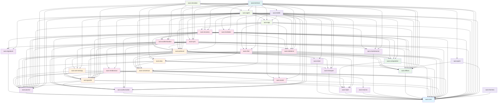

# Project Structure

This document provides the authoritative reference for Aura's crate organization, dependencies, and development policies.

The **primary specifications** live in `docs/` (e.g., consensus in `docs/106_consensus.md`, ceremony lifecycles in `docs/107_operation_categories.md`). The `work/` directory is non-authoritative scratch and may be removed.

## 8-Layer Architecture

Aura's codebase is organized into 8 clean architectural layers. Each layer builds on the layers below without circular dependencies.

```
┌────────────────────────────────────────────────────┐
│ Layer 8: Testing & Development Tools               │
│   • aura-testkit    • aura-quint    • aura-harness │
├────────────────────────────────────────────────────┤
│ Layer 7: User Interface                            │
│   • aura-terminal                                  │
├────────────────────────────────────────────────────┤
│ Layer 6: Runtime Composition                       │
│   • aura-agent    • aura-simulator    • aura-app   │
├────────────────────────────────────────────────────┤
│ Layer 5: Feature/Protocol Implementation           │
│   • aura-authentication    • aura-chat             │
│   • aura-invitation        • aura-recovery         │
│   • aura-relational        • aura-rendezvous       │
│   • aura-sync              • aura-social           │
├────────────────────────────────────────────────────┤
│ Layer 4: Orchestration                             │
│   • aura-protocol          • aura-guards           │
│   • aura-consensus         • aura-amp              │
│   • aura-anti-entropy                              │
├────────────────────────────────────────────────────┤
│ Layer 3: Implementation                            │
│   • aura-effects           • aura-composition      │
├────────────────────────────────────────────────────┤
│ Layer 2: Specification                             │
│   Domain Crates:                                   │
│   • aura-journal           • aura-authorization    │
│   • aura-signature         • aura-store            │
│   • aura-transport         • aura-maintenance      │
│   Choreography:                                    │
│   • aura-mpst              • aura-macros           │
├────────────────────────────────────────────────────┤
│ Layer 1: Foundation                                │
│   • aura-core                                      │
└────────────────────────────────────────────────────┘
```

## Layer 1: Foundation — `aura-core`

**Purpose**: Single source of truth for all domain concepts and interfaces.

**Contains**:
- Effect traits for core infrastructure, authentication, storage, network, cryptography, privacy, configuration, and testing
- Domain types: `AuthorityId`, `ContextId`, `SessionId`, `FlowBudget`, `ObserverClass`, `Capability`
- Cryptographic utilities: key derivation, FROST types, merkle trees, Ed25519 helpers
- Semantic traits: `JoinSemilattice`, `MeetSemilattice`, `CvState`, `MvState`
- Error types: `AuraError`, error codes, and guard metadata
- Configuration system with validation and multiple formats
- Causal context types for CRDT ordering
- AMP channel lifecycle effect surface: `aura-core::effects::amp::AmpChannelEffects` (implemented by runtime, simulator, and testkit mocks).

**Key principle**: Interfaces only, no implementations or business logic.

**Exceptions**:

1. **Extension traits** providing convenience methods are allowed (e.g., `LeakageChoreographyExt`, `SimulationEffects`, `AuthorityRelationalEffects`). These blanket implementations extend existing effect traits with domain-specific convenience methods while maintaining interface-only semantics.

2. **Arc<T> blanket implementations** for effect traits are required in aura-core due to Rust's orphan rules. These are *not* "runtime instantiations" - they are purely mechanical delegations that enable `Arc<AuraEffectSystem>` to satisfy trait bounds. Example:
   ```rust
   impl<T: CryptoEffects + ?Sized> CryptoEffects for std::sync::Arc<T> {
       async fn ed25519_sign(&self, msg: &[u8], key: &[u8]) -> Result<Vec<u8>, CryptoError> {
           (**self).ed25519_sign(msg, key).await  // Pure delegation
       }
   }
   ```

   **Why this is architecturally sound**: `Arc` is a language-level primitive (like `Vec`, `Box`, or `&`), not a "runtime" in the architectural sense. These implementations add no behavior or state - they simply say "if T can do X, then Arc<T> can too by asking T." Without these, any handler wrapped in `Arc` would fail to satisfy effect trait bounds, breaking the entire dependency injection pattern.

**Architectural Compliance**: aura-core maintains strict interface-only semantics. Test utilities like MockEffects are provided in aura-testkit (Layer 8) where they architecturally belong.

**Dependencies**: None (foundation crate).

### Commitment Tree Types and Functions

**Location**: `aura-core/src/tree/`

**Contains**:
- Core tree types: `TreeOp`, `AttestedOp`, `Policy`, `LeafNode`, `BranchNode`, `BranchSigningKey`, `TreeCommitment`, `Epoch`
- Commitment functions: `commit_branch()`, `commit_leaf()`, `policy_hash()`, `compute_root_commitment()`
- Policy meet-semilattice implementation for threshold refinement
- Snapshot types: `Snapshot`, `Cut`, `ProposalId`, `Partial`
- Verification module: `verify_attested_op()` (cryptographic), `check_attested_op()` (state consistency), `compute_binding_message()`

**Why Layer 1?**

Commitment tree types MUST remain in `aura-core` because:
1. **Effect traits require them**: `TreeEffects` and `SyncEffects` in `aura-core/src/effects/` use these types in their signatures
2. **FROST primitives depend on them**: `aura-core/src/crypto/tree_signing.rs` implements threshold signing over tree operations
3. **Authority abstraction needs them**: `aura-core/src/authority.rs` uses `Policy`, `AttestedOp`, and `TreeOpKind`
4. **Foundational cryptographic structures**: Commitment trees are merkle trees with threshold policies - core cryptographic primitives, not domain logic

**Layer 2 separation (`aura-journal`) contains**:
- Tree state machine: Full `TreeState` with branches, leaves, topology, and path validation
- Reduction logic: Deterministic state derivation from `OpLog<AttestedOp>`
- Domain validation: Business rules for tree operations (e.g., policy monotonicity, leaf lifecycle)
- Application logic: `apply_verified()`, compaction, garbage collection
- Re-exports: `pub use aura_core::tree::*` for convenience via `aura_journal::commitment_tree`

**Key architectural distinction**:
- **Layer 1 (`aura-core`)**: Tree *types* and *cryptographic commitment functions* (pure primitives)
- **Layer 2 (`aura-journal`)**: Tree *state machine*, *CRDT semantics*, and *validation rules* (domain implementation)

This separation allows effect traits in Layer 1 to reference tree types without creating circular dependencies, while keeping the stateful CRDT logic in the appropriate domain crate.

## Layer 2: Specification — Domain Crates and Choreography

**Purpose**: Define domain semantics and protocol specifications.

### Layer 2 Architecture Diff (Invariants)

Layer 2 is the *specification* layer: pure domain semantics with zero runtime coupling.

**Must hold:**
- No handler composition, runtime assembly, or UI dependencies.
- Domain facts are versioned and encoded via canonical DAG-CBOR.
- Fact reducers register through `FactRegistry`; no direct wiring in `aura-journal`.
- Authorization scopes use `aura-core` `ResourceScope` and typed operations.
- No in-memory production state; stateful test handlers live in `aura-testkit`.

**Forbidden:**
- Direct OS access (time, fs, network) outside effect traits.
- Tokio/async-std usage in domain protocols.
- State-bearing singletons or process-wide caches.

### Domain Crates

| Crate | Domain | Responsibility |
|-------|--------|-----------------|
| `aura-journal` | Fact-based journal | CRDT semantics, tree state machine, reduction logic, validation (re-exports tree types from `aura-core`) |
| `aura-authorization` | Trust and authorization | Capability refinement, Biscuit token helpers |
| `aura-signature` | Identity semantics | Signature verification, device lifecycle |
| `aura-store` | Storage domain | Storage types, capabilities, domain logic |
| `aura-transport` | Transport semantics | P2P communication abstractions |
| `aura-maintenance` | Maintenance facts | Snapshot, cache invalidation, OTA activation, admin replacement facts + reducer |

**Key characteristics**: Implement domain logic without effect handlers or coordination.

### Extensible Fact Types (`aura-journal`)

The journal provides **generic fact infrastructure** that higher-level crates extend with domain-specific fact types. This follows the Open/Closed Principle: the journal is open for extension but closed for modification.

#### Protocol-Level vs Domain-Level Facts

The `RelationalFact` enum in `aura-journal/src/fact.rs` contains two categories:

**Protocol-Level Facts** (stay in `aura-journal`):

These are core protocol constructs with complex reduction logic in `reduce_context()`. They have interdependencies and specialized state derivation that cannot be delegated to simple domain reducers:

| Fact | Purpose | Why Protocol-Level |
|------|---------|-------------------|
| `Protocol(GuardianBinding)` | Guardian relationship | Core recovery protocol |
| `Protocol(RecoveryGrant)` | Recovery capability | Core recovery protocol |
| `Protocol(Consensus)` | Aura Consensus results | Core agreement mechanism |
| `Protocol(AmpChannelCheckpoint)` | Ratchet window anchoring | Complex epoch state computation |
| `Protocol(AmpProposedChannelEpochBump)` | Optimistic epoch transitions | Spacing rules, bump selection |
| `Protocol(AmpCommittedChannelEpochBump)` | Finalized epoch transitions | Epoch chain validation |
| `Protocol(AmpChannelPolicy)` | Channel policy overrides | Skip window derivation |

**Domain-Level Facts** (via `Generic` + `FactRegistry`):

Application-specific facts use `RelationalFact::Generic` and are reduced by registered `FactReducer` implementations.

| Domain Crate | Fact Type | Purpose |
|-------------|-----------|---------|
| `aura-chat` | `ChatFact` | Channels, messages |
| `aura-invitation` | `InvitationFact` | Invitation lifecycle |
| `aura-relational` | `ContactFact` | Contact management |
| `aura-social/moderation` | `Block*Fact` | Block, mute, ban, kick |

**Design Pattern**:
1. **`aura-journal`** provides:
   - `DomainFact` trait for fact type identity and serialization
   - `FactReducer` trait for domain-specific reduction logic
   - `FactRegistry` for runtime fact type registration
   - `RelationalFact::Generic` as the extensibility mechanism

2. **Domain crates** implement:
   - Their own typed fact enums (e.g., `ChatFact`, `InvitationFact`)
   - `DomainFact` trait with `to_generic()` for storage
   - `FactReducer` for reduction to `RelationalBinding`

3. **`aura-agent/src/fact_registry.rs`** registers all domain reducers:
   ```rust
   pub fn build_fact_registry() -> FactRegistry {
       let mut registry = FactRegistry::new();
       registry.register::<ChatFact>(CHAT_FACT_TYPE_ID, Box::new(ChatFactReducer));
       registry.register::<InvitationFact>(INVITATION_FACT_TYPE_ID, Box::new(InvitationFactReducer));
       registry.register::<ContactFact>(CONTACT_FACT_TYPE_ID, Box::new(ContactFactReducer));
       register_moderation_facts(&mut registry);
       registry
   }
   ```

**Why This Architecture**:
- **Open/Closed Principle**: New domain facts don't require modifying `aura-journal`
- **Domain Isolation**: Each crate owns its fact semantics
- **Protocol Integrity**: Core protocol facts with complex reduction stay in `aura-journal`
- **Testability**: Domain facts can be tested independently
- **Type Safety**: Compile-time guarantees within each domain

**Core Fact Types in `aura-journal`**:
Only facts fundamental to journal operation remain as direct enum variants:
- `AttestedOp`: Commitment tree operations (cryptographic primitives)
- `Snapshot`: Journal compaction checkpoints
- `RendezvousReceipt`: Cross-authority coordination receipts
- Protocol-level `RelationalFact` variants listed above

#### Fact Implementation Patterns by Layer

Aura uses **two distinct fact patterns** based on architectural layer to prevent circular dependencies:

**Layer 2 Pattern** (Domain Crates: `aura-maintenance`, `aura-authorization`, `aura-signature`, `aura-store`, `aura-transport`):

These crates use the `aura-core::types::facts` pattern with **NO dependency on `aura-journal`**:

```rust
use aura_core::types::facts::{FactTypeId, FactError, FactEnvelope, FactDeltaReducer};

pub static MY_FACT_TYPE_ID: FactTypeId = FactTypeId::new("my_domain");
pub const MY_FACT_SCHEMA_VERSION: u16 = 1;

impl MyFact {
    pub fn try_encode(&self) -> Result<Vec<u8>, FactError> {
        aura_core::types::facts::try_encode_fact(
            &MY_FACT_TYPE_ID,
            MY_FACT_SCHEMA_VERSION,
            self,
        )
    }

    pub fn to_envelope(&self) -> Result<FactEnvelope, FactError> {
        // Create envelope manually for Generic wrapping
    }
}

impl FactDeltaReducer<MyFact, MyFactDelta> for MyFactReducer {
    fn apply(&self, fact: &MyFact) -> MyFactDelta { /* ... */ }
}
```

**Layer 4/5 Pattern** (Feature Crates: `aura-chat`, `aura-invitation`, `aura-relational`, `aura-recovery`, `aura-social`):

These crates use the `aura-journal::extensibility::DomainFact` pattern and **register with `FactRegistry`**:

```rust
use aura_journal::extensibility::{DomainFact, FactReducer};
use aura_macros::DomainFact;

#[derive(DomainFact)]
#[domain_fact(type_id = "my_domain", schema_version = 1, context_fn = "context_id")]
pub enum MyFact { /* ... */ }

impl FactReducer for MyFactReducer {
    fn handles_type(&self) -> &'static str { /* ... */ }
    fn reduce_envelope(...) -> Option<RelationalBinding> { /* ... */ }
}
```

**Why Two Patterns?**

- **Layer 2 → Layer 2 dependencies create circular risk**: `aura-journal` is itself a Layer 2 crate. If other Layer 2 crates depend on `aura-journal` for the `DomainFact` trait, we risk circular dependencies.
- **Layer 4/5 can safely depend on Layer 2**: Higher layers depend on lower layers by design, so feature crates can use the `DomainFact` trait from `aura-journal`.
- **Registration location differs**: Layer 2 facts are wrapped manually in `RelationalFact::Generic`. Layer 4/5 facts register with `FactRegistry` in `aura-agent/src/fact_registry.rs`.

For a quick decision tree on pattern selection, see `CLAUDE.md` under "Agent Decision Aids".

### Choreography Specification

**`aura-mpst`**: Aura-facing compatibility crate over Telltale. Re-exports choreography/runtime surfaces and Aura extension traits used by generated protocols and adapters.

**`aura-macros`**: Compile-time choreography frontend. Parses Aura annotations (`guard_capability`, `flow_cost`, `journal_facts`, `leak`) and emits Telltale-backed generated modules plus Aura effect-bridge helpers.

## Layer 3: Implementation — `aura-effects` and `aura-composition`

**Purpose**: Effect implementation and handler composition.

### `aura-effects` — Stateless Effect Handlers

**Purpose**: Stateless, single-party effect implementations. **Architectural Decision**: `aura-effects` is the designated singular point of interaction with non-deterministic operating system services (entropy, wall-clock time, network I/O, file system). This design choice makes the architectural boundary explicit and centralizes impure operations.

**Contains**:
- **Production handlers**: `RealCryptoHandler`, `TcpTransportHandler`, `FilesystemStorageHandler`, `PhysicalTimeHandler`
- OS integration adapters that delegate to system services
- Pure functions that transform inputs to outputs without state

**What doesn't go here**:
- Handler composition or registries
- Multi-handler coordination
- Stateful implementations
- Mock/test handlers

**Key characteristics**: Each handler should be independently testable and reusable. No handler should know about other handlers. This enables clean dependency injection and modular testing.

**Dependencies**: `aura-core` and external libraries.

**Note**: Mock and test handlers are located in `aura-testkit` (Layer 8) to maintain clean separation between production and testing concerns.

### `aura-composition` — Handler Composition

**Purpose**: Assemble individual handlers into cohesive effect systems.

**Contains**:
- Effect registry and builder patterns
- Handler composition utilities
- Effect system configuration
- Handler lifecycle management (start/stop/configure)
- Reactive infrastructure: `Dynamic<T>` FRP primitives for composing view updates over effect changes

**What doesn't go here**:
- Individual handler implementations
- Multi-party protocol logic
- Runtime-specific concerns
- Application lifecycle

**Key characteristics**: Feature crates need to compose handlers without pulling in full runtime infrastructure. This is about "how do I assemble handlers?" not "how do I coordinate distributed protocols?"

**Dependencies**: `aura-core`, `aura-effects`.

## Layer 4: Orchestration — `aura-protocol` + subcrates

**Purpose**: Multi-party coordination and distributed protocol orchestration.

**Contains**:
- Guard chain coordination (`CapGuard → FlowGuard → JournalCoupler`) in `aura-guards`
- Multi-party protocol orchestration (consensus in `aura-consensus`, anti-entropy in `aura-anti-entropy`)
- Quorum-driven DKG orchestration and transcript handling in `aura-consensus/src/dkg/`
- Cross-handler coordination logic (`TransportCoordinator`, `StorageCoordinator`, etc.)
- Distributed state management
- Stateful coordinators for multi-party protocols

**What doesn't go here**:
- Effect trait definitions (all traits belong in `aura-core`)
- Handler composition infrastructure (belongs in `aura-composition`)
- Single-party effect implementations (belongs in `aura-effects`)
- Test/mock handlers (belong in `aura-testkit`)
- Runtime assembly (belongs in `aura-agent`)
- Application-specific business logic (belongs in domain crates)

**Key characteristics**: This layer coordinates multiple handlers working together across network boundaries. It implements the "choreography conductor" pattern, ensuring distributed protocols execute correctly with proper authorization, flow control, and state consistency. All handlers here manage multi-party coordination, not single-party operations.

**Dependencies**: `aura-core`, `aura-effects`, `aura-composition`, `aura-mpst`, domain crates, and Layer 4 subcrates (`aura-guards`, `aura-consensus`, `aura-amp`, `aura-anti-entropy`). Performance-critical protocol operations may require carefully documented exceptions for direct cryptographic library usage.

## Layer 5: Feature/Protocol Implementation

**Purpose**: Complete end-to-end protocol implementations.

**Crates**:

| Crate | Protocol | Purpose |
|-------|----------|---------|
| `aura-authentication` | Authentication | Device, threshold, and guardian auth flows |
| `aura-chat` | Chat | Chat domain facts + view reducers; local chat prototype |
| `aura-invitation` | Invitations | Peer onboarding and relational facts |
| `aura-recovery` | Guardian recovery | Recovery grants and dispute escalation |
| `aura-relational` | Cross-authority relationships | RelationalContext protocols (domain types in aura-core) |
| `aura-rendezvous` | Peer discovery | Context-scoped rendezvous and routing |
| `aura-social` | Social topology | Block/neighborhood materialized views, relay selection, progressive discovery layers, role/access semantics (`Member`/`Participant`, `Full`/`Partial`/`Limited`) |
| `aura-sync` | Synchronization | Journal sync and anti-entropy protocols |

**Key characteristics**: Reusable building blocks with no UI or binary entry points.

**Notes**:
- Layer 5 crates now include `ARCHITECTURE.md` describing facts, invariants, and operation categories.
- `OPERATION_CATEGORIES` constants in each Layer 5 crate map operations to A/B/C classes.
- Runtime-owned caches (e.g., invitation/rendezvous descriptors) live in Layer 6 handlers, not in Layer 5 services.
- Layer 5 facts use versioned binary encoding (bincode) with JSON fallback for debug and compatibility.
- FactKey helper types are required for reducers/views to keep binding key derivation consistent.
- Ceremony facts carry optional `trace_id` values to support cross-protocol traceability.

**Dependencies**: `aura-core`, `aura-effects`, `aura-composition`, `aura-mpst`, plus Layer 4 orchestration crates (`aura-protocol`, `aura-guards`, `aura-consensus`, `aura-amp`, `aura-anti-entropy`).

## Layer 6: Runtime Composition — `aura-agent`, `aura-simulator`, and `aura-app`

**Purpose**: Assemble complete running systems for production deployment.

**`aura-agent`**: Production runtime for deployment with application lifecycle management, runtime-specific configuration, production deployment concerns, and system integration.

**`aura-app`**: Portable headless application core providing the business logic and state management layer for all platforms. Exposes a platform-agnostic API consumed by terminal, iOS, Android, and web frontends. Contains intent processing, view derivation, and platform feature flags (`native`, `ios`, `android`, `web-js`, `web-dominator`).

**`aura-simulator`**: Deterministic simulation runtime with virtual time, transport shims, failure injection, and generative testing via Quint integration (see `aura-simulator/src/quint/` for generative simulation bridge).

**Contains**:
- Application lifecycle management (startup, shutdown, signals)
- Runtime-specific configuration and policies
- Production deployment concerns
- System integration and monitoring hooks
- Reactive event loop: `ReactiveScheduler` (Tokio task) that orchestrates fact ingestion, journal updates, and view propagation

**What doesn't go here**:
- Effect handler implementations
- Handler composition utilities
- Protocol coordination logic
- CLI or UI concerns

**Key characteristics**: This is about "how do I deploy and run this as a production system?" It's the bridge between composed handlers/protocols and actual running applications.

**Dependencies**: All domain crates, `aura-effects`, `aura-composition`, and Layer 4 orchestration crates (`aura-protocol`, `aura-guards`, `aura-consensus`, `aura-amp`, `aura-anti-entropy`).

## Layer 7: User Interface — `aura-terminal`

**Purpose**: User-facing applications with main entry points.

**`aura-terminal`**: Terminal-based interface combining CLI commands and an interactive TUI (Terminal User Interface). Provides account and device management, recovery status visualization, chat interfaces, and scenario execution. Consumes `aura-app` for all business logic and state management.

**Key characteristic**: Contains `main()` entry point that users run directly. Binary is named `aura`.

**Dependencies**: `aura-app`, `aura-agent`, `aura-core`, `aura-recovery`, and Layer 4 orchestration crates (`aura-protocol`, `aura-guards`, `aura-consensus`, `aura-amp`, `aura-anti-entropy`).

## Layer 8: Testing and Development Tools

**Purpose**: Cross-cutting test utilities, formal verification bridges, and generative testing infrastructure.

**`aura-testkit`**: Comprehensive testing infrastructure including:
- Shared test fixtures and scenario builders
- Property test helpers and deterministic utilities
- **Mock effect handlers**: `MockCryptoHandler`, `SimulatedTimeHandler`, `MemoryStorageHandler`, etc.
- Stateful test handlers that maintain controllable state for deterministic testing

**`aura-quint`**: Formal verification bridge to Quint model checker including:
- Native Quint subprocess interface for parsing and type checking
- Property specification management with classification (authorization, budget, integrity)
- Verification runner with caching and counterexample generation
- Effect trait implementations for property evaluation during simulation

**`aura-harness`**: Multi-instance runtime harness for orchestrating test scenarios including:
- Coordinator and executor for managing multiple Aura instances
- Scenario definition and replay capabilities
- Artifact synchronization and determinism validation
- Screen normalization and VT100 terminal emulation for TUI testing
- Resource guards and capability checking

**Key characteristics**: Mock handlers in `aura-testkit` are allowed to be stateful (using `Arc<Mutex<>>`, etc.) since they need controllable, deterministic state for testing. This maintains the stateless principle for production handlers in `aura-effects` while enabling comprehensive testing.

**Dependencies**: `aura-core` (for aura-harness); `aura-agent`, `aura-composition`, `aura-journal`, `aura-transport`, `aura-core`, `aura-protocol`, `aura-guards`, `aura-consensus`, `aura-amp`, `aura-anti-entropy` (for aura-testkit and aura-quint).

## Workspace Structure

```
crates/
├── aura-agent           Runtime composition and agent lifecycle
├── aura-app             Portable headless application core (multi-platform)
├── aura-authentication  Authentication protocols
├── aura-anti-entropy    Anti-entropy sync and reconciliation
├── aura-amp             Authenticated messaging protocol (AMP)
├── aura-chat            Chat facts + local prototype service
├── aura-composition     Handler composition and effect system assembly
├── aura-consensus       Consensus protocol implementation
├── aura-core            Foundation types and effect traits
├── aura-effects         Effect handler implementations
├── aura-guards          Guard chain enforcement
├── aura-harness         Multi-instance runtime harness
├── aura-invitation      Invitation choreographies
├── aura-journal         Fact-based journal domain
├── aura-macros          Choreography DSL compiler
├── aura-maintenance     Maintenance facts and reducers
├── aura-mpst            Session types and choreography specs
├── aura-protocol        Orchestration and coordination
├── aura-quint           Quint formal verification
├── aura-recovery        Guardian recovery protocols
├── aura-relational      Cross-authority relationships
├── aura-rendezvous      Peer discovery and routing
├── aura-simulator       Deterministic simulation engine
├── aura-social          Social topology and progressive disclosure
├── aura-store           Storage domain types
├── aura-sync            Synchronization protocols
├── aura-terminal        Terminal UI (CLI + TUI)
├── aura-testkit         Testing utilities and fixtures
├── aura-transport       P2P communication layer
├── aura-signature       Identity verification
└── aura-authorization   Web-of-trust authorization
```

## Dependency Graph


```mermaid
graph TD
    %% Layer 1: Foundation
    core[aura-core]

    %% Layer 2: Specification
    signature[aura-signature]
    journal[aura-journal]
    authorization[aura-authorization]
    store[aura-store]
    transport[aura-transport]
    mpst[aura-mpst]
    macros[aura-macros]
    maintenance[aura-maintenance]

    %% Layer 3: Implementation
    effects[aura-effects]
    composition[aura-composition]

    %% Layer 4: Orchestration
    guards[aura-guards]
    anti_entropy[aura-anti-entropy]
    consensus[aura-consensus]
    amp[aura-amp]
    protocol[aura-protocol]

    %% Layer 5: Feature
    social[aura-social]
    chat[aura-chat]
    relational[aura-relational]
    auth[aura-authentication]
    rendezvous[aura-rendezvous]
    invitation[aura-invitation]
    recovery[aura-recovery]
    sync[aura-sync]

    %% Layer 6: Runtime
    app[aura-app]
    agent[aura-agent]
    simulator[aura-simulator]

    %% Layer 7: Application
    terminal[aura-terminal]

    %% Layer 8: Testing
    testkit[aura-testkit]
    quint[aura-quint]
    harness[aura-harness]

    %% Layer 2 dependencies
    signature --> core
    journal --> core
    authorization --> core
    store --> core
    transport --> core
    mpst --> core
    macros --> core
    maintenance --> core

    %% Layer 3 dependencies
    effects --> core
    composition --> core
    composition --> effects
    composition --> mpst

    %% Layer 4 dependencies
    guards --> core
    guards --> authorization
    guards --> mpst
    guards --> journal
    anti_entropy --> core
    anti_entropy --> guards
    anti_entropy --> journal
    consensus --> core
    consensus --> macros
    consensus --> journal
    consensus --> mpst
    consensus --> guards
    amp --> core
    amp --> effects
    amp --> journal
    amp --> transport
    amp --> consensus
    amp --> guards
    protocol --> core
    protocol --> effects
    protocol --> composition
    protocol --> journal
    protocol --> guards
    protocol --> consensus
    protocol --> amp
    protocol --> anti_entropy
    protocol --> authorization
    protocol --> transport
    protocol --> mpst
    protocol --> store

    %% Layer 5 dependencies
    social --> core
    social --> journal
    chat --> core
    chat --> journal
    chat --> composition
    chat --> guards
    relational --> core
    relational --> journal
    relational --> consensus
    relational --> effects
    auth --> core
    auth --> effects
    auth --> journal
    auth --> protocol
    auth --> guards
    auth --> relational
    auth --> signature
    auth --> authorization
    rendezvous --> core
    rendezvous --> journal
    rendezvous --> guards
    rendezvous --> social
    invitation --> core
    invitation --> effects
    invitation --> guards
    invitation --> authorization
    invitation --> auth
    invitation --> journal
    invitation --> composition
    recovery --> core
    recovery --> journal
    recovery --> composition
    recovery --> signature
    recovery --> auth
    recovery --> authorization
    recovery --> effects
    recovery --> protocol
    recovery --> relational
    sync --> core
    sync --> protocol
    sync --> guards
    sync --> journal
    sync --> authorization
    sync --> maintenance
    sync --> rendezvous
    sync --> effects
    sync --> anti_entropy

    %% Layer 6 dependencies
    app --> core
    app --> effects
    app --> journal
    app --> relational
    app --> chat
    app --> social
    app --> maintenance
    app --> protocol
    app --> recovery
    agent --> core
    agent --> app
    agent --> effects
    agent --> composition
    agent --> protocol
    agent --> guards
    agent --> consensus
    agent --> journal
    agent --> relational
    agent --> chat
    agent --> auth
    agent --> invitation
    agent --> rendezvous
    agent --> social
    agent --> sync
    agent --> maintenance
    agent --> transport
    agent --> recovery
    agent --> authorization
    agent --> signature
    agent --> store
    simulator --> core
    simulator --> agent
    simulator --> effects
    simulator --> journal
    simulator --> amp
    simulator --> consensus
    simulator --> protocol
    simulator --> testkit
    simulator --> sync
    simulator --> quint
    simulator --> guards

    %% Layer 7 dependencies
    terminal --> app
    terminal --> core
    terminal --> agent
    terminal --> protocol
    terminal --> recovery
    terminal --> invitation
    terminal --> auth
    terminal --> sync
    terminal --> effects
    terminal --> authorization
    terminal --> maintenance
    terminal --> chat
    terminal --> journal
    terminal --> relational

    %% Layer 8 dependencies
    testkit --> core
    testkit --> effects
    testkit --> mpst
    testkit --> journal
    testkit --> relational
    testkit --> social
    testkit --> transport
    testkit --> authorization
    testkit --> consensus
    testkit --> anti_entropy
    testkit --> amp
    testkit --> protocol
    testkit --> app
    quint --> core
    quint --> effects
    harness --> core

    %% Styling
    classDef foundation fill:#e1f5fe
    classDef spec fill:#f3e5f5
    classDef impl fill:#e8f5e9
    classDef orch fill:#fff3e0
    classDef feature fill:#fce4ec
    classDef runtime fill:#f1f8e9
    classDef application fill:#e0f2f1
    classDef test fill:#ede7f6

    class core foundation
    class signature,journal,authorization,store,transport,mpst,macros,maintenance spec
    class effects,composition impl
    class guards,anti_entropy,consensus,amp,protocol orch
    class social,chat,relational,auth,rendezvous,invitation,recovery,sync feature
    class app,agent,simulator runtime
    class terminal application
    class testkit,quint,harness test
```

## Effect Trait Classification

Not all effect traits are created equal. Aura organizes effect traits into three categories that determine where their implementations should live:

**Fundamental Principle**: All effect trait definitions belong in `aura-core` (Layer 1) to maintain a single source of truth for interfaces. This includes infrastructure effects (OS integration), application effects (domain-specific), and protocol coordination effects (multi-party orchestration).

### Infrastructure Effects (Implemented in aura-effects)

Infrastructure effects are truly foundational capabilities that every Aura system needs. These traits define OS-level operations that are universal across all Aura use cases.

**Characteristics**:
- OS integration (file system, network, cryptographic primitives)
- No Aura-specific semantics
- Reusable across any distributed system
- Required for basic system operation

**Examples**:
- `CryptoEffects`: Ed25519 signing, key generation, hashing
- `NetworkEffects`: TCP connections, message sending/receiving
- `StorageEffects`: File read/write, directory operations
- `PhysicalTimeEffects`, `LogicalClockEffects`, `OrderClockEffects`: Unified time system
- `RandomEffects`: Cryptographically secure random generation
- `ConfigurationEffects`: Configuration file parsing
- `ConsoleEffects`: Terminal input/output
- `LeakageEffects`: Cross-cutting metadata leakage tracking (composable infrastructure)
- `ReactiveEffects`: Type-safe signal-based state management for UI and inter-component communication

**Implementation Location**: These traits have stateless handlers in `aura-effects` that delegate to OS services.

### Application Effects (Implemented in Domain Crates)

Application effects encode Aura-specific abstractions and business logic. These traits capture domain concepts that are meaningful only within Aura's architecture.

**Characteristics**:
- Aura-specific semantics and domain knowledge
- Built on top of infrastructure effects
- Implement business logic and domain rules
- May have multiple implementations for different contexts

**Examples**:
- `JournalEffects`: Fact-based journal operations, specific to Aura's CRDT design (aura-journal)
- `AuthorityEffects`: Authority-specific operations, central to Aura's identity model
- `FlowBudgetEffects`: Privacy budget management, unique to Aura's information flow control (aura-authorization)
- `AuthorizationEffects`: Biscuit token evaluation, tied to Aura's capability system (aura-authorization)
- `RelationalContextEffects`: Cross-authority relationship management
- `GuardianEffects`: Recovery protocol operations

**Protocol Coordination Effects** (new category):
- `ChoreographicEffects`: Multi-party protocol coordination
- `EffectApiEffects`: Event sourcing and audit for protocols
- `SyncEffects`: Anti-entropy synchronization operations

**Implementation Location**: Application effects are implemented in their respective domain crates (`aura-journal`, `aura-authorization`, etc.). Protocol coordination effects are implemented in Layer 4 orchestration crates (`aura-protocol`, `aura-guards`, `aura-consensus`, `aura-amp`, `aura-anti-entropy`) as they manage multi-party state.

**Why Not in aura-effects?**: Moving these to `aura-effects` would create circular dependencies. Domain crates need to implement these effects using their own domain logic, but `aura-effects` cannot depend on domain crates due to the layered architecture.

**Implementation Pattern**: Domain crates implement application effects by creating domain-specific handler structs that compose infrastructure effects for OS operations while encoding Aura-specific business logic.

```rust
// Example: aura-journal implements JournalEffects
pub struct JournalHandler<C: CryptoEffects, S: StorageEffects> {
    crypto: C,
    storage: S,
    // Domain-specific state
}

impl<C: CryptoEffects, S: StorageEffects> JournalEffects for JournalHandler<C, S> {
    async fn append_fact(&self, fact: Fact) -> Result<(), AuraError> {
        // 1. Domain validation using Aura-specific rules
        self.validate_fact_semantics(&fact)?;
        
        // 2. Cryptographic operations via infrastructure effects
        let signature = self.crypto.sign(&fact.hash()).await?;
        
        // 3. Storage operations via infrastructure effects  
        let entry = JournalEntry { fact, signature };
        self.storage.write_chunk(&entry.id(), &entry.encode()).await?;
        
        // 4. Domain-specific post-processing
        self.update_fact_indices(&fact).await?;
        Ok(())
    }
}
```

### Common Effect Placement Mistakes

Here are examples of incorrect effect placement and how to fix them:

```rust
// WRONG: Domain handler using OS operations directly
// File: aura-journal/src/effects.rs
impl JournalEffects for BadJournalHandler {
    async fn read_facts(&self, namespace: Namespace) -> Vec<Fact> {
        // VIOLATION: Direct file system access in domain handler
        let data = std::fs::read("journal.dat")?;
        serde_json::from_slice(&data)?
    }
}

// CORRECT: Inject StorageEffects for OS operations
impl<S: StorageEffects> JournalEffects for GoodJournalHandler<S> {
    async fn read_facts(&self, namespace: Namespace) -> Vec<Fact> {
        // Use injected storage effects
        let data = self.storage.read_chunk(&namespace.to_path()).await?;
        self.deserialize_facts(data)
    }
}
```

```rust
// WRONG: Application effect implementation in aura-effects
// File: aura-effects/src/journal_handler.rs
pub struct JournalHandler { }

impl JournalEffects for JournalHandler {
    // VIOLATION: Domain logic in infrastructure crate
    async fn validate_fact(&self, fact: &Fact) -> bool {
        match fact {
            Fact::TreeOp(op) => self.validate_tree_semantics(op),
            Fact::Commit(c) => self.validate_commit_rules(c),
        }
    }
}

// CORRECT: Application effects belong in domain crates
// File: aura-journal/src/effects.rs
impl<C, S> JournalEffects for JournalHandler<C, S> {
    // Domain validation logic belongs here
}
```

```rust
// WRONG: Infrastructure effect in domain crate
// File: aura-journal/src/network_handler.rs
pub struct CustomNetworkHandler { }

impl NetworkEffects for CustomNetworkHandler {
    // VIOLATION: OS-level networking in domain crate
    async fn connect(&self, addr: &str) -> TcpStream {
        TcpStream::connect(addr).await?
    }
}

// CORRECT: Use existing NetworkEffects from aura-effects
impl<N: NetworkEffects> MyDomainHandler<N> {
    async fn send_fact(&self, fact: Fact) -> Result<()> {
        // Compose with injected network effects
        self.network.send(fact.encode()).await
    }
}
```

**Key principles for domain effect implementations**:
- **Domain logic first**: Encode business rules and validation specific to the domain
- **Infrastructure composition**: Use infrastructure effects for OS operations, never direct syscalls
- **Clean separation**: Domain handlers should not contain OS integration code
- **Testability**: Mock infrastructure effects for unit testing domain logic

### Fallback Handlers and the Null Object Pattern

Infrastructure effects sometimes require **fallback implementations** for platforms or environments where the underlying capability is unavailable (e.g., biometric hardware on servers, secure enclaves in CI, HSMs in development).

**When fallback handlers are appropriate**:
- The effect trait represents optional hardware/OS capabilities
- Code must run on platforms without the capability
- Graceful degradation is preferable to compile-time feature flags everywhere

**Naming conventions**:
- Good: `FallbackBiometricHandler`, `NoOpSecureEnclaveHandler`, `UnsupportedHsmHandler`
- Avoid: `RealBiometricHandler` (misleading - implies real implementation)

**Fallback handler behavior**:
- Return `false` for capability checks (`is_available()`, `supports_feature()`)
- Return descriptive errors for operations (`Err(NotSupported)`)
- Never panic or silently succeed when the capability is unavailable

For a checklist on removing stub handlers, see `CLAUDE.md` under "Agent Decision Aids".

**Why this matters**: A fallback handler is not dead code if its trait is actively used. It's the Null Object Pattern providing safe defaults. The architectural violation is a misleading name, not the existence of the fallback.

### Composite Effects (Convenience Extensions)

Composite effects provide convenience methods that combine multiple lower-level operations. These are typically extension traits that add domain-specific convenience to infrastructure effects.

**Characteristics**:
- Convenience wrappers around other effects
- Domain-specific combinations of operations
- Often implemented as blanket implementations
- Improve developer ergonomics

**Examples**:
- `TreeEffects`: Combines `CryptoEffects` and `StorageEffects` for merkle tree operations
- `SimulationEffects`: Testing-specific combinations for deterministic simulation
- `LeakageChoreographyExt`: Combines leakage tracking with choreography operations

**Implementation Location**: Usually implemented as extension traits in `aura-core` or as blanket implementations in domain crates.

### Effect Classification

For quick decision aids (decision matrix, decision tree), see `CLAUDE.md` under "Agent Decision Aids".

**Examples:**

- **CryptoEffects** → Infrastructure (OS crypto, no Aura semantics, reusable)
- **JournalEffects** → Application (Aura facts, domain validation, not reusable)
- **NetworkEffects** → Infrastructure (TCP/UDP, no domain logic, reusable)
- **FlowBudgetEffects** → Application (Aura privacy model, domain rules)

This classification ensures that:
- Infrastructure effects have reliable, stateless implementations available in `aura-effects`
- Application effects can evolve with their domain logic in domain crates
- Composite effects provide ergonomic interfaces without architectural violations
- The dependency graph remains acyclic
- Domain knowledge stays in domain crates, OS knowledge stays in infrastructure
- Clean composition enables testing domain logic independently of OS integration

## Architecture Principles

### No Circular Dependencies

Each layer builds on lower layers without reaching back down. This enables independent testing, reusability, and clear responsibility boundaries.

The layered architecture means that Layer 1 has no dependencies on any other Aura crate. Layer 2 depends only on Layer 1. Layer 3 depends on Layers 1 and 2. This pattern continues through all 8 layers.

### Code Location Policy

The 8-layer architecture enforces strict placement rules. Violating these rules creates circular dependencies or breaks architectural invariants.

For a quick reference table of layer rules, see `CLAUDE.md` under "Agent Decision Aids".

For practical guidance on effects and handlers, see [Effects Guide](802_effects_guide.md). For choreography development, see [Choreography Guide](803_choreography_guide.md).

### Pure Mathematical Utilities

Some effect traits in aura-core (e.g., `BloomEffects`) represent pure mathematical operations without OS integration. These follow the standard trait/handler pattern for consistency, but are technically not "effects" in the algebraic sense (no side effects).

This is acceptable technical debt - the pattern consistency outweighs the semantic impurity. Future refactoring may move pure math to methods on types in aura-core.

### Architectural Compliance Checking

The project includes an automated architectural compliance checker to enforce these layering principles:

**Command**: `just check-arch`  
**Script**: `scripts/arch-check.sh`

**What it validates**:
- Layer boundary violations (no upward dependencies)
- Dependency direction (Lx→Ly where y≤x only)
- Effect trait classification and placement
- Domain effect implementation patterns
- Stateless handler requirements in `aura-effects` (no `Arc<Mutex>`, `Arc<RwLock>`)
- Mock handler location in `aura-testkit`
- Guard chain integrity (no bypass of CapGuard → FlowGuard → JournalCoupler)
- Impure function routing through effects (`SystemTime::now`, `thread_rng`, etc.)
- Physical time guardrails (`tokio::time::sleep` confinement)
- Handler composition patterns (no direct instantiation)
- Placeholder/TODO detection
- Invariants documentation schema validation

The checker reports violations that must be fixed and warnings for review. Run it before submitting changes to ensure architectural compliance.

## Feature Flags

Aura uses a minimal set of deliberate feature flags organized into three tiers.

### Tier 1: Workspace-Wide Features

| Feature | Crate | Purpose |
|---------|-------|---------|
| `simulation` | `aura-core`, `aura-effects` | Enables simulation/testing effect traits and handlers. Required by `aura-simulator`, `aura-quint`, `aura-testkit`. |
| `proptest` | `aura-core` | Property-based testing support via the proptest crate. |

### Tier 2: Platform Features (aura-app)

| Feature | Purpose |
|---------|---------|
| `native` | Rust consumers (aura-terminal, tests). Enables futures-signals API. |
| `ios` | iOS via UniFFI → Swift bindings. |
| `android` | Android via UniFFI → Kotlin bindings. |
| `wasm` | Web via wasm-bindgen → JavaScript/TypeScript. |
| `web-dominator` | Pure Rust WASM apps using futures-signals + dominator. |

**Development features**: `instrumented` (tracing), `debug-serialize` (JSON debug output), `host` (binding stub).

### Tier 3: Crate-Specific Features

| Crate | Feature | Purpose |
|-------|---------|---------|
| `aura-terminal` | `terminal` | TUI mode (default). |
| `aura-terminal` | `development` | Includes simulator, testkit, debug features. |
| `aura-testkit` | `full-effect-system` | Optional aura-agent integration for higher-layer tests. |
| `aura-testkit` | `lean` | Lean oracle for differential testing against formal models. |
| `aura-agent` | `dev-console` | Optional development console server. |
| `aura-agent` | `real-android-keystore` | Real Android Keystore implementation. |
| `aura-mpst` | `debug` | Choreography debugging output. |
| `aura-macros` | `proc-macro` | Proc-macro compilation (default). |

### Feature Usage Examples

```bash
# Standard development (default features)
cargo build

# With simulation support
cargo build -p aura-core --features simulation

# Terminal with development tools
cargo build -p aura-terminal --features development

# Lean differential testing (requires Lean toolchain)
just lean-oracle-build
cargo test -p aura-testkit --features lean --test lean_differential

# iOS build
cargo build -p aura-app --features ios
```

## Effect System and Impure Function Guidelines

### Core Principle: Deterministic Simulation

Aura's effect system ensures **fully deterministic simulation** by requiring all impure operations (time, randomness, filesystem, network) to flow through effect traits. This enables:

- **Predictable testing**: Mock all external dependencies for unit tests
- **WASM compatibility**: No blocking operations or OS thread assumptions
- **Cross-platform support**: Same code runs in browsers and native environments
- **Simulation fidelity**: Virtual time and controlled randomness for property testing

### Impure Function Classification

**FORBIDDEN: Direct impure function usage**
```rust
// VIOLATION: Direct system calls
let now = SystemTime::now();
let random = thread_rng().gen::<u64>();
let file = File::open("data.txt")?;
let socket = TcpStream::connect("127.0.0.1:8080").await?;

// VIOLATION: Global state
static CACHE: Mutex<HashMap<String, String>> = Mutex::new(HashMap::new());
```

**REQUIRED: Effect trait usage**
```rust
// CORRECT: Via effect traits with explicit context
async fn my_operation<T: TimeEffects + RandomEffects + StorageEffects>(
    ctx: &EffectContext,
    effects: &T,
) -> Result<ProcessedData> {
    let timestamp = effects.current_time().await;
    let nonce = effects.random_bytes(32).await?;
    let data = effects.read_chunk(&chunk_id).await?;
    
    // ... business logic with pure functions
    Ok(ProcessedData { timestamp, nonce, data })
}
```

### Legitimate Effect Injection Sites

The architectural compliance checker **ONLY** allows direct impure function usage in these specific locations:

#### 1. Effect Handler Implementations (`aura-effects`)
```rust
// ALLOWED: Production effect implementations
impl PhysicalTimeEffects for PhysicalTimeHandler {
    async fn physical_time(&self) -> Result<PhysicalTime, TimeError> {
        // OK: This IS the effect implementation
        let now = SystemTime::now().duration_since(UNIX_EPOCH)?;
        Ok(PhysicalTime::from_ms(now.as_millis() as u64))
    }
}

impl RandomCoreEffects for RealRandomHandler {
    async fn random_bytes(&self, len: usize) -> Vec<u8> {
        let mut bytes = vec![0u8; len];
        rand::thread_rng().fill_bytes(&mut bytes);  // OK: Legitimate OS randomness source
        bytes
    }
}
```

#### 2. Runtime Effect Assembly (`runtime/effects.rs`)
```rust
// ALLOWED: Effect system bootstrapping
pub fn create_production_effects() -> AuraEffectSystem {
    AuraEffectSystemBuilder::new()
        .with_handler(Arc::new(PhysicalTimeHandler::new()))
        .with_handler(Arc::new(RealRandomHandler::new())) // OK: Assembly point
        .build()
}
```

#### 3. Pure Functions (`aura-core::hash`)
```rust
// ALLOWED: Deterministic, pure operations
pub fn hash(data: &[u8]) -> [u8; 32] {
    blake3::hash(data).into()  // OK: Pure function, no external state
}
```

### Exemption Rationale

**Why these exemptions are architecturally sound**:

1. **Effect implementations** MUST access the actual system - that's their purpose
2. **Runtime assembly** is the controlled injection point where production vs. mock effects are chosen
3. **Pure functions** are deterministic regardless of when/where they're called

**Why broad exemptions are dangerous**:
- Crate-level exemptions (`aura-agent`, `aura-protocol`, `aura-guards`, `aura-consensus`, `aura-amp`, `aura-anti-entropy`) would allow business logic to bypass effects
- This breaks simulation determinism and WASM compatibility
- Makes testing unreliable by introducing hidden external dependencies

### Effect System Usage Patterns

#### Correct: Infrastructure Effects in aura-effects
```rust
// File: crates/aura-effects/src/transport/tcp.rs
pub struct TcpTransportHandler {
    config: TransportConfig,
}

impl TcpTransportHandler {
    pub async fn connect(&self, addr: TransportSocketAddr) -> TransportResult<TransportConnection> {
        let stream = TcpStream::connect(*addr.as_socket_addr()).await?; // OK: Implementation
        // ... connection setup
        Ok(connection)
    }
}
```

#### Correct: Domain Effects in Domain Crates
```rust
// File: crates/aura-journal/src/effects.rs
pub struct JournalHandler<C: CryptoEffects, S: StorageEffects> {
    crypto: C,
    storage: S,
}

impl<C: CryptoEffects, S: StorageEffects> JournalEffects for JournalHandler<C, S> {
    async fn append_fact(&self, ctx: &EffectContext, fact: Fact) -> Result<()> {
        // Domain validation (pure)
        self.validate_fact_semantics(&fact)?;
        
        // Infrastructure effects for impure operations
        let signature = self.crypto.sign(&fact.hash()).await?;
        self.storage.write_chunk(&entry.id(), &entry.encode()).await?;
        
        Ok(())
    }
}
```

#### Violation: Direct impure access in domain logic
```rust
// File: crates/aura-core/src/crypto/tree_signing.rs  
pub async fn start_frost_ceremony() -> Result<()> {
    let start_time = SystemTime::now(); // VIOLATION: Should use TimeEffects
    let session_id = Uuid::new_v4();    // VIOLATION: Should use RandomEffects
    
    // This breaks deterministic simulation!
    ceremony_with_timing(start_time, session_id).await
}
```

### Context Propagation Requirements

**All async operations must propagate EffectContext**:
```rust
// CORRECT: Explicit context propagation
async fn process_request<T: AllEffects>(
    ctx: &EffectContext,  // Required for tracing/correlation
    effects: &T,
    request: Request,
) -> Result<Response> {
    let start = effects.current_time().await;
    
    // Context flows through the call chain
    let result = process_business_logic(ctx, effects, request.data).await?;
    
    let duration = effects.current_time().await.duration_since(start)?;
    tracing::info!(
        request_id = %ctx.request_id,
        duration_ms = duration.as_millis(),
        "Request processed"
    );
    
    Ok(result)
}
```

### Mock Testing Pattern

**Tests use controllable mock effects**:
```rust
// File: tests/integration/frost_test.rs
#[tokio::test]
async fn test_frost_ceremony_timing() {
    // Controllable time for deterministic tests
    let mock_time = SimulatedTimeHandler::new();
    mock_time.set_time(PhysicalTime::from_ms(1000_000));

    let effects = TestEffectSystem::new()
        .with_time(mock_time)
        .with_random(MockRandomHandler::deterministic())
        .build();

    let ctx = EffectContext::test();

    // Test runs deterministically regardless of wall-clock time
    let result = start_frost_ceremony(&ctx, &effects).await;
    assert!(result.is_ok());
}
```

### WASM Compatibility Guidelines

**Forbidden in all crates (except effect implementations)**:
- `std::thread` - No OS threads in WASM
- `std::fs` - No filesystem in browsers  
- `SystemTime::now()` - Time must be injected
- `rand::thread_rng()` - Randomness must be controllable
- Blocking operations - Everything must be async

**Required patterns**:
- Async/await for all I/O operations
- Effect trait injection for all impure operations
- Explicit context propagation through call chains
- Builder patterns for initialization with async setup

### Compliance Checking

The `just check-arch` command validates these principles by:

1. **Scanning for direct impure usage**: Detects `SystemTime::now`, `thread_rng()`, `std::fs::`, etc.
2. **Enforcing precise exemptions**: Only allows usage in `impl.*Effects`, `runtime/effects.rs`
3. **Context propagation validation**: Warns about async functions without `EffectContext`
4. **Global state detection**: Catches `lazy_static`, `Mutex<static>` anti-patterns

Run before every commit to maintain architectural compliance and simulation determinism.

## Serialization Policy

Aura uses **DAG-CBOR** as the canonical serialization format for:
- **Wire protocols**: Network messages between peers
- **Facts**: CRDT state, journal entries, attestations
- **Cryptographic commitments**: Content-addressable hashes (determinism required)

### Canonical Module

All serialization should use `aura_core::util::serialization`:

```rust
use aura_core::util::serialization::{to_vec, from_slice, hash_canonical};
use aura_core::util::serialization::{VersionedMessage, SemanticVersion};

// Serialize to DAG-CBOR
let bytes = to_vec(&value)?;

// Deserialize from DAG-CBOR
let value: MyType = from_slice(&bytes)?;

// Content-addressable hash (deterministic)
let hash = hash_canonical(&value)?;
```

### Why DAG-CBOR?

1. **Deterministic canonical encoding**: Required for FROST threshold signatures where all parties must produce identical bytes
2. **Content-addressable**: IPLD compatibility for content hashing and Merkle trees
3. **Forward/backward compatible**: Semantic versioning support via `VersionedMessage<T>`
4. **Efficient binary encoding**: Better than JSON, comparable to bincode

### Allowed Alternatives

| Format | Use Case | Example |
|--------|----------|---------|
| `serde_json` | User-facing config files | `.aura/config.json` |
| `serde_json` | Debug output and logging | `tracing` spans |
| `serde_json` | Dynamic metadata | `HashMap<String, Value>` |

### Versioned Facts Pattern

All fact types should use the versioned serialization pattern:

```rust
use aura_core::util::serialization::{to_vec, from_slice, SerializationError};

const CURRENT_VERSION: u32 = 1;

impl MyFact {
    pub fn to_bytes(&self) -> Result<Vec<u8>, SerializationError> {
        to_vec(self)
    }

    pub fn from_bytes(bytes: &[u8]) -> Result<Self, SerializationError> {
        // Try DAG-CBOR first, fall back to JSON for compatibility
        from_slice(bytes).or_else(|_| {
            serde_json::from_slice(bytes)
                .map_err(|e| SerializationError::Deserialization(e.to_string()))
        })
    }
}
```

### Enforcement

The `just check-arch --serialization` command validates:
- Wire protocol files use canonical serialization
- Facts files use versioned serialization

## Invariant Traceability

This section indexes invariants across Aura and maps them to enforcement loci. Invariant specifications live in crate `ARCHITECTURE.md` files. Contracts in [Theoretical Model](002_theoretical_model.md), [Privacy and Information Flow Contract](003_information_flow_contract.md), and [Distributed Systems Contract](004_distributed_systems_contract.md) define the cross-crate safety model.

### Canonical Naming

Use `InvariantXxx` names in proofs and tests. Use prose aliases for readability when needed. When both forms appear, introduce the alias once and then reference the canonical name.

Examples:
- `Charge-Before-Send` maps to `InvariantSentMessagesHaveFacts` and `InvariantFlowBudgetNonNegative`.
- `Context Isolation` maps to `InvariantContextIsolation`.
- `Secure Channel Lifecycle` maps to `InvariantReceiptValidityWindow` and `InvariantCrossEpochReplayPrevention`.

Use shared terminology from [Theoretical Model](002_theoretical_model.md#shared-terms-and-notation):
- Role terms: `Member`, `Participant`, `Moderator`
- Access terms: `AccessLevel` with `Full`, `Partial`, `Limited`
- Storage/pinning terms: `Shared Storage`, `allocation`, and `pinned` facts

### Core Invariant Index

| Alias | Canonical Name(s) | Primary Enforcement | Related Contracts |
| --- | --- | --- | --- |
| Charge-Before-Send | `InvariantSentMessagesHaveFacts`, `InvariantFlowBudgetNonNegative` | [crates/aura-guards/ARCHITECTURE.md](../crates/aura-guards/ARCHITECTURE.md) | [Privacy and Information Flow Contract](003_information_flow_contract.md), [Distributed Systems Contract](004_distributed_systems_contract.md) |
| CRDT Convergence | `InvariantCRDTConvergence` | [crates/aura-journal/ARCHITECTURE.md](../crates/aura-journal/ARCHITECTURE.md) | [Theoretical Model](002_theoretical_model.md), [Distributed Systems Contract](004_distributed_systems_contract.md) |
| Context Isolation | `InvariantContextIsolation` | [crates/aura-core/ARCHITECTURE.md](../crates/aura-core/ARCHITECTURE.md) | [Theoretical Model](002_theoretical_model.md), [Privacy and Information Flow Contract](003_information_flow_contract.md), [Distributed Systems Contract](004_distributed_systems_contract.md) |
| Secure Channel Lifecycle | `InvariantSecureChannelLifecycle`, `InvariantReceiptValidityWindow`, `InvariantCrossEpochReplayPrevention` | [crates/aura-rendezvous/ARCHITECTURE.md](../crates/aura-rendezvous/ARCHITECTURE.md) | [Privacy and Information Flow Contract](003_information_flow_contract.md), [Distributed Systems Contract](004_distributed_systems_contract.md) |
| Authority Tree Topology and Commitment Coherence | `InvariantAuthorityTreeTopologyCommitmentCoherence` | [crates/aura-journal/ARCHITECTURE.md](../crates/aura-journal/ARCHITECTURE.md) | [Theoretical Model](002_theoretical_model.md), [Distributed Systems Contract](004_distributed_systems_contract.md) |

### Distributed Contract Invariants

The distributed and privacy contracts define additional canonical names used by proofs and conformance tests:

- `InvariantUniqueCommitPerInstance`
- `InvariantCommitRequiresThreshold`
- `InvariantEquivocatorsExcluded`
- `InvariantNonceUnique`
- `InvariantSequenceMonotonic`
- `InvariantReceiptValidityWindow`
- `InvariantCrossEpochReplayPrevention`
- `InvariantVectorClockConsistent`
- `InvariantHonestMajorityCanCommit`
- `InvariantCompromisedNoncesExcluded`

When a crate enforces one of these invariants, record the same canonical name in that crate's `ARCHITECTURE.md`.

### Traceability Matrix

This matrix provides a single cross-reference for contract names, owning crate docs, and proof/test artifacts.

| Canonical Name | Crate Architecture Spec | Proof/Test Artifact |
| --- | --- | --- |
| `InvariantSentMessagesHaveFacts` | [crates/aura-guards/ARCHITECTURE.md](../crates/aura-guards/ARCHITECTURE.md) | `verification/quint/transport.qnt` |
| `InvariantFlowBudgetNonNegative` | [crates/aura-guards/ARCHITECTURE.md](../crates/aura-guards/ARCHITECTURE.md) | `verification/quint/transport.qnt` |
| `InvariantContextIsolation` | [crates/aura-core/ARCHITECTURE.md](../crates/aura-core/ARCHITECTURE.md), [crates/aura-transport/ARCHITECTURE.md](../crates/aura-transport/ARCHITECTURE.md) | `verification/quint/transport.qnt` |
| `InvariantSequenceMonotonic` | [crates/aura-transport/ARCHITECTURE.md](../crates/aura-transport/ARCHITECTURE.md) | `verification/quint/transport.qnt` |
| `InvariantReceiptValidityWindow` | [crates/aura-rendezvous/ARCHITECTURE.md](../crates/aura-rendezvous/ARCHITECTURE.md) | `verification/quint/epochs.qnt` |
| `InvariantCrossEpochReplayPrevention` | [crates/aura-rendezvous/ARCHITECTURE.md](../crates/aura-rendezvous/ARCHITECTURE.md) | `verification/quint/epochs.qnt` |
| `InvariantNonceUnique` | [crates/aura-journal/ARCHITECTURE.md](../crates/aura-journal/ARCHITECTURE.md) | `verification/quint/journal/core.qnt` |
| `InvariantVectorClockConsistent` | [crates/aura-anti-entropy/ARCHITECTURE.md](../crates/aura-anti-entropy/ARCHITECTURE.md) | `verification/quint/journal/anti_entropy.qnt` |
| `InvariantUniqueCommitPerInstance` | [crates/aura-consensus/ARCHITECTURE.md](../crates/aura-consensus/ARCHITECTURE.md) | `verification/quint/consensus/core.qnt`, `verification/lean/Aura/Proofs/Consensus/Agreement.lean` |
| `InvariantCommitRequiresThreshold` | [crates/aura-consensus/ARCHITECTURE.md](../crates/aura-consensus/ARCHITECTURE.md) | `verification/quint/consensus/core.qnt`, `verification/lean/Aura/Proofs/Consensus/Validity.lean` |
| `InvariantEquivocatorsExcluded` | [crates/aura-consensus/ARCHITECTURE.md](../crates/aura-consensus/ARCHITECTURE.md) | `verification/quint/consensus/core.qnt`, `verification/lean/Aura/Proofs/Consensus/Adversary.lean` |
| `InvariantHonestMajorityCanCommit` | [crates/aura-consensus/ARCHITECTURE.md](../crates/aura-consensus/ARCHITECTURE.md) | `verification/quint/consensus/adversary.qnt`, `verification/lean/Aura/Proofs/Consensus/Adversary.lean` |
| `InvariantCompromisedNoncesExcluded` | [crates/aura-consensus/ARCHITECTURE.md](../crates/aura-consensus/ARCHITECTURE.md) | `verification/quint/consensus/adversary.qnt` |

Use `just check-invariants` to validate system invariants across the workspace.
