# Aura Messaging Protocol

The Aura Messaging Protocol (AMP) provides secure asynchronous messaging for threshold identity systems. Traditional messaging protocols assume that secrets are stored on specific devices. This assumption breaks down when identity is distributed across multiple devices using threshold cryptography.

AMP builds on a novel foundation. Shared state in CRDT journals is canonical. Secrets derive deterministically from this shared state. Ratchet operations remain fully recoverable. This design eliminates the traditional tension between post-compromise security and account recovery.

## Design Constraints

AMP operates under strict architectural constraints arising from Aura's relational authority model. The protocol must support multi-device authorities where device membership changes over time. It must provide deterministic recovery after complete device loss. It must prevent head-of-line blocking in asynchronous group communication.

The protocol requires that all ratchet state can be reconstructed from journal facts. No device may maintain ratchet state that cannot be recovered by other devices in the authority. This requirement stems from Aura's core principle that authorities are opaque. External parties cannot observe which specific devices are online or processing messages.

Flow budgets and receipts must integrate with the ratchet mechanism. Every message send must charge monotone budgets before transmission. Receipts must prove that budget charges occurred.

## Commitment Tree Foundation

The commitment tree defines authority structure. Each authority maintains an internal tree with branch nodes and leaf nodes. Leaf nodes represent devices holding threshold signing shares. Branch nodes represent subpolicies expressed as m-of-n thresholds. The tree structure is hidden from external parties.

```rust
pub struct TreeState {
    pub epoch: Epoch,
    pub root_commitment: TreeHash32,
    pub branches: BTreeMap<NodeIndex, BranchNode>,
    pub leaves: BTreeMap<LeafId, LeafNode>,
}
```

The `TreeState` represents the result of reducing all operations in the OpLog. The `epoch` field scopes all derived keys. The `root_commitment` field is a Merkle hash over the ordered tree structure. The `branches` and `leaves` fields store the actual tree nodes. External parties see only the epoch and root commitment.

Tree operations modify device membership and policies. The `AddLeaf` operation inserts a new device. The `RemoveLeaf` operation removes an existing device. The `ChangePolicy` operation updates threshold requirements. The `RotateEpoch` operation increments the epoch and invalidates all derived keys.

Each operation appears in the journal as an attested operation signed by the required threshold of devices. The tree supports concurrent updates through deterministic conflict resolution.


This diagram shows how the reduction algorithm processes concurrent tree operations. The algorithm groups operations by their parent commitment. It selects a deterministic winner from each group. It applies winners in epoch order to produce a single canonical tree state.

The commitment tree integrates with AMP through key derivation. The channel base key for a given `ChannelId` and epoch derives as `KDF(TreeRoot, ChannelId, epoch)`. All devices in the authority compute the same base key.

## Journal and CRDT State

Aura uses CRDT journals to store all authoritative state. Each authority and each relational context has its own journal namespace. Journals are join semilattices under set union where facts monotonically accumulate and deterministically reduce.

```rust
pub struct Journal {
    pub namespace: JournalNamespace,
    pub facts: BTreeSet<Fact>,
}

pub enum FactContent {
    AttestedOp(AttestedOp),
    Relational(RelationalFact),
    Snapshot(SnapshotFact),
    RendezvousReceipt { envelope_id: [u8; 32], authority_id: AuthorityId, ... },
}
```

The `Journal` type defines a namespaced fact set. The `namespace` field identifies whether this is an authority or context journal. The `FactContent` enum defines the types of facts that can appear. Attested operations represent signed tree updates. Relational facts represent cross-authority coordination. Snapshot facts summarize prior state for garbage collection. Rendezvous receipts track message flow.

AMP stores channel checkpoints as relational facts in the context journal. Each checkpoint defines two overlapping skip windows that specify valid ratchet generations.

```rust
pub struct ChannelCheckpoint {
    pub context: ContextId,
    pub channel: ChannelId,
    pub chan_epoch: u64,
    pub base_gen: u64,
    pub window: u32,
    pub ck_commitment: Hash32,
    pub skip_window_override: Option<u32>,
}
```

This checkpoint structure anchors the ratchet state. The `chan_epoch` field identifies the current channel epoch. The `base_gen` field defines the anchor point for the dual windows. The `window` field defines the size of each window with a default of 1024 generations. The `skip_window_override` field allows per-checkpoint window customization.

Channel epoch bumps use consensus for strong agreement. A proposed bump is published as a relational fact. Witnesses verify that all authorities see the same prestate. The consensus protocol produces a threshold signature over the bump. The committed bump fact enters the journal.

## Channel Epoch System

Channel epochs provide the primary boundary for post-compromise security. Each epoch uses an independent base key derived from the tree root. Epoch rotation invalidates all keys from the previous epoch. The rotation is atomic. All devices observe the same epoch after merging journal facts.

The epoch bump lifecycle has two states. The stable state indicates that epoch e is finalized. The pending state indicates that an optimistic bump has been proposed. No new bump can be proposed while a bump is pending. This single-pending-bump invariant ensures linear epoch progression.

```mermaid
sequenceDiagram
    participant D as Device
    participant J as Journal
    participant C as Consensus
    participant N as Network

    D->>J: Observe spacing rule satisfied
    D->>C: Propose epoch bump (e→e+1)
    C->>C: Run consensus with witnesses
    C->>J: Insert CommittedChannelEpochBump
    J->>J: Reduction advances epoch
    D->>D: Derive new base key for e+1
    D->>N: Send messages under epoch e+1
```



A device observes that the spacing rule is satisfied. The device proposes a bump to consensus. Consensus produces a threshold signature. The committed bump enters the journal. Reduction advances the epoch. Devices derive new keys and continue messaging.

The spacing rule limits routine bump frequency. A routine bump from epoch e to e+1 requires that `current_gen - base_gen >= W/2`. With the default window size of 1024, at least 512 generations must have passed. This spacing ensures that dual windows provide complete coverage during transitions.

Suspicious events such as repeated AEAD failures or conflicting ratchet commitments can trigger an emergency bump. Emergency bumps bypass the spacing rule and rotate keys immediately. The dual window mechanism absorbs the transition without message loss.

## Dual Window Ratchet Mechanism

AMP uses an always-dual window model. Every checkpoint implicitly defines two consecutive skip windows. This provides continuous coverage of 2W ratchet generations. The model eliminates boundary conditions that would otherwise lead to queued or dropped messages.

```rust
// Window layout for checkpoint at generation G with window W
let window_a = G..(G + W);
let window_b = (G + W + 1)..(G + 2*W);
let valid_gen_set = window_a.union(window_b);
```

Window A covers generations from G to G+W. Window B covers generations from G+W+1 to G+2W. The valid generation set is the union of both windows. Any message with a generation in this set can be decrypted.

The dual window design solves the asynchronous delivery problem. Messages may arrive out of order by up to W generations. During epoch transitions, messages may be sent under either the old or new epoch. The overlapping windows ensure that all valid messages can be decrypted.

Ratchet generation is not a local counter. It derives from reduced journal state. Devices compute the current generation by examining send and receive events in the reduced context state. This ensures that all devices converge to the same ratchet position.

Message derivation uses a KDF chain similar to Signal's construction but with key differences. AMP derives all ratchet state deterministically from replicated journal facts rather than device-local databases. This enables complete recovery across multiple devices without coordination.

```rust
pub struct AmpHeader {
    pub context: ContextId,
    pub channel: ChannelId,
    pub chan_epoch: u64,
    pub ratchet_gen: u64,
}
```

The `AmpHeader` contains the routing and ratchet information. The `context` and `channel` fields identify the communication stream. The `chan_epoch` field identifies which base key to use. The `ratchet_gen` field identifies which generation key to derive. This header becomes the AEAD additional data.

The reduce-before-send rule is critical. Before sending a message, a device must merge the latest journal facts. It must reduce the channel state to get the current epoch and generation. It must verify that the generation is within the valid window. Only then can it derive the message key and encrypt.

## Forward Secrecy and Post-Compromise Security

AMP provides bounded forward secrecy and strong post-compromise security. Forward secrecy is bounded by the skip window size. Within a single epoch, an attacker who compromises a device learns at most W future message keys. Older epochs use independent base keys. Compromise of epoch e reveals nothing about epoch e-1.

Post-compromise security operates at two levels. Channel epoch bumps heal compromise of channel secret state. Context epoch bumps heal compromise of tree root material. Channel bumps are frequent and cheap. Context bumps are rare and expensive.

The dual window mechanism provides continuous post-compromise healing. When an emergency bump occurs, the new epoch uses a fresh base key. Messages sent under the new epoch cannot be decrypted with the old base key. The overlapping windows ensure that honest messages in flight are not lost.

Key rotation integrates with the commitment tree. When a tree epoch rotates, all derived channel base keys change. This is the strongest form of post-compromise security. It requires that all relational contexts re-derive their shared secrets.

## Distributed Systems Properties

AMP achieves several critical distributed systems properties. The protocol provides eventual consistency through CRDT journals. It provides deterministic recovery through fact-based state. It provides strong agreement where needed through Aura Consensus. It provides no head-of-line blocking through skip windows.

Concurrent message sends are handled naturally. Multiple devices in an authority can send messages simultaneously. Each device advances its local generation counter. The messages arrive at receivers in arbitrary order. The dual window mechanism accepts all messages within the valid generation range.

The protocol tolerates network partitions. Devices that are offline continue to accumulate journal facts when they reconnect. Reduction brings them to the current epoch and checkpoint. They can immediately decrypt messages sent during their absence.


This diagram shows the recovery flow for an offline device. The device reconnects to the network. It merges new facts from other devices. It reduces the journal to compute current state. It resumes normal messaging.

Consensus integration provides the necessary synchronization primitive. Channel epoch bumps use consensus to ensure all devices agree on the epoch transition. The consensus protocol binds the bump to the current tree commitments of all participants. Witnesses verify the prestate before producing shares.

Garbage collection operates safely over the journal. Checkpoints define pruning boundaries. Facts older than the checkpoint can be removed. The pruning boundary is computed as `max_checkpoint_gen - 2*W - safety_margin`. Pruned facts are replaced by snapshot facts that summarize the state.

## Authorization and Flow Control

AMP integrates with Aura's guard chain for authorization and flow control. Every message send passes through `CapabilityGuard`, `FlowBudgetGuard`, `JournalCouplingGuard`, and `LeakageTrackingGuard` before reaching the transport.

Guard evaluation runs over a prepared `GuardSnapshot` and produces `EffectCommand` items. An async interpreter executes those commands only after the entire guard chain succeeds. Unauthorized or over-budget sends never touch the network.

The guard chain uses Biscuit tokens for capability evaluation. Each authority holds a device token derived from its root keypair. The device token contains capabilities scoped to specific contexts. Sending a message requires the send capability for the target channel.

```rust
let outcome = guard_chain.evaluate(&snapshot, &request);

if !outcome.is_authorized() {
    return Err(AuraError::authorization_failed("Guard denied"));
}

for cmd in outcome.effects {
    interpreter.execute(cmd).await?;
}
```

This code shows the guard chain evaluation pattern. The snapshot captures the current capability frontier and flow budget state. Each guard emits `EffectCommand` items instead of performing I/O. The interpreter executes the resulting commands in production or simulation. Any failure returns locally without observable effects.

Flow budgets are replicated as spent counters in the journal. The `spent` counter for a context and peer pair is a monotone fact. The `limit` computes at runtime from Biscuit capabilities and sovereign policy. Before sending, the flow budget guard checks that `spent + cost <= limit`.

Receipts provide accountability for multi-hop forwarding. Each relay hop produces a receipt containing the context, source, destination, epoch, cost, and signature. The receipt proves that the relay charged its budget before forwarding.

The charge-before-send invariant is enforced by the guard chain sequence. The journal fact for the budget charge must be committed before the transport send occurs. If journal commit fails, the send aborts locally.

## Consensus Integration

Aura Consensus provides the synchronization primitive for channel epoch bumps. The protocol uses a witness set drawn from the participating authorities in the relational context. Witnesses may be the participants themselves or designated guardians.

The consensus protocol binds operations to explicit prestates. The prestate hash commits to the current tree root of each authority and the current context state. Witnesses verify that their local state matches the prestate before producing signature shares.

```rust
let prestate_hash = H(C_auth1, C_auth2, C_context);
let operation_hash = H(Op);
let consensus_id = ConsensusId::new(prestate_hash, operation_hash, nonce);
```

This code shows prestate computation. The prestate hash commits to the tree commitment of each authority and the journal commitment of the context. The operation hash commits to the proposed bump. The consensus ID uniquely identifies this consensus instance.

The fast path completes in one round trip when witnesses agree on prestate. The initiator broadcasts execute messages containing the prestate and operation. Witnesses verify the prestate, generate signature shares, and return them with their next-round nonce commitments.

The fallback path uses epidemic gossip when witnesses disagree or the initiator fails. Witnesses exchange share proposals through bounded fanout gossip. Any witness that assembles a valid threshold signature broadcasts the complete commit fact.

The committed bump fact includes the threshold signature and the list of participating authorities. The fact enters the relational context journal. Reduction observes the fact and advances the channel epoch.

## Recovery and Determinism

Recovery in AMP is fully deterministic. A device that loses all local state can recover by loading the relational context journal. It reduces the journal to compute the current channel epoch and checkpoint. It derives the channel base key from the tree root and epoch.

The recovery process requires no coordination. The device does not need to contact other participants. It does not need to request missing state. It only needs access to the journal facts. Once reduction completes, the device has the same view as all other participants.


This diagram shows the recovery pipeline. The device loads all facts from the journal. It reduces the account journal to get the tree state. It reduces the context journal to get the channel epoch and checkpoint. It derives the base key and is ready to send and receive messages.

The deterministic recovery property distinguishes AMP from traditional messaging protocols. Signal Protocol and similar systems store ratchet state in local databases. Loss of the database means loss of message history and current ratchet position. AMP stores all ratchet state in the replicated journal.

This property enables true multi-device messaging. All devices in an authority see the same messages. All devices can send and receive without coordinating who is currently active. All devices can recover independently after being offline. The authority appears as a single messaging entity to external parties.

## Conclusion

The Aura Messaging Protocol demonstrates that deterministic recovery and post-compromise security are compatible. The protocol achieves this through careful integration of commitment trees, CRDT journals, dual window ratchets, and consensus.

The commitment tree provides the foundation for key derivation. The journal provides the substrate for deterministic state. The dual window ratchet provides asynchronous message delivery. The consensus protocol provides epoch synchronization. The guard chain provides authorization and flow control.

## See Also

- [Aura Messaging Protocol](../112_amp.md) for the complete protocol specification
- [System Architecture](../001_system_architecture.md) for broader system context
- [Commitment Tree](../101_accounts_and_commitment_tree.md) for tree operation details
- [Journal System](../102_journal.md) for CRDT journal mechanics
