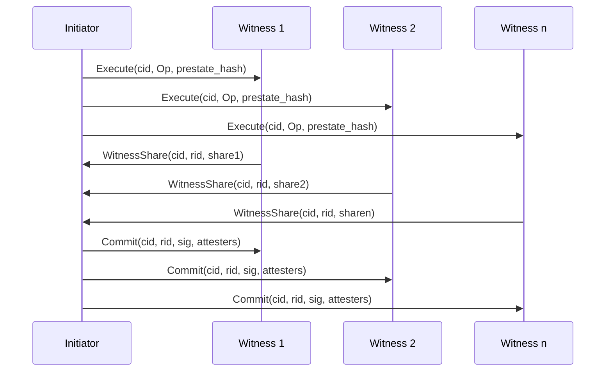

# Aura Consensus

Aura consensus is designed for small groups that communicate peer-to-peer with intermittent connectivity. Each context defines a stable committee of witnesses, although individual members may be offline at any time. The committee is used only when a specific decision requires strong agreement.

Aura targets agreement on single operations inside a context. Most state evolves through CRDT merges that require no coordination. A small set of operations cannot be merged safely, for example changes to account authority. These operations run inside a context with a fixed witness group that shares threshold key material.

The protocol gives the initiator of an operation a one round trip decision path in the good case. All honest witnesses finalize after an additional commit broadcast. The system does not maintain a global ordered log. It only agrees on commit facts for operations that require strong coordination.

## Consensus as Fact Emission

Aura treats consensus as production of a single commit fact. A commit fact is an immutable value added to a CRDT replica store. The replica store is convergent under merge.

```rust
struct CommitFact {
    cid: ConsensusId,
    rid: ResultId,          // result id = H(operation, prestate)
    threshold_signature: ThresholdSignature,
    attester_set: BTreeSet<DeviceId>,
}
```

This structure records the consensus instance identifier, the deterministic result identifier, the threshold signature, and the set of attesting witnesses. Consensus safety reduces to agreement on which `CommitFact` exists for a given `cid`. Every peer merges this fact into its replica store. Once a threshold signed commit fact exists, it is final and stable under CRDT merges.

## Fast Path

The fast path is a single shot threshold signing protocol coordinated by an initiator. The initiator sends a proposal to all witnesses. Witnesses validate the pre state and execute the operation deterministically. Each witness produces a signature share on the resulting `rid`. The initiator collects shares, forms a threshold signature, writes a commit fact, and broadcasts a commit message.

The initiator decides when it has collected enough matching shares to form a threshold signature. Honest witnesses decide when they receive and verify the commit. In a synchronous period with an honest initiator and agreement on pre state, the initiator decides in one round trip. Witnesses decide after an additional one way commit broadcast. This corresponds to three message steps among all parties.

**Messages**

* `Execute(cid, Op, prestate_hash, evidΔ)`
* `WitnessShare(cid, rid, share, prestate_hash, evidΔ)`
* `Commit(cid, rid, sig, attesters, evidΔ)`

Assume witness set `W`, threshold `t`, and fallback timeout `T_fallback`.

**Initiator**

The initiator reads the pre state, proposes an operation with its pre state hash, collects witness shares, and decides when it can form a valid threshold signature. It then emits a commit fact and broadcasts a commit message that lets other witnesses finalize.


```haskell
-- Initiator i

State:
  cid      := fresh_consensus_id()
  Op       := input operation
  shares   := {}                  -- witness_id -> (rid, share)
  decided  := {}                  -- decided[cid] = Bool, initially false

1. Start:
    prestate := ReadState()
    prestate_hash := H(prestate)
    For all w in W:
        Send Execute(cid, Op, prestate_hash, EvidenceDelta(cid)) to w

2. On WitnessShare(cid, rid, share, prestate_hash, evidΔ) from w:
    MergeEvidence(cid, evidΔ)
    If decided[cid] = false and w not in shares:
        shares[w] := (rid, share)
        H := { (w', s') in shares | s'.rid = rid }
        If |H| ≥ t:
            sig := CombineShares({ s'.share | (_, s') in H })
            attesters := { w' | (w', _) in H }
            CommitFact(cid, rid, sig, attesters)
            For all v in W:
                Send Commit(cid, rid, sig, attesters, EvidenceDelta(cid)) to v
            decided[cid] := true

3. On Commit(cid, rid, sig, attesters, evidΔ):
    If decided[cid] = false and VerifyThresholdSig(rid, sig, attesters):
        MergeEvidence(cid, evidΔ)
        CommitFact(cid, rid, sig, attesters)
        decided[cid] := true
```


**Witness**

A witness verifies that its local pre state matches the hash, computes a deterministic result identifier, signs it, and starts a fallback timer. If it later receives a valid commit, it finalizes the commit fact and stops the timer. If the timer expires without a commit, it moves into the fallback protocol.

```haskell
-- Witness w

State:
  proposals := {}                 -- rid -> set(w, share, prestate_hash)
  decided   := {}                 -- decided[cid] = Bool
  timers    := {}                 -- timers[cid]

1. On Execute(cid, Op, prestate_hash, evidΔ) from i:
    MergeEvidence(cid, evidΔ)
    If decided[cid] = false:
        prestate := ReadState()
        If H(prestate) != prestate_hash:
            -- Explicitly notify initiator and participate in fallback
            Send StateMismatch(cid, prestate_hash, H(prestate), EvidenceDelta(cid)) to i
            StartTimer(cid, T_fallback)
            return

        rid := H(Op, prestate)
        share := ProduceShare(cid, rid)

        proposals[rid] := { (w, share, prestate_hash) }
        Send WitnessShare(cid, rid, share, prestate_hash, EvidenceDelta(cid)) to i
        StartTimer(cid, T_fallback)

2. On Commit(cid, rid, sig, attesters, evidΔ):
    If decided[cid] = false and VerifyThresholdSig(rid, sig, attesters):
        MergeEvidence(cid, evidΔ)
        CommitFact(cid, rid, sig, attesters)
        decided[cid] := true
        StopTimer(cid)

3. OnTimer(cid, T_fallback):
    If decided[cid] = false:
        periodic.Start(cid)
```

### Fast Path Sequence

The initiator broadcasts `Execute`, collects `WitnessShare` messages from a threshold of witnesses, builds a threshold signature, and broadcasts `Commit`. The initiator can decide after it forms `sig`. Each witness decides after it verifies `Commit`.



## Evidence Propagation

Evidence is a CRDT keyed by `cid`. It tracks the final attesters and signature once known. It merges monotonically. A commit fact is always inserted under a monotonic rule. Once a threshold signature appears for `cid`, it is never replaced.

Every message that participates in a consensus instance carries an evidence delta. The session protocol is structured so that these deltas follow the communication pattern. Peers merge evidence on send and receive. Peers that reconnect after being offline converge automatically.

```haskell
EvidenceDelta(cid):
    return CRDT_Delta_for(cid)

MergeEvidence(cid, evidΔ):
    CRDT_Merge(cid, evidΔ)
```

This interface exposes evidence as a per consensus instance CRDT. `EvidenceDelta` returns a delta for a given `cid`. `MergeEvidence` merges an incoming delta into local state. This makes commit evidence durable and convergent even under partitions and reconnection.

## Fallback

Fallback runs when witnesses disagree on the result identifier, disagree on the pre state hash, or when the initiator fails to produce a commit in time. Each witness forms proposals keyed by `(rid, prestate_hash)`. Each proposal contains its own signature share.

Witnesses exchange proposal maps over a sparse overlay. Each witness merges incoming maps and checks for equivocation. Equivocation is defined as a witness producing two shares for the same `cid` and `prestate_hash` but different `rid`. When any proposal accumulates `t` valid and non equivocating shares, the witness produces a threshold signature and broadcasts a `ThresholdComplete` message. All witnesses accept the first valid threshold signature they see.

**Messages**

* `Conflict(cid, proposals, evidΔ)`
* `AggregateShare(cid, proposals, evidΔ)`
* `ThresholdComplete(cid, rid, sig, attesters, evidΔ)`
* `StateMismatch(cid, expected_hash, actual_hash, evidΔ)`

**Initiator**

The initiator can trigger fallback early when it observes conflict in shares. It packages conflicting proposals and sends them to all witnesses along with the current evidence delta.

```haskell
-- Initiator i (trigger)

1. On detecting conflicting rids or prestate_hashes in shares for cid:
    conflicts := proposals extracted from received shares
    For all w in W:
        Send Conflict(cid, conflicts, EvidenceDelta(cid)) to w
```

**Witness**

Witnesses maintain proposal sets, merge them through gossip, and produce a threshold signature once any candidate reaches `t` non equivocating shares. The first valid `ThresholdComplete` defines the committed result. Evidence and commit facts are propagated as CRDTs, which keeps state convergent.

```haskell
-- Witness w (fallback)

State:
  proposals := {}                -- (rid, prestate_hash) -> set(w, share)
  decided   := {}                -- decided[cid]
  k         := 3                 -- fanout
  periodic  := per-cid periodic timers

1. On Conflict(cid, conflicts, evidΔ):
    MergeEvidence(cid, evidΔ)
    merge conflicts into proposals
    CheckThreshold(cid)
    periodic.Start(cid)

2. On AggregateShare(cid, proposals', evidΔ):
    MergeEvidence(cid, evidΔ)
    For each entry (rid, pre_hash) with set S':
        For each (w', sh') in S':
            If not HasEquivocated(proposals, w', cid, pre_hash):
                proposals[(rid, pre_hash)] := proposals[(rid, pre_hash)] ∪ { (w', sh') }
    CheckThreshold(cid)

3. CheckThreshold(cid):
    For each (rid, pre_hash) in proposals:
        S := proposals[(rid, pre_hash)]
        If decided[cid] = false and |S| ≥ t:
            sig := CombineShares({ sh | (_, sh) in S })
            If VerifyThresholdSig(rid, sig):
                attesters := { w | (w, _) in S }
                CommitFact(cid, rid, sig, attesters)
                For all v in W:
                    Send ThresholdComplete(cid, rid, sig, attesters, EvidenceDelta(cid)) to v
                decided[cid] := true
                periodic.Stop(cid)

4. On ThresholdComplete(cid, rid, sig, attesters, evidΔ):
    If decided[cid] = false and VerifyThresholdSig(rid, sig, attesters):
        MergeEvidence(cid, evidΔ)
        CommitFact(cid, rid, sig, attesters)
        decided[cid] := true
        periodic.Stop(cid)

5. On periodic tick for cid and decided[cid] = false:
    peers := SampleRandomSubset(W \ {w}, k)
    For each p in peers:
        Send AggregateShare(cid, proposals, EvidenceDelta(cid)) to p

HasEquivocated(proposals, witness, cid, pre_hash):
    Return true if witness has produced two shares for same cid and same pre_hash but different rid
    Otherwise false
```

## Properties

Aura runs a single shot consensus instance inside a context scoped group with shared threshold key material. The initiator first attempts a fast path. It sends `Execute`, witnesses verify the pre state, compute a deterministic `rid`, and return shares. If the initiator collects `t` matching shares it produces a threshold signature and commits. If witnesses disagree on the `rid` or the initiator fails, witnesses switch to a leaderless fallback. They gossip proposal maps until some witness sees `t` non equivocating shares and produces a threshold signature.

The protocol assumes partial synchrony with a global stabilization time `GST`. After `GST`, every message between honest peers arrives within delay `Δ`. Honest parties only finalize after verifying a valid threshold signature. The adversary controls fewer than `t` key shares. Each honest witness signs at most one `(cid, rid, prestate_hash)` triple.

### Liveness in the Fast Path

If all honest witnesses compute the same `rid = H(Op, prestate)` and the initiator is honest, the fast path completes in a bounded number of message delays. The initiator decides after one round trip. Honest witnesses decide after the commit broadcast.

This property describes the common case behavior that gives initiators low latency. It does not claim fewer than three message steps among all parties. It only specifies decision points for the initiator and witnesses under the model assumptions.

### Eventual Liveness in Fallback

If witnesses disagree on the result identifier or the initiator stalls, fallback gossip ensures eventual completion whenever `t` honest witnesses eventually become connected. Honest shares for a fixed `(rid, prestate_hash)` diffuse by epidemic gossip.

This property relies on the random overlay induced by the `AggregateShare` fanout. If the connected component of honest witnesses remains connected for long enough, some honest witness eventually gathers `t` non equivocating shares. That witness produces a threshold signature and broadcasts `ThresholdComplete`. All honest parties that receive and verify `ThresholdComplete` eventually finalize.

### Agreement

Two different result identifiers cannot both be finalized for the same `cid`. Producing a threshold signature requires at least `t` valid shares. Each honest witness produces at most one share per `(cid, prestate_hash)`. Fallback rejects equivocation when it detects multiple shares from the same witness under the same pre state hash.

This implies that two different result identifiers would require two disjoint sets of honest signers. This is impossible when honest witnesses follow the rule that they sign at most one candidate per instance and pre state hash. Therefore at most one threshold signature can exist for a given `(cid, prestate_hash)`.

### Validity

Finalized results correspond to deterministic execution of the intended operation on a consistent pre state. Honest witnesses sign only after verifying the pre state hash and executing the operation deterministically.

A valid threshold signature includes at least one honest share because the adversary controls fewer than `t` key shares. Therefore any finalized `rid` equals `H(Op, prestate)` for some honest execution. This connects the abstract result identifier to a concrete deterministic computation.

## Comparison

CRDTs provide eventual consistency and high availability for the majority of operations. They do not provide atomic agreement for updates that must not be merged independently. Aura invokes consensus only for those updates. The rest of the system can operate offline and converge via CRDT merge.

Threshold signing systems provide strong atomicity for a single chosen value. They often assume fixed participants and reliable communication patterns. Aura adds a concrete protocol around threshold signatures. It includes evidence propagation as a CRDT, a fast path with an initiator, a leaderless fallback, and explicit handling of equivocation and reconnection.

Classical consensus protocols for ordered logs provide a total order of operations across a fixed or slowly changing committee. They require continuous coordination and view changes. Aura does not maintain a total order. It focuses on single shot agreement inside scoped contexts and uses threshold signatures to produce compact, composable commit facts.

## Summary

Aura consensus uses an initiator for low latency decision in the common case and a leaderless gossip protocol for fallback. It relies on local timers and partial synchrony assumptions. It scopes consensus to a context level witness group and a single operation per instance.

The protocol integrates CRDT based state, threshold signatures, and session style message flows. Aura's novelty is the combination of context scoped single shot consensus, CRDT based evidence and commit facts, and a threshold signature based fast path with a gossip based fallback. This design provides strong agreement when required while keeping most of the system available and convergent through CRDT merges.

## See Also

- [Consensus](../104_consensus.md) - Full consensus specification and implementation
- [Journal](../102_journal.md) - CRDT fact stores and deterministic reduction
- [Relational Contexts](../103_relational_contexts.md) - Context scoped witness groups
- [System Architecture](../001_system_architecture.md) - Integration with choreographic protocols
- [Distributed Systems Contract](../004_distributed_systems_contract.md) - Safety and liveness guarantees
