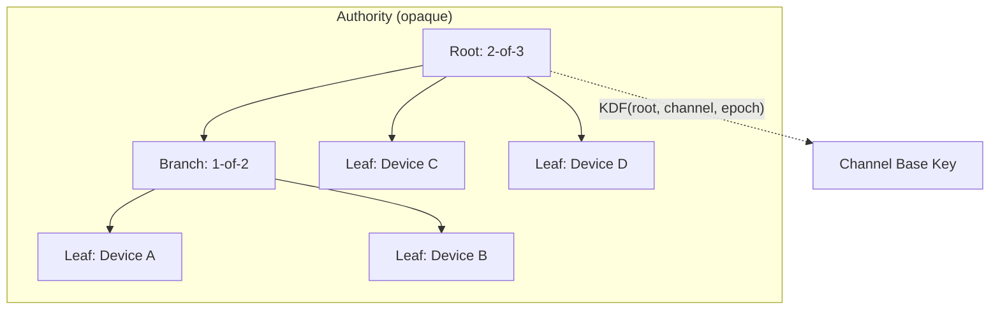
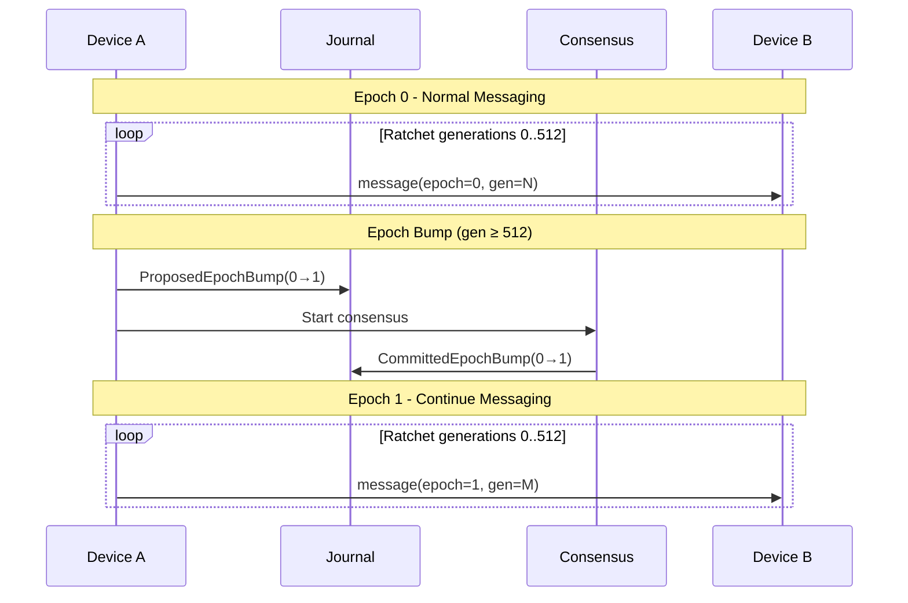

# Recoverable Ratchets

The design of secure messaging protocols like MLS and TreeKEM typically focuses on cryptographic properties, key agreement, forward secrecy, post-compromise security.  distributed systems problem underneath.

In Aura, both state and identity are distributed. Multiple devices form a single authority. Facts replicate across nodes via CRDT journals. There is no central ordering service. This changes the problem. We need messaging with explicit safety, liveness, and partition tolerance properties.

The Aura Messaging Protocol (AMP) brings a distributed systems lens to secure messaging. It provides the same cryptographic guarantees as TreeKEM-based protocols while supporting deterministic recovery from replicated state alone. See the [protocol specification](../112_amp.md) for complete technical details and the [comparison section](#comparison-with-existing-protocols) for how AMP differs from MLS and Keyhive.

## Requirements

Aura's architecture imposes constraints that existing messaging protocols cannot satisfy.

**Deterministic Recovery**

Aura guarantees social recovery. Users must be able to reconstruct their identity from the network after catastrophic device loss. All ratchet state must be deterministically derivable from replicated facts.

The journal is the only durable state. Secrets derive from reduced journal state combined with authority keys. No device may maintain ratchet state that cannot be recovered by other devices in the authority.

**Multi-Device Authorities**

An authority may contain multiple devices acting as a single opaque identity. External parties cannot observe which device sent a message. Devices can join or leave without visible membership changes.

The protocol must support concurrent message sends from different devices within the same authority. All devices must converge to the same ratchet position after merging facts.

**Selective Consistency**

Some operations require eventual consistency. Others require strong agreement. The protocol must support both models and apply each where appropriate.

Message sends must tolerate concurrent activity and out-of-order delivery. Epoch transitions must produce a linear chain with no forks. The protocol cannot assume a central ordering service.

**Expressive Authorization**

Every message send must pass a guard before reaching the network. The guard chain enforces the authorization of capabilities and measurement of information flow budgets.

These checks must integrate into the key derivation path. Authorization failure must prevent key derivation and budget accounting operations must be atomic with message sends.

## Architectural Overview

AMP combines a three-level key hierarchy, CRDT-based state management, and a dual window ratchet to achieve its design goals.

### Key Hierarchy

Despite the title, AMP does, in fact, use a tree, just not for ratcheting. The commitment tree defines Aura's authority structure and threshold policies. In contrast, TreeKEM protocols use binary trees for key distribution, where ratchet state derives from tree path updates. AMP separates these concerns: the tree handles identity, while a linear ratchet handles message keys.

AMP separates key evolution across three levels:

1. Authority epochs - Rotate threshold key shares via DKG ceremony. This provides identity-level post-compromise security approximately daily or upon confirmed compromise.

2. Channel epochs - Rotate channel base keys via consensus-finalized bumps. This provides channel-level post-compromise security after roughly 512 messages or upon detected anomalies.

3. Ratchet generations - Derive per-message keys from the channel base key. This provides bounded forward secrecy within a skip window of 1024 generations.

The commitment tree defines authority structure and allows for key derivation. Each authority maintains an internal tree, concealed from external parties. The channel base key derives from the tree root, channel identifier, and epoch.

Branch nodes define threshold policies. Leaf nodes hold device signing shares. External parties see only the root commitment. Key derivation uses the root to produce channel base keys.

### State and Consistency

This is where the distributed systems perspective becomes concrete. Journals store all authoritative state as monotone facts, including the channel checkpoints that anchor ratchet windows. The protocol must remain safe under network partitions and live under partial connectivity.

AMP achieves this through selective consistency. Message sends use CRDT merge for availability during partitions. Epoch bumps require consensus for linearizable agreement. The dual window ratchet bridges these modes by accepting messages from both current and previous epochs during transitions.

### Dual Ratchet

The dual ratchet provides continuous coverage of 2W generations. Every checkpoint defines two consecutive windows. Window `A` spans generations `G` to `G+W`. Window `B` spans `G+W+1` to `G+2W`. Messages may arrive out of order by up to W generations without head-of-line blocking. During epoch transitions, both old and new epochs remain valid within their respective windows.

Before sending, a device merges the latest journal facts and reduces to the current channel state. It derives the message key from the channel base key, generation, and direction. The message header contains the context, channel, epoch, and generation. This header serves as additional authenticated data for AEAD encryption.

### Security Properties

The protocol provides bounded forward secrecy and strong post-compromise security. Forward secrecy is bounded by the skip window. An attacker who compromises a device learns at most W future message keys within the current epoch. Post-compromise security restores confidentiality through epoch bumps. Channel bumps heal channel-level compromise. Authority bumps heal identity-level compromise by rotating threshold key shares.

### Trade-offs

AMP trades per-message forward secrecy for deterministic recovery. Traditional double ratchets delete keys immediately after use. AMP must be able to rederive keys within the skip window to support recovery from journal state alone.

Epoch transitions favor safety over liveness. Consensus must finalize a bump before the new epoch becomes canonical. The dual window design mitigates liveness failure up to a point by accepting messages from both the current and previous windows during transitions.

### Epoch Lifecycle

Messages advance the ratchet generation within each epoch. When the spacing rule is satisfied, a device proposes an epoch bump. Consensus finalizes the bump and messaging continues under the new epoch with a fresh base key.

### Recovery

Recovery is fully deterministic. A device that loses all local state can recover by loading the journal, reducing to the current epoch and checkpoint, and rederiving all keys. No coordination or retained mutable snapshots are required.

## Comparison with Existing Protocols

Several protocols address secure group messaging in decentralized settings. MLS and its decentralized variants focus on TreeKEM-based key agreement. Keyhive adapts TreeKEM for CRDT-based coordination. These are excellent protocols with different trade-offs.

The key difference is how each handles the distributed systems problem. MLS delegates ordering to a Delivery Service. Keyhive uses eventual consistency everywhere. Neither provides the selective consistency that Aura requires for both concurrent messaging and linearizable epoch transitions.

### MLS

MLS requires a Delivery Service to enforce strict commit ordering. Members must process commits in sequence before using new epoch keys. This creates head-of-line blocking incompatible with concurrent multi-device sends.

Decentralized MLS relaxes ordering requirements by retaining key material for out-of-order processing. This degrades forward secrecy during fork retention. Fork resolution is delegated to the application layer rather than built into the protocol.

Both protocols derive ratchet state from processing history. Recovery requires retained epoch snapshots or puncture sets. Pure reduction from replicated facts is not possible without storing all intermediate states.

### BeeKEM

Keyhive uses BeeKEM, a decentralized TreeKEM variant. It tolerates concurrent updates through conflict keys that persist until pruned. The protocol provides eventual consistency for all operations.

Eventual consistency cannot enforce linear epoch chains. Concurrent epoch proposals would create forks requiring application-level resolution. Epoch linearity is important for Aura because key rotation requires all participants to agree on the new key material before use. Aura's consensus-finalized bumps ensure exactly one committed bump per parent epoch.

Keyhive has a simple fixed authorization model with read, write, admin, and pull permissions. Aura requires arbitrary capabilities that can be attenuated and delegated.

### Why AMP?

Aura's recovery system requires pure reduction from facts. Existing protocols derive state from processing history with deleted intermediates. Retrofitting recovery would require storing all intermediate states or accepting that recovery loses message history.

MLS requires strict ordering. Keyhive provides only eventual consistency. AMP applies each consistency model where appropriate.

Existing protocols do not provide hooks for authorization checks before key derivation.

TreeKEM protocols expose group structure through tree operations. AMP derives keys from authority-scoped roots that hide internal device structure.

| Requirement | MLS | Keyhive | AMP |
|-------------|-----|---------|-----|
| Pure recovery from facts | No | Partial | Yes |
| Linear epoch chain | Via DS | No | Via consensus |
| Concurrent sends | No | Yes | Yes |
| Extensible authorization | No | No | Yes |
| Opaque authority | No | No | Yes |

## Conclusion

Secure messaging is usually framed as a cryptographic problem. AMP reframes it as a distributed systems problem where both state and identity are replicated across nodes with no central coordinator.

The protocol demonstrates that deterministic recovery and post-compromise security are compatible. This requires explicit choices about safety, liveness, and partition tolerance at each layer. Message sends favor availability. Epoch transitions favor consistency. The dual window ratchet provides bounded forward secrecy while remaining fully recoverable from journal state.

MLS assumes ordered delivery. Keyhive assumes eventual consistency everywhere. AMP applies each consistency model where the distributed systems requirements demand it.

## See Also

- [Aura Messaging Protocol Specification](../112_amp.md) for complete technical details
- [System Architecture](../001_system_architecture.md) for broader system context
- [Accounts and Commitment Tree](../101_accounts_and_commitment_tree.md) for tree operation details
- [Journal System](../102_journal.md) for CRDT journal mechanics
