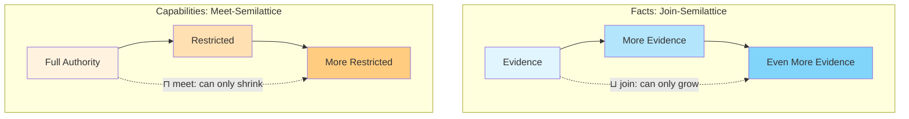
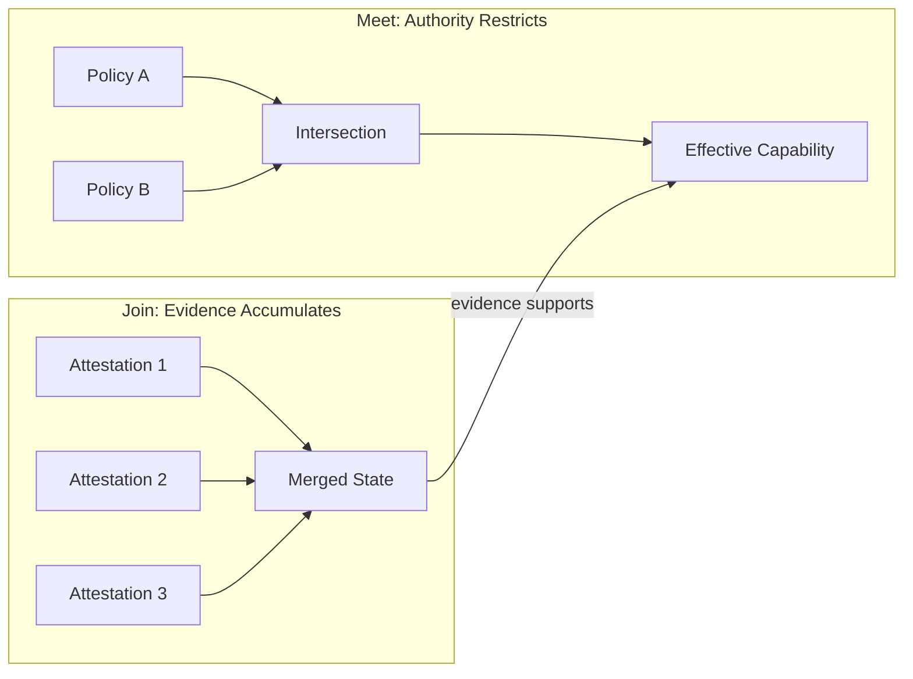
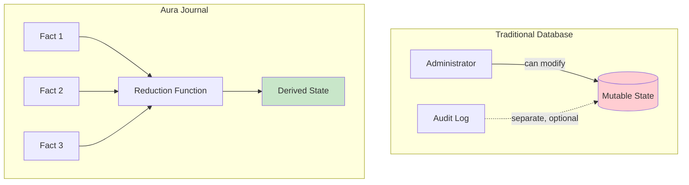
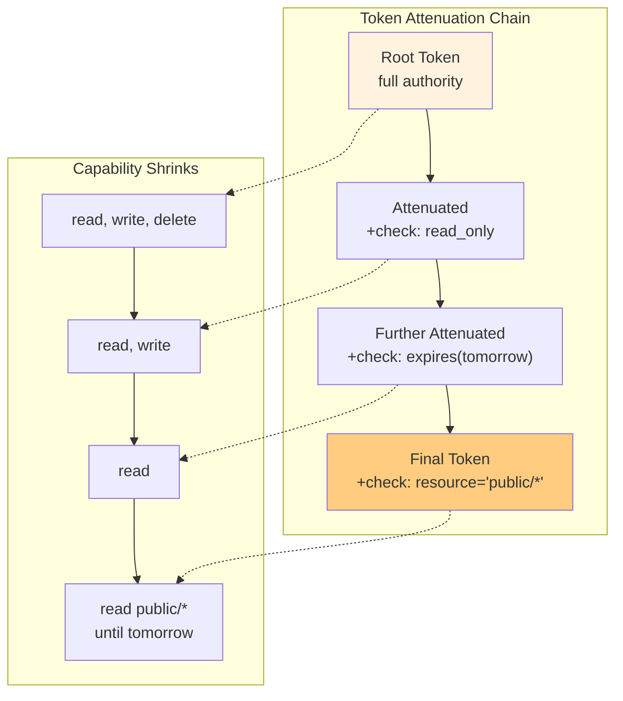
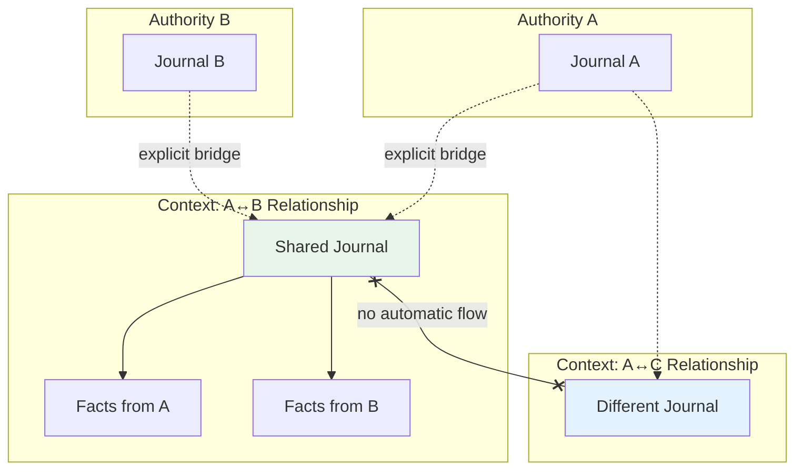
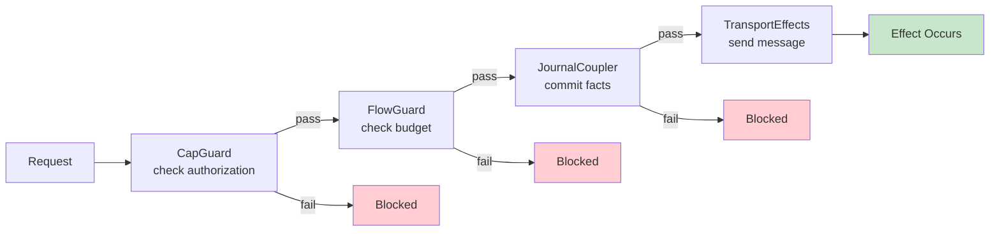
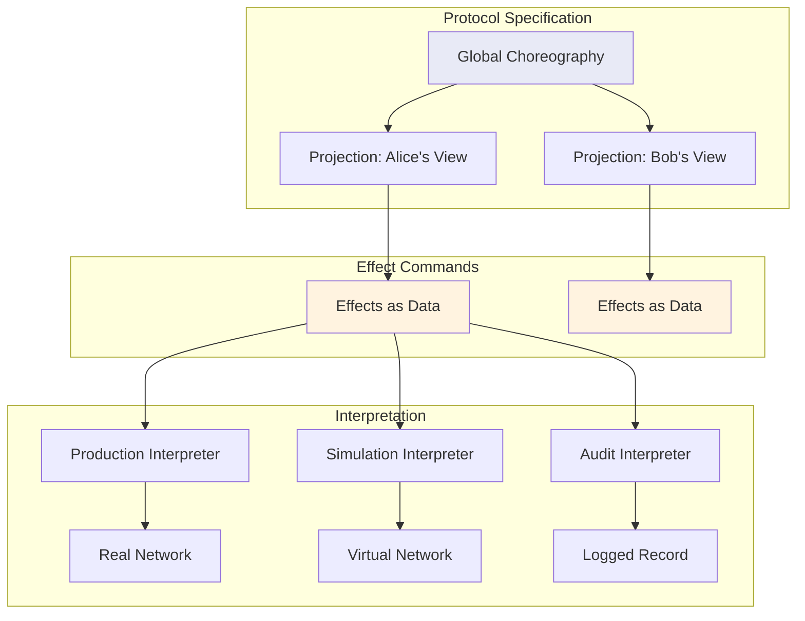
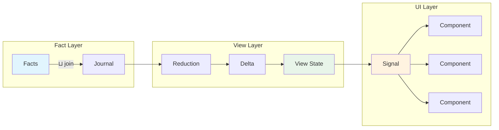
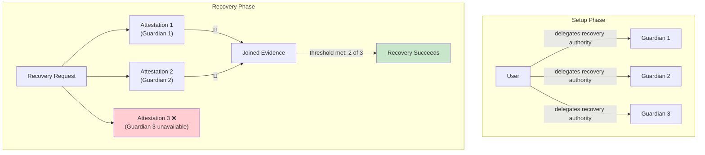
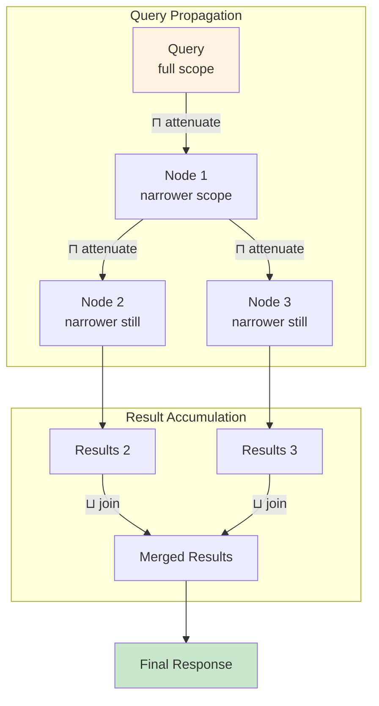

# The Shape of Agreement

When you agree to something in the physical world, that agreement has structure. You can add conditions. You can narrow the scope. You can delegate to someone else, but only what you yourself were given. What you cannot do is unilaterally expand what was agreed to. You cannot grant yourself permissions you were never offered.

This asymmetry is not arbitrary. It reflects something fundamental about how consent works. Consent flows downward and outward. It can be refined, partitioned, and passed along. But it cannot be inflated or reversed without returning to the source.

Digital systems have mostly ignored this structure. Permissions are stored in databases controlled by administrators. Someone with root access can change anything. Terms of service grant platforms the right to modify agreements unilaterally. Your identity is a row in someone else's table.

This is not a technical limitation. It is a design choice. And it is the wrong choice if what we want is genuine self-determination in networked spaces.

There is a branch of mathematics that captures the structure of consent precisely. It is called lattice theory. The specific structures we need are semilattices. They provide operations that can only move in one direction. Some things can only grow. Other things can only shrink. These constraints are not bugs. They are the formal expression of how agreement actually works.

Aura is built on this foundation. The entire system, from how we store state to how we authorize actions to how we propagate updates to user interfaces, respects semilattice semantics. This is not an optimization or an implementation detail. It is the core architectural commitment that makes everything else possible.

## Two Directions

A semilattice is a set with a binary operation that is associative, commutative, and idempotent. That sounds abstract but the intuition is simple. There is a way to combine any two elements that always produces a consistent result regardless of order. And combining something with itself changes nothing.

There are two kinds of semilattice. A join-semilattice has an operation that finds the least upper bound of two elements. Think of it as combining information. If you know A and I know B, together we know the combination of A and B. Information only accumulates. It never disappears.

A meet-semilattice has an operation that finds the greatest lower bound. Think of it as intersecting permissions. If you can do A and I can do B, what we can do together is only what falls within both A and B. Authority only restricts. It never expands.

Aura uses both structures simultaneously. Facts about the world live in a join-semilattice. They accumulate over time. You cannot delete a fact. You can add a new fact that supersedes it, but the original record remains. History is append-only.

Capabilities live in a meet-semilattice. When you delegate authority to someone else, you can only give them a subset of what you have. When multiple authority sources combine, the result is their intersection. No one can possess more authority than what was granted to them.

These two structures work together. Facts provide evidence of what has been agreed to. Capabilities determine what actions that evidence permits. The join-semilattice ensures the evidentiary record is tamper-proof. The meet-semilattice ensures authority cannot be manufactured.

## The Journal as Constitutional Record

Traditional databases store state directly. If you want to know the current balance of an account, you read a number from a row. If you want to change it, you update that row. The history of how you got there is separate, stored in logs that might or might not exist and might or might not be complete.

This design gives enormous power to whoever controls the database. They can change the present state. They can modify or delete the historical record. The "truth" is whatever the database says right now.

Aura does not have a database in this sense. It has a journal. The journal stores facts. Each fact is a signed, timestamped assertion about something that happened. The current state of any entity is computed by reducing the relevant facts according to deterministic rules.

This inversion matters. The journal is the source of truth. State is derived. If you want to know why an account has a particular configuration, you can trace it back through the facts that produced it. The reduction function is public and verifiable. Anyone with the same facts will compute the same state.

Facts in the journal form a join-semilattice. The merge operation is set union. If two replicas of the journal have different facts, merging them produces a journal with all facts from both. This is why distributed replicas converge. Any two nodes that eventually exchange their facts will eventually agree on state. No coordination protocol is needed beyond gossip.

The journal also provides auditability by construction. Every current state has a proof trail. You cannot arrive at a configuration without the facts that justify it. This is not a feature bolted on after the fact. It is an intrinsic property of deriving state from an append-only log.

## Authorization as Logic

Most authorization systems work by looking up permissions in a table. Does user X have permission Y on resource Z? Check the access control list. If the entry exists, allow. If not, deny.

This approach has several problems. The table is controlled by someone. That someone can add or remove entries at will. The basis for any given permission is opaque. Why does X have access to Z? Because there is a row that says so. Where did that row come from? You would have to dig through audit logs, assuming they exist.

Aura uses a different model based on Biscuit tokens. A Biscuit is a cryptographically signed capability that carries its own authorization logic. It uses Datalog, a logic programming language, to express what the bearer is allowed to do.

When you create a Biscuit, you embed facts and rules that define a set of capabilities. When you delegate to someone else, you attenuate the token by adding checks. Each check is an additional constraint that must be satisfied. Checks can only narrow what is permitted. They cannot expand it.

This is the meet-semilattice in action. Delegation is intersection. If your token says you can read and write, and you delegate with a check that restricts to read-only, the recipient can only read. They cannot remove your check because the token is cryptographically sealed. They can only add more checks of their own.

Authorization becomes a logical derivation rather than a table lookup. Given the facts embedded in the token, the facts known to the verifier, and the rules in play, can we derive that this action is permitted? The proof is the derivation itself. It can be inspected. It can be reproduced.

The same Datalog engine that evaluates authorization also powers queries against the journal. This is not a coincidence. Both are asking the same fundamental question: given the evidence, what can we conclude? Authorization asks whether an action is permitted. Queries ask what information is accessible. The mechanism is identical.

## Context as Jurisdiction

Every relationship you have is different. What you share with your doctor is not what you share with your employer. What you discuss with close friends is not what you post publicly. These boundaries are not just preferences. They are constitutive of the relationships themselves.

Most digital systems collapse these distinctions. Your identity on a platform is singular. Your data lives in one place governed by one set of rules. The platform decides how much separation to offer, and that decision can change at any time.

Aura models relationships through contexts. A context is a separate namespace with its own journal, its own facts, and its own capability frontier. What happens in one context does not automatically flow to another. Cross-context information transfer requires an explicit protocol that both sides have agreed to.

Contexts are identified by opaque UUIDs. The identifier reveals nothing about who participates or what the context is for. From the outside, a context is a black box. This is deliberate. The existence of a relationship should not leak to parties outside that relationship.

Inside a context, the usual lattice rules apply. Facts accumulate. Capabilities attenuate. But the boundary of the context acts as a jurisdictional border. The rules of one context do not govern another. Authorities in one context have no automatic standing in another.

This maps to how sovereignty works in the physical world. A nation has authority within its borders. That authority does not automatically extend beyond them. Relations across borders require treaties and protocols that both sides accept. Contexts provide the same structure for digital relationships.

## The Guard Chain

Having the right structure for consent is not enough. The structure must be enforced. Every operation that could produce an observable effect must pass through a series of checks that verify it respects the lattice constraints.

In Aura this enforcement happens through a guard chain. Every message sent, every fact committed, every query executed flows through a sequence of guards. Each guard checks one aspect of the operation. If any guard fails, the operation is blocked and produces no effect.

The first guard checks capabilities. Does the entity attempting this action have sufficient authority? This is where Biscuit tokens are verified. The Datalog rules are evaluated. If the action's requirements exceed the caller's capabilities, the guard fails.

The second guard checks flow budgets. Every context has a budget for how much activity it permits. Each operation has a cost. The guard verifies that the budget has room for this cost and charges it. This prevents spam and abuse while also limiting how much information can leak from a context over time.

The third guard couples the operation to the journal. Before an effect can occur, the facts justifying it must be committed. This ensures that the evidentiary record always stays ahead of the actions it authorizes. You cannot take an action without first creating the audit trail.

Only after all guards pass does the actual effect happen. A message gets sent. A state change propagates. The response returns to the caller.

This architecture has a critical property. Guards do not perform effects themselves. They evaluate conditions and produce commands. A separate interpreter executes those commands. This separation allows the same guard logic to run in production, in simulation, and in tests. The enforcement is identical across environments.

## Effects as Values

Programs traditionally have side effects. They read from files. They send network messages. They query databases. These effects happen as the program runs. They interleave with computation in ways that can be difficult to reason about or predict.

Algebraic effects take a different approach. Instead of performing effects directly, programs produce descriptions of effects. These descriptions are values. They can be inspected, combined, and transformed. A separate runtime interprets the descriptions and actually performs the effects.

This might sound like unnecessary indirection but it provides something important. The program becomes a specification of what should happen. The interpreter decides how to make it happen. Different interpreters can give the same specification different meanings.

Aura uses this pattern throughout. When a protocol wants to send a message, it does not call a send function that immediately transmits bytes. It produces a SendEnvelope command that describes what should be sent. The guard chain evaluates whether the command is permitted. If so, an effect interpreter performs the actual send.

This enables simulation. The same protocol code that runs in production can run against a simulated network with virtual time and controlled failures. The interpreter changes. The protocol does not. Tests run deterministically because the interpreter controls all sources of non-determinism.

It also enables auditability. Since effects are values, they can be logged before execution. The audit trail captures not just what happened but the full specification of what was intended to happen. Discrepancies between specification and outcome become detectable.

Choreographies specify multi-party protocols as global types that describe the interaction from a bird's-eye view. Projection extracts each participant's local view from the global specification. The local views are session types that guarantee communication safety and progress. The effect system interprets these session types into actual network operations.

The lattice structure extends to effects. Capability checks are meet operations on what is permitted. Fact commits are join operations on the evidentiary record. The effect interpreter respects these operations. An effect that would violate the lattice constraints is not executed.

## Reactive Propagation

User interfaces need to stay synchronized with underlying state. When facts change, views should update. This is the classic problem of reactive programming.

One approach is polling. The UI periodically checks whether anything has changed. This is wasteful and introduces latency. Another approach is manual notification. Code that changes state explicitly triggers updates. This is error-prone and creates coupling between unrelated parts of the system.

Aura uses functional reactive programming built on the same lattice foundations as everything else. Signals represent time-varying values. When the underlying value changes, dependents are automatically notified. The propagation follows the dataflow graph.

Signals themselves form a join-semilattice. Updates only move forward. A signal cannot revert to a previous value without going through an explicit state transition that is itself recorded. The monotonicity of the underlying fact journal propagates through to the UI layer.

The pipeline from facts to display has several stages. Facts commit to the journal through the guard chain. The reactive scheduler observes journal changes. Reduction functions compute deltas from new facts. Views apply those deltas to their state. Signal updates propagate to subscribed components. Components re-render.

Each stage preserves the lattice structure. Facts join into the journal. Reductions derive from the joined state. Views update monotonically. The UI is a projection of the fact lattice. What you see on screen is a faithful representation of what has been consented to.

This is not just an implementation convenience. It is architecturally important. If the UI could show state that did not derive from the fact journal, it would break the audit trail. Users could see things that have no evidentiary basis. By making the UI layer respect the same lattice semantics as everything else, we ensure end-to-end coherence.

## Recovery Through Relationships

The structures described so far reach a practical test in account recovery. What happens when a user loses access to all their devices? Traditional systems answer this with a "forgot password" flow that relies on a central authority. You prove your identity to the platform. The platform resets your credentials. Your security depends on the platform's integrity and availability.

Aura has no central authority to appeal to. Recovery must happen through the social graph. Before losing access, a user designates guardians. Each guardian receives a capability to attest that recovery should proceed. The guardians are typically trusted contacts. They might be friends, family members, or colleagues.

Recovery works through the lattice structure. When a user initiates recovery from a new device, they create a recovery request fact. This fact propagates through the network to guardians. Each guardian who approves adds an attestation fact. These facts accumulate in the recovery context's journal.

The attestations form a join-semilattice. Each new attestation increases the evidence supporting recovery. When the evidence crosses a threshold, recovery succeeds. The threshold is set by the original user when designating guardians. Two of three, three of five, or whatever policy reflects their trust relationships.

Guardian capabilities form a meet-semilattice. Each guardian can only attest within the scope of authority they were delegated. A guardian designated for account recovery cannot attest to other operations. The capabilities are specific to the purpose and cannot be expanded.

The combination provides security without centralization. No single guardian can recover your account. No coalition smaller than the threshold can either. The platform operator has no special role. Your identity is secured by the relationships you chose to establish, not by someone else's database.

## Search Without Surveillance

Distributed search is another test case. The goal is to find information across a network of authorities without requiring a central index that sees everything.

In a centralized search engine, queries go to one place that has indexed the entire corpus. The index operator knows what everyone searches for. They know what results people click on. They control ranking. They can censor results. The convenience of search comes at the cost of surveillance and control.

Aura's architecture permits a different design. Search queries are capabilities. They propagate through the network with each hop attenuating what can be learned. Results accumulate as responses flow back.

The outbound propagation uses meet semantics. A search query starts with some scope of what it can ask about. Each relay can narrow that scope. By the time a query reaches distant nodes, it may be restricted to public information that the querier already has standing to access. No node reveals more than the attenuated query permits.

The inbound accumulation uses join semantics. Results from different parts of the network merge into a combined response. The final result is the union of what was found, deduplicated and ranked. Any two paths through the network that eventually exchange results will converge.

Budget constraints prevent abuse. Each query hop costs flow budget. An attacker cannot spray unlimited queries across the network. The same mechanism that prevents spam prevents surveillance. If you cannot send unlimited messages, you cannot scrape unlimited data.

This is a pattern that generalizes. Any distributed operation that accumulates evidence and attenuates authority can be built on the dual lattice. Search is one example. Voting protocols are another. Collective decision-making processes are another. The lattice structure provides correctness guarantees without requiring a trusted coordinator.

## The Lattice as Constitution

Sovereignty requires structure. Who can make rules? How are they changed? What happens in a crisis? These questions need answers that persist across time and survive pressure.

Traditional institutions answer these questions through constitutions. A constitution specifies how authority is organized, how it flows, and what limits apply. It provides stability that particular decisions do not. You can change a law more easily than you can change the constitution that authorizes lawmaking.

Aura's lattice architecture serves a similar function. The semilattice properties are not policies that can be reconfigured. They are structural constraints built into how the system operates. Facts will always join. Capabilities will always meet. The guard chain will always enforce. These are not preferences.

Within this structure there is flexibility. Users choose their guardians. Authorities set their context boundaries. Policies determine thresholds and budgets. These choices happen within the lattice constraints. They do not alter the constraints themselves.

This parallels how constitutional government works. Elections happen within constitutional rules. Legislation happens within constitutional limits. The constitution can be amended but it requires more than ordinary politics. There is a hierarchy of changeability. Some things are meant to be stable so that other things can vary.

The lattice structure provides internal sovereignty. It answers how authority is organized inside the system. The context boundaries provide external sovereignty. They answer how different jurisdictions relate without dominating each other. The guard chain provides accountability. It ensures that actions trace back to their authorization.

These are not metaphors. They are the same functions that political constitutions serve, implemented in protocol design. If network protocols are emerging institutions, then their architecture is constitutional work. Getting the lattice right is how we build institutions that can support genuine self-determination.

## Mathematics as Political Design

There is a view of mathematics as neutral, as merely technical, as separate from values. This view is mistaken. Mathematical structures encode assumptions about what is possible and what matters. Choosing one structure over another is a design decision with consequences.

Aura chooses semilattices because they capture the structure of consent. This is not arbitrary. It is not because semilattices are elegant or efficient, though they can be both. It is because consent fundamentally has the properties that semilattices formalize. Things that only grow. Things that only shrink. Operations that commute and associate. Idempotence. Convergence.

Building a system on these foundations means the system respects these properties by construction. You do not need to trust that administrators will behave correctly. You do not need to audit every code path for violations. The violations are not expressible. The structure prevents them.

This is what it means to make consent real in code. Not consent as a checkbox you click before using a service. Not consent as a legal fiction that platforms invoke. Consent as a mathematical structure that determines what operations are even possible. Consent as algebra.

The vision articulated in discussions of digital sovereignty asks what it would take for networked communities to become political subjects in their own right. To have internal structure that supports self-governance. To have boundaries that others respect. To have accountability that keeps power connected to the people affected by it.

This is an ambitious goal. It requires more than good intentions. It requires architecture that makes self-determination the default rather than the exception. The lattice does not guarantee good outcomes. People will still make choices within the system. Some choices will be better than others. But the lattice ensures that the basic conditions for self-determination are preserved. Authority cannot be manufactured. Evidence cannot be erased. Boundaries cannot be overridden.

These are the prerequisites for any political life worth having. Mathematics provides them. That is why the mathematics matters. That is why consent as algebra is not just a technical curiosity but a foundation for how we might actually live together in networked spaces.
