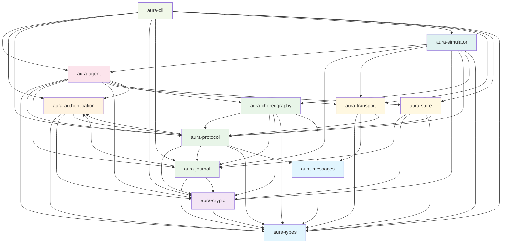

# Aura Crate Dependency Graph and API Reference

This document provides a comprehensive overview of the Aura project's crate structure, dependencies, and exposed APIs.

## Dependency Graph

```mermaid
graph TD
    %% Foundation Layer
    types[aura-types]
    console_types[aura-console-types]
    messages[aura-messages]
    
    %% Cryptography Layer
    crypto[aura-crypto]
    
    %% Authentication Layer
    auth[aura-authentication]
    
    %% Protocol Infrastructure
    journal[aura-journal]
    protocol[aura-protocol]
    choreography[aura-choreography]
    
    %% Storage & Transport
    transport[aura-transport]
    store[aura-store]
    
    %% Application Layer
    agent[aura-agent]
    
    %% Development Tools
    test_utils[aura-test-utils]
    cli[aura-cli]
    
    %% Simulation & Analysis
    aura_quint_api[aura-quint-api]
    simulator[aura-simulator]
    
    %% WASM & Console
    aura_wasm[aura-wasm]
    console[aura-console]
    analysis_client[app-analysis-client]
    live_client[app-live-client]
    sim_client[app-sim-client]
    sim_server[app-sim-server]
    
    %% Dependencies
    messages --> types
    crypto --> types
    auth --> types
    auth --> crypto
    auth --> protocol
    journal --> types
    journal --> crypto
    journal --> auth
    transport --> types
    transport --> messages
    transport --> protocol
    store --> journal
    store --> crypto
    store --> types
    store --> protocol
    protocol --> crypto
    protocol --> journal
    protocol --> types
    protocol --> auth
    protocol --> messages
    choreography --> protocol
    choreography --> journal
    choreography --> crypto
    choreography --> types
    choreography --> messages
    choreography --> simulator
    choreography --> test_utils
    agent --> types
    agent --> protocol
    agent --> journal
    agent --> crypto
    agent --> transport
    agent --> store
    agent --> choreography
    agent --> auth
    test_utils --> agent
    test_utils --> crypto
    test_utils --> journal
    test_utils --> transport
    test_utils --> types
    cli --> agent
    cli --> auth
    cli --> protocol
    cli --> crypto
    cli --> journal
    cli --> simulator
    cli --> transport
    cli --> store
    cli --> types
    simulator --> agent
    simulator --> journal
    simulator --> transport
    simulator --> crypto
    simulator --> protocol
    simulator --> choreography
    simulator --> console_types
    simulator --> types
    simulator --> aura_quint_api
    console --> aura_wasm
    console --> console_types
    analysis_client --> console_types
    analysis_client --> types
    analysis_client --> aura_wasm
    analysis_client --> aura_quint_api
    live_client --> console_types
    live_client --> aura_wasm
    sim_client --> console_types
    sim_client --> aura_wasm
    sim_server --> console_types
    sim_server --> simulator
    
    %% Styling
    classDef foundation fill:#e1f5fe
    classDef crypto fill:#f3e5f5
    classDef auth fill:#fff3e0
    classDef protocol fill:#e8f5e8
    classDef storage fill:#fff8e1
    classDef app fill:#fce4ec
    classDef dev fill:#f1f8e9
    classDef sim fill:#e0f2f1
    classDef wasm fill:#e8eaf6
    
    class types,messages,console_types foundation
    class crypto crypto
    class auth auth
    class journal,protocol,choreography protocol
    class transport,store storage
    class agent app
    class test_utils,cli dev
    class aura_quint_api,simulator sim
    class aura_wasm,console,analysis_client,live_client,sim_client,sim_server wasm
```

## Core Platform Dependency Graph (Production Crates Only)

This simplified view focuses on the core platform crates used in production, excluding development tools, WASM bindings, and console/analysis interfaces.

## Architecture Layers

### Foundation Layer (Blue)
- **aura-types**: Core shared types and identifiers
- **aura-console-types**: Console-specific message types  
- **aura-messages**: Protocol wire format types

### Cryptography Layer (Purple)
- **aura-crypto**: Cryptographic primitives and utilities

### Authentication Layer (Orange)
- **aura-authentication**: Identity verification and signature checking

### Protocol Infrastructure Layer (Green)
- **aura-journal**: CRDT-based state management and event ledger
- **aura-protocol**: Effect system and middleware for protocol operations
- **aura-choreography**: Choreographic protocol implementations using session types

### Storage & Transport Layer (Yellow)
- **aura-transport**: P2P communication abstractions with middleware
- **aura-store**: Encrypted capability-driven storage

### Application Layer (Pink)
- **aura-agent**: High-level agent API with session types

### Development Tools (Light Green)
- **aura-test-utils**: Testing utilities and mocks
- **aura-cli**: Command-line interface
- **aura-macros**: Macro utilities for choreography

### Simulation & Analysis (Teal)
- **aura-quint-api**: Quint formal verification integration
- **aura-simulator**: Deterministic protocol simulation

### WASM & Console (Light Purple)
- **aura-wasm**: WebAssembly bindings
- **aura-console**: Web-based debugging console
- **app-analysis-client**: Analysis and property monitoring
- **app-live-client**: Live network debugging
- **app-sim-client**: Simulation client interface
- **app-sim-server**: Simulation server backend

---

## Crate API Reference

### aura-types
**Purpose**: Core shared types and identifiers for the Aura platform

**Key Exports**:
- **Identifiers**: `AccountId`, `DeviceId`, `SessionId`, `EventId`, `GuardianId`
- **Protocol Types**: `ProtocolType` (Dkd, Counter, Resharing, Locking, Recovery, Compaction), `OperationType`, `ProtocolDuration`, `ProtocolPriority`, `ProtocolMode`
- **Session Types**: `SessionStatus` (Initializing, Active, Waiting, Completed, Failed, Expired, TimedOut, Cancelled), session type primitives
- **Capabilities**: `CapabilityId`, `CapabilityScope`, `CapabilityResource`, `Permission`, `CapabilityExpiration`, `CapabilityToken`
- **Content**: `ContentId`, `ChunkId`, `ManifestId`
- **Peers**: `PeerInfo`, `RelationshipType`, `ContextType`
- **Errors**: `AuraError`, `ErrorCode`, `ErrorSeverity`, `ErrorContext`, `ProtocolError`
- **Encoding**: `ToBase64`, `FromBase64`, `ToHex`, `FromHex`
- **Semilattice**: `JoinSemiLattice`, `MeetSemiLattice`, `Bottom`, `Top`, `MvState` traits

**Dependencies**: None (foundation crate)

**Type Consolidation Notes**:
- `ProtocolType` is the canonical enum used across aura-protocol and domain-specific implementations
- `SessionStatus` is the single source of truth for session lifecycle (unified from aura-simulator and aura-cli)
- `CapabilityToken` provides the lightweight canonical type; domain-specific layers extend as needed
- `Permission` enum supports both canonical variants and Custom(String) for domain-specific permissions

---

### aura-messages
**Purpose**: Protocol wire format message types organized by domain

**Key Exports**:
- **Unified Message**: `AuraMessage` enum (Crypto, Social, Recovery)
- **Crypto Messages**: `CryptoMessage`, `CryptoPayload` (DKD, FROST, resharing)
- **Social Messages**: `SocialMessage`, `SocialPayload` (rendezvous, SSB)
- **Recovery Messages**: `RecoveryMessage`, `RecoveryPayload` (guardian coordination)
- **Common Infrastructure**: Message envelopes, error types, version compatibility
- **SSB Envelope**: `SsbEnvelope` with header and ciphertext

**Dependencies**: `aura-types`

---

### aura-crypto
**Purpose**: Cryptographic primitives and threshold cryptography implementation

**Key Exports**:
- **FROST**: Threshold signatures (`FrostSignature`, `FrostKeyShare`, `KeyShare`)
- **DKD**: Deterministic Key Derivation
- **Encryption**: Ed25519 signatures, HPKE encryption
- **Hash**: Blake3 hashing utilities
- **Effects**: `CryptoEffects` for injectable time/randomness
- **Middleware**: Comprehensive middleware system for crypto operations (security levels, audit logging, hardware integration)

**Dependencies**: `aura-types`

---

### aura-authentication
**Purpose**: Identity verification and signature checking

**Key Exports**:
- **Device Authentication**: Signature verification for device operations
- **Threshold Authentication**: Threshold signature verification
- **Guardian Authentication**: Guardian signature verification
- **Session Authentication**: Session ticket verification
- **Context**: `AuthenticationContext` with public keys and threshold configs
- **Types**: `ThresholdConfig`, `EventAuthorization`
- **Errors**: `AuthenticationError`

**Dependencies**: `aura-types`, `aura-crypto`, `aura-protocol`

---

### aura-journal
**Purpose**: CRDT-based authenticated ledger for account state

**Key Exports**:
- **Core State**: `AccountState`, `AccountLedger`, `Appliable` trait
- **Events**: Protocol event types (threshold-signed operations)
- **Bootstrap**: Account initialization and genesis ceremony
- **Capabilities**: Capability-based authorization system
- **Session Types**: Simple session management for journal operations
- **CRDT Types**: Convergent and Meet semilattice implementations
- **Serialization**: CRDT event serialization utilities
- **Errors**: `JournalError`

**Dependencies**: `aura-types`, `aura-crypto`, `aura-authentication`

---

### aura-protocol
**Purpose**: Unified effect system and middleware architecture for protocol operations

**Key Exports**:
- **Effects**: Core effect traits and implementations (`AuraEffects`, `CryptoEffects`, `TimeEffects`)
- **Handlers**: Effect handler registry and composition
- **Middleware**: Middleware system for effect composition (tracing, metrics, security, caching)
- **Context**: Protocol execution context and infrastructure
- **Types**: Protocol configuration and error types
- **Prelude**: Common imports and utility re-exports

**Dependencies**: `aura-crypto`, `aura-journal`, `aura-types`, `aura-authentication`, `aura-messages`

---

### aura-choreography
**Purpose**: Choreographic protocol implementations using session types for compile-time safety

**Key Exports**:
- **Protocol Implementations**: DKD, FROST, resharing, recovery, and other distributed protocols
- **Session Types**: Session type definitions for compile-time protocol state safety
- **Handlers**: Protocol-specific effect handlers and coordinators
- **Tree-based Coordination**: Tree-structured protocol coordination and consensus
- **Recovery Protocols**: Byzantine fault tolerance and account recovery mechanisms

**Dependencies**: `aura-protocol`, `aura-journal`, `aura-crypto`, `aura-types`, `aura-messages`, `aura-test-utils`, `aura-simulator`

---

### aura-transport
**Purpose**: P2P communication layer with middleware-based architecture

**Key Exports**:
- **Core Transport**: `TransportHandler`, `TransportOperation`, `TransportResult`
- **Middleware System**: Composable middleware stack for transport operations
- **Network Address**: Unified `NetworkAddress` type supporting TCP, UDP, HTTP, Memory, and Peer variants
- **Types**: Message envelope and metadata types
- **Errors**: `TransportError` and `TransportResult<T>`

**Dependencies**: `aura-types`, `aura-messages`, `aura-protocol`

---

### aura-store
**Purpose**: Capability-driven encrypted storage layer

**Key Exports**:
- **Access Control**: Capability-based access control and enforcement
- **Content Processing**: Chunking, encryption, and erasure coding
- **Manifest**: Object manifest with access control and key derivation specifications
- **Storage**: Chunk store and content indexing
- **Replication**: Static and social replication strategies
- **Errors**: `StoreError` and `Result<T>`

**Dependencies**: `aura-journal`, `aura-crypto`, `aura-types`, `aura-protocol`

---

### aura-agent
**Purpose**: Unified agent with session types for compile-time state safety

**Key Exports**:
- **Agent Interface**: `Agent` trait with state-specific implementations
- **Session States**: `Uninitialized`, `Idle`, `Coordinating`, `Failed`
- **Factory**: `AgentFactory` for creating agents
- **Configuration**: Bootstrap and initialization configuration
- **Identity**: Device identity and key derivation
- **Storage**: Platform-specific secure storage abstractions
- **Errors**: `AgentError` and `Result<T>`

**Dependencies**: `aura-types`, `aura-protocol`, `aura-journal`, `aura-crypto`, `aura-transport`, `aura-store`, `aura-choreography`, `aura-authentication`

---

### aura-console-types
**Purpose**: Console-specific message and response types

**Key Exports**:
- **Commands**: Console command types for debugging and analysis
- **Responses**: Console response types for visualization
- **Network**: Network state visualization types
- **Trace**: Execution trace and debugging types

**Dependencies**: None

---

### aura-test-utils
**Purpose**: Testing utilities and mocks for development

**Key Exports**:
- **Factories**: Test data factories and fixtures
- **Mocks**: Mock implementations of core traits
- **Assertions**: Testing helpers and assertion macros
- **Crypto Utilities**: Test key and signature generation

**Dependencies**: `aura-agent`, `aura-crypto`, `aura-journal`, `aura-transport`, `aura-types`

---

### aura-cli
**Purpose**: Command-line interface for account management and testing

**Key Exports**:
- **Commands**: CLI command implementations for account and protocol testing
- **Configuration**: CLI configuration and argument parsing
- **Utilities**: Development and testing utilities
- **Prelude**: Common imports

**Dependencies**: `aura-agent`, `aura-authentication`, `aura-protocol`, `aura-crypto`, `aura-journal`, `aura-simulator`, `aura-transport`, `aura-store`, `aura-types`

---

### aura-macros
**Purpose**: Macro utilities for protocol development and choreography

**Key Exports**:
- **Derive Macros**: Procedural macros for choreographic protocol definitions
- **Attribute Macros**: Attributes for protocol configuration

**Dependencies**: Procedural macro crate (derives)

---

### aura-quint-api
**Purpose**: Quint formal verification integration

**Key Exports**:
- **Evaluator**: Quint specification evaluator interface
- **Properties**: Property verification utilities
- **Runner**: Quint execution and trace analysis
- **Types**: Quint-specific type definitions

**Dependencies**: External Quint integration

---

### aura-simulator
**Purpose**: Deterministic protocol simulation and testing framework

**Key Exports**:
- **Simulation Engine**: Core simulation runtime with deterministic execution
- **Adversary Models**: Byzantine failure and network attack simulation
- **Analysis**: Trace recording and post-mortem failure analysis
- **Builder**: Simulation configuration and scenario builder
- **Observability**: Debugging tools and event monitoring
- **Middleware System**: Property checking, state inspection, and chaos injection

**Dependencies**: `aura-agent`, `aura-journal`, `aura-transport`, `aura-crypto`, `aura-protocol`, `aura-choreography`, `aura-console-types`, `aura-types`, `aura-quint-api`

**Type Consolidation Notes**:
- Uses canonical `SessionStatus` from aura-types
- Removed duplicate definitions; imports from aura-types

---

### aura-wasm
**Purpose**: WebAssembly bindings and browser integration

**Key Exports**:
- **WASM Bindings**: WebAssembly interface exports
- **Browser Integration**: Browser-specific utilities and APIs
- **Logging**: WASM-compatible logging infrastructure

**Dependencies**: None

---

### aura-console
**Purpose**: Web-based debugging and visualization console

**Key Exports**:
- **Components**: UI components for protocol visualization
- **Services**: Data processing and WebSocket communication
- **Visualization**: Network topology and execution trace visualization

**Dependencies**: `aura-wasm`, `aura-console-types`

---

### aura-analysis-client
**Purpose**: Analysis and property monitoring client

**Key Exports**:
- **Analyzer**: Protocol analysis and verification utilities
- **Property Monitor**: Property monitoring and violation detection
- **Causality**: Causal relationship and ordering analysis

**Dependencies**: `aura-console-types`, `aura-types`, `aura-wasm`, `aura-quint-api`

---

### aura-live-client
**Purpose**: Live network debugging and monitoring

**Key Exports**:
- **Live Network Interface**: Real-time network debugging interface
- **Monitoring**: Live system state monitoring and visualization

**Dependencies**: `aura-console-types`, `aura-wasm`

---

### app-sim-client
**Purpose**: Simulation client interface

**Key Exports**:
- **Simulation Client**: Client interface for simulation backend communication
- **Event Buffer**: Simulation event buffering and management

**Dependencies**: `app-console-types`, `aura-wasm`

---

### aura-sim-server
**Purpose**: Simulation server backend

**Key Exports**:
- **Simulation Server**: WebSocket-based simulation server
- **Command Handler**: Simulation command processing and execution
- **Branch Manager**: Simulation state branch management for exploration

**Dependencies**: `aura-console-types`, `aura-simulator`

---

## Key Architectural Patterns

1. **Layered Architecture**: Clean separation from foundation types through protocols to applications
2. **Dependency Injection**: Effects system allows injectable side effects for testing
3. **Session Types**: Compile-time state safety in choreographic protocols
4. **Choreographic Programming**: Protocol coordination through global viewpoints with session types
5. **CRDT-Based State**: Eventually consistent state management with semilattice operations
6. **Capability-Based Security**: Unified access control across storage and communication
7. **Middleware System**: Composable cross-cutting concerns for effects and transport
8. **Platform Abstraction**: Unified interfaces with platform-specific implementations

---

## Type Consolidation and Single Source of Truth

### ProtocolType Consolidation

**Canonical Definition**: `aura-types::ProtocolType`

**Variants**:
- `Dkd` - Deterministic Key Derivation
- `Counter` - Counter reservation protocol
- `Resharing` - Key resharing for threshold updates
- `Locking` - Resource locking protocol
- `Recovery` - Account recovery protocol
- `Compaction` - Ledger compaction protocol

**Supporting Types**:
- `OperationType` - Maps from ProtocolType with appropriate granularity
- `ProtocolDuration` - Categorizes expected protocol duration (Short, Medium, Long)
- `ProtocolPriority` - Execution priority levels (Low, Normal, High, Critical)
- `ProtocolMode` - Execution mode (Synchronous, Asynchronous, Interactive)

**Usage Across Crates**:
- `aura-types`: Canonical definition with all methods
- `aura-protocol`: Re-exports and uses canonical definition
- `aura-choreography`: Uses canonical definition for protocol implementations
- `aura-simulator`: Uses canonical definition with simulation-specific extensions

### SessionStatus Consolidation

**Canonical Definition**: `aura-types::SessionStatus`

**Variants** (lifecycle order):
1. `Initializing` - Session initializing before execution
2. `Active` - Session currently executing
3. `Waiting` - Session waiting for participant responses
4. `Completed` - Session completed successfully
5. `Failed` - Session failed with error
6. `Expired` - Session expired due to timeout
7. `TimedOut` - Session timed out during execution
8. `Cancelled` - Session was cancelled

**Unified From**:
- Removed duplicate from `aura-simulator` (had 7 variants with different semantics)
- Removed duplicate from `aura-cli` (had 4 variants)
- Extended aura-types to include all necessary lifecycle states

**Usage Across Crates**:
- `aura-types`: Single source of truth
- `aura-simulator`: Imports from aura-types
- `aura-cli`: Imports from aura-types
- `aura-choreography`: Uses indirectly through aura-types

### Capability System Layering

**Design Decision**: Intentional layering with no consolidation needed

The capability system uses **multiple architectural layers**, each serving legitimate purposes with appropriate abstractions for their use cases.

**Key Design Principles**:
- Canonical types in aura-types provide lightweight references
- Authorization layer adds policy enforcement features
- Domain-specific layers (journal, storage) implement access control
- Clear conversion paths between layers enable inter-layer communication
- Custom variants support domain-specific extensions

### ProtocolError Separation

**Status**: Multiple implementations, intentionally separated by layer

**Definitions**:

1. **aura-types::ProtocolError** - High-level protocol errors
   - Used by: Application and coordination layers
   - Variants: Domain-specific protocol failure reasons
   - Purpose: Application-level error handling

2. **aura-protocol::ProtocolError** - Low-level operational errors
   - Used by: Middleware and effect system
   - Variants: Operational concerns (serialization, authorization, timeout)
   - Purpose: Effect system error handling

**Design Rationale**:
- Different layers need different error models
- High-level errors for protocol semantics
- Low-level errors for operational concerns
- Clear separation prevents mixing architectural concerns

### Type Consolidation Summary

| Type | Status | Source | Notes |
|------|--------|--------|-------|
| `ProtocolType` | ✅ Consolidated | aura-types | Single canonical enum with 6 variants |
| `SessionStatus` | ✅ Consolidated | aura-types | Single canonical enum with 8 variants |
| `CapabilityToken` | ✅ Layered | Multiple (intentional) | Generic in aura-types, extended in authorization and storage |
| `Permission` | ✅ Layered | Multiple (intentional) | Canonical + domain-specific variants |
| `ProtocolError` | ✅ Separated | Multiple (intentional) | Different layers have different concerns |

---

## Consolidation Benefits

1. **Reduced Maintenance Burden**: Single definition to maintain instead of duplicates
2. **Improved Consistency**: All crates use same types, preventing divergence
3. **Clearer Semantics**: `SessionStatus` variants clearly indicate lifecycle progression
4. **Better Type Safety**: `ProtocolType` ensures all protocol variants are handled
5. **Preserved Flexibility**: Custom variants allow domain-specific extensions
6. **Backward Compatibility**: SessionStatus enum extensions are additive, no breaking changes
7. **Unified Effect System**: Centralized effects management through aura-protocol

---

## Future Consolidation Opportunities

### Short-term (Low Risk)
1. Standardize error conversion patterns between layers
2. Document canonical vs. extended type usage patterns
3. Add explicit conversion traits for capability variants

### Medium-term (Considered Design)
1. Enhance middleware system with additional observability features
2. Add protocol composition utilities to aura-protocol
3. Expand choreography support for more complex coordination patterns

### Long-term (Major Refactoring)
1. Unified middleware framework across all subsystems
2. Enhanced protocol composition and reusability
3. Formalized type conversion and adapter patterns
