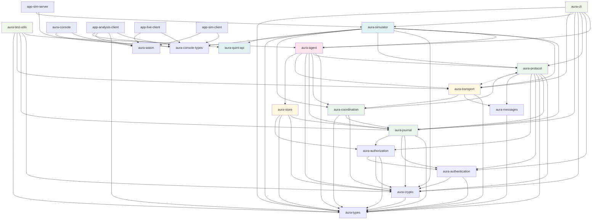

# Aura Crate Dependency Graph and API Reference

This document provides a comprehensive overview of the Aura project's crate structure, dependencies, and exposed APIs.

## Dependency Graph

## Core Platform Dependency Graph (Production Crates Only)

This simplified view focuses on the core platform crates used in production, excluding development tools, WASM bindings, and console/analysis interfaces.

## Architecture Layers

### Foundation Layer (Blue)
- **aura-types**: Core shared types and identifiers
- **aura-console-types**: Console-specific message types  
- **aura-messages**: Protocol wire format types

### Cryptography Layer (Purple)
- **aura-crypto**: Cryptographic primitives and utilities

### Authentication & Authorization Layer (Orange)
- **aura-authentication**: Identity verification and signature checking
- **aura-authorization**: Access control and capability evaluation

### Protocol Infrastructure Layer (Green)
- **aura-journal**: CRDT-based state management and event ledger
- **aura-protocol**: Defines choreographic protocol abstractions and implementations.
- **aura-coordination**: Handles the orchestration and execution of distributed protocols.

### Storage & Transport Layer (Yellow)
- **aura-transport**: P2P communication abstractions
- **aura-store**: Encrypted capability-driven storage

### Application Layer (Pink)
- **aura-agent**: High-level agent API with session types

### Development Tools (Light Green)
- **aura-test-utils**: Testing utilities and mocks
- **aura-cli**: Command-line interface

### Simulation & Analysis (Teal)
- **aura-quint-api**: Quint formal verification integration
- **aura-simulator**: Deterministic protocol simulation

### WASM & Console (Light Purple)
- **aura-wasm**: WebAssembly bindings
- **aura-console**: Web-based debugging console
- **app-analysis-client**: Analysis and property monitoring
- **app-live-client**: Live network debugging
- **app-sim-client**: Simulation client interface
- **app-sim-server**: Simulation server backend

---

## Crate API Reference

### aura-types
**Purpose**: Core shared types and identifiers for the Aura platform

**Key Exports**:
- **Identifiers**: `AccountId`, `DeviceId`, `SessionId`, `EventId`, `GuardianId`
- **Protocol Types**: `ProtocolType` (Dkd, Counter, Resharing, Locking, Recovery, Compaction), `OperationType`, `ProtocolDuration`, `ProtocolPriority`, `ProtocolMode`
- **Session Types**: `SessionStatus` (Initializing, Active, Waiting, Completed, Failed, Expired, TimedOut, Cancelled), session type primitives
- **Capabilities**: `CapabilityId`, `CapabilityScope`, `CapabilityResource`, `Permission`, `CapabilityExpiration`, `CapabilityToken`
- **Content**: `ContentId`, `ChunkId`, `ManifestId`
- **Peers**: `PeerInfo`, `RelationshipType`, `ContextType`
- **Errors**: `AuraError`, `ErrorCode`, `ErrorSeverity`, `ErrorContext`, `ProtocolError` (with detailed variants)
- **Encoding**: `ToBase64`, `FromBase64`, `ToHex`, `FromHex`

**Dependencies**: None (foundation crate)

**Type Consolidation Notes**:
- `ProtocolType` is the canonical enum used across aura-protocol, aura-types, and domain-specific implementations
- `SessionStatus` is the single source of truth for session lifecycle (unified from aura-simulator and aura-cli duplicates)
- `CapabilityToken` provides the lightweight canonical type; domain-specific layers (aura-authorization, aura-journal) extend as needed
- `Permission` enum supports both canonical variants and Custom(String) for domain-specific permissions

---

### aura-messages
**Purpose**: Protocol wire format message types organized by domain

**Key Exports**:
- **Unified Message**: `AuraMessage` enum (Crypto, Social, Recovery)
- **Crypto Messages**: `CryptoMessage`, `CryptoPayload` (DKD, FROST, resharing)
- **Social Messages**: `SocialMessage`, `SocialPayload` (rendezvous, SSB)
- **Recovery Messages**: `RecoveryMessage`, `RecoveryPayload` (guardian coordination)
- **Common Infrastructure**: Message envelopes, error types, version compatibility
- **SSB Envelope**: `SsbEnvelope` with header and ciphertext

**Dependencies**: `aura-types`

---

### aura-crypto
**Purpose**: Cryptographic primitives and threshold cryptography implementation

**Key Exports**:
- **FROST**: Threshold signatures (`FrostSignature`, `FrostKeyShare`)
- **DKD**: Deterministic Key Derivation (`derive_key`, `DkdContext`)
- **Encryption**: `encrypt_data`, `decrypt_data`, `EncryptionKey`
- **Signatures**: `Ed25519SigningKey`, `Ed25519VerifyingKey`, `Ed25519Signature`
- **Hash**: `Blake3Hash`, `hash_data`
- **HPKE**: `hpke_encrypt`, `hpke_decrypt` for guardian shares
- **Effects**: `CryptoEffects` for injectable time/randomness
- **Sealing**: `seal_data`, `unseal_data` for sensitive storage

**Dependencies**: `aura-types`

---

### aura-authentication
**Purpose**: Identity verification and signature checking (Layer 2 security)

**Key Exports**:
- **Device Authentication**: `verify_device_signature`, `verify_signature`
- **Threshold Authentication**: `verify_threshold_signature`
- **Guardian Authentication**: `verify_guardian_signature`
- **Session Authentication**: `verify_session_ticket`
- **Event Validation**: `validate_device_signature`, `validate_threshold_signature`
- **Context**: `AuthenticationContext` with public keys and threshold configs
- **Types**: `ThresholdConfig`, `EventAuthorization`, `ThresholdSig`
- **Errors**: `AuthenticationError`, `Result<T>`

**Dependencies**: `aura-types`, `aura-crypto`

---

### aura-authorization
**Purpose**: Access control and permission decisions (Layer 3 security)

**Key Exports**:
- **Capabilities**: `CapabilityToken`, `CapabilityChain`, `CapabilityScope`
- **Access Control**: `authorize_event`, `AccessDecision`
- **Policy Evaluation**: `AuthorityGraph`, `PolicyEvaluation`
- **Subjects**: `Subject` enum (Device, Guardian, ThresholdGroup, Session)
- **Resources**: `Resource` enum (Account, Device, StorageObject, ProtocolSession)
- **Actions**: `Action` enum (Read, Write, Delete, Execute, Delegate, Revoke, Admin)
- **Errors**: `AuthorizationError`, `Result<T>`

**Dependencies**: `aura-types`, `aura-crypto`, `aura-authentication`

---

### aura-journal
**Purpose**: CRDT-based authenticated ledger for account state

**Key Exports**:
- **Core State**: `AccountState`, `AccountLedger`, `Appliable` trait
- **Events**: Protocol event types (threshold-signed operations)
- **Bootstrap**: Account initialization and genesis ceremony
- **Capabilities**: Capability-based authorization system
- **Session Types**: Simple session management for journal operations
- **Serialization**: CRDT event serialization utilities
- **Errors**: `JournalError`, `Result<T>`

**Dependencies**: `aura-types`, `aura-crypto`, `aura-authentication`, `aura-authorization`

---

### aura-protocol
**Purpose**: Defines choreographic protocol abstractions and implementations with a middleware architecture. This crate provides the building blocks for distributed protocols, which are then orchestrated by `aura-coordination`.

**Naming Note**: Other documents may refer to this crate as `protocol-core`. The name should be standardized to `aura-protocol` in the future.

**Key Exports**:
- **Middleware**: `AuraProtocolHandler`, `EffectsMiddleware`, `TracingMiddleware`
- **Effects**: Protocol effects and side-effect injection system
- **Context**: Protocol execution context and infrastructure
- **Protocols**: Protocol-specific implementations and message types (DKD, Counter, Resharing, Locking, Recovery, Compaction)
- **Handlers**: Base protocol implementations
- **Types**: `IdentifierMapping`, `ProtocolType` (Dkd, Counter, Resharing, Locking, Recovery, Compaction), `ProtocolConfig`, `ProtocolError`
- **Instructions**: `Instruction`, `InstructionResult` for protocol coordination
- **Prelude**: Common imports (`prelude` module)

**Dependencies**: `aura-crypto`, `aura-journal`, `aura-types`, `aura-authentication`, `aura-authorization`, `aura-messages`, `aura-transport` (optional)

---

### aura-coordination
**Purpose**: Handles the orchestration and execution of distributed protocols. Contains the `LocalSessionRuntime` and `LifecycleScheduler` which manage the state and progression of choreographic protocols.

**Key Exports**:
- **Runtime**: `LocalSessionRuntime`, `LifecycleScheduler`
- **Protocol Lifecycles**: Implementations for DKD, Resharing, Recovery, etc.
- **Session Types**: Compile-time safety for protocol states.

**Dependencies**: `aura-types`, `aura-crypto`, `aura-journal`, `aura-protocol`

---

### aura-transport
**Purpose**: Unified transport layer with layered architecture

**Key Exports**:
- **Core Transport**: `Transport` trait, `TransportFactory`, `MemoryTransport`
- **Adapters**: `ChoreographicAdapter`, `ProtocolAdapter`
- **Handlers**: Legacy handler layer (transitional)
- **Types**: `TransportEnvelope`, `MessageMetadata`, `MessagePriority`, `TransportConfig`
- **Errors**: `TransportError`, `TransportErrorBuilder`, `TransportResult<T>`

**Dependencies**: `aura-types`

---

### aura-store
**Purpose**: Capability-driven encrypted storage layer

**Key Exports**:
- **Access Control**: `CapabilityChecker`, `CapabilityManager`, `CapabilityToken`
- **Content Processing**: `chunking`, `encryption`, `erasure` modules
- **Manifest**: `ObjectManifest`, `AccessControl`, `ChunkingParams`, `KeyDerivationSpec`
- **Storage**: `ChunkStore`, `ChunkId`, `Indexer`, `QuotaTracker`
- **Replication**: Static and social replication strategies
- **Errors**: `StoreError`, `StoreErrorBuilder`, `Result<T>`

**Dependencies**: `aura-journal`, `aura-crypto`, `aura-types`, `aura-authorization`

---

### aura-agent
**Purpose**: Unified agent with session types for compile-time state safety

**Key Exports**:
- **Agent Interface**: `Agent` trait with state-specific implementations
- **Session States**: `Uninitialized`, `Idle`, `Coordinating`, `Failed`
- **Factory**: `AgentFactory` for creating agents
- **Configuration**: `BootstrapConfig` for agent initialization
- **Identity**: `DerivedIdentity`, identity derivation protocols
- **Storage**: Platform-specific secure storage abstractions
- **Traits**: `IdentityAgent`, `StorageAgent`, `Storage`, `Transport`, `TransportAdapter`
- **Adapters**: `CoordinationTransportAdapter`, `ProductionStorage`
- **Errors**: `AgentError`, `Result<T>`

**Dependencies**: `aura-types`, `aura-protocol`, `aura-journal`, `aura-crypto`, `aura-transport`, `aura-store`

---

### aura-console-types
**Purpose**: Console-specific message and response types

**Key Exports**:
- **Commands**: Console command types
- **Responses**: Console response types
- **Network**: Network visualization types
- **Trace**: Tracing and debugging types

**Dependencies**: None

---

### aura-test-utils
**Purpose**: Testing utilities and mocks for development

**Key Exports**:
- **Factories**: Test data factories
- **Mocks**: Mock implementations of core traits
- **Fixtures**: Test fixtures and sample data
- **Assertions**: Testing assertion helpers

**Dependencies**: `aura-agent`, `aura-crypto`, `aura-journal`, `aura-transport`, `aura-types`

---

### aura-cli
**Purpose**: Command-line interface for account management and testing

**Key Exports**:
- **Commands**: CLI command implementations (debug, scenarios, account management)
- **Configuration**: CLI configuration management
- **Testing**: Development and testing utilities
- **SessionStatus**: Re-exported from aura-types (canonical single source of truth)

**Dependencies**: `aura-agent`, `aura-authentication`, `aura-protocol`, `aura-crypto`, `aura-journal`, `aura-simulator`, `aura-transport`, `aura-types`

**Type Consolidation Notes**:
- Uses canonical `SessionStatus` from aura-types
- Removed duplicate SessionStatus definition; now imports from aura-types

---

### aura-quint-api
**Purpose**: Quint formal verification integration

**Key Exports**:
- **Evaluator**: Quint specification evaluator
- **Properties**: Property verification utilities
- **Runner**: Quint execution runner
- **Types**: Quint-specific type definitions

**Dependencies**: None (external Quint integration)

---

### aura-simulator
**Purpose**: Deterministic protocol simulation and testing framework

**Key Exports**:
- **Simulation Engine**: Core simulation runtime
- **Adversary**: Byzantine failure and network attack simulation
- **Analysis**: Trace recording and failure analysis
- **Builder**: Simulation configuration builder
- **Network**: Simulated network journal
- **Observability**: Debugging and monitoring tools
- **SessionStatus**: Re-exported from aura-types (canonical single source of truth)

**Dependencies**: `aura-agent`, `aura-journal`, `aura-transport`, `aura-crypto`, `aura-protocol`, `aura-console-types`, `aura-types`, `aura-quint-api`

**Type Consolidation Notes**:
- Uses canonical `SessionStatus` from aura-types (supports Initializing, Active, Waiting, Completed, Failed, Expired, TimedOut, Cancelled)
- Removed duplicate SessionStatus definition; now imports from aura-types

---

### aura-wasm
**Purpose**: WebAssembly bindings and browser integration

**Key Exports**:
- **WASM Bindings**: WebAssembly interface exports
- **Browser Integration**: Browser-specific utilities
- **Logging**: WASM-compatible logging infrastructure

**Dependencies**: None

---

### aura-console
**Purpose**: Web-based debugging and visualization console

**Key Exports**:
- **Components**: React-style UI components
- **Services**: Data processing and WebSocket services
- **Visualization**: Network and timeline visualization

**Dependencies**: `aura-wasm`, `aura-console-types`

---

### aura-analysis-client
**Purpose**: Analysis and property monitoring client

**Key Exports**:
- **Analyzer**: Protocol analysis utilities
- **Property Monitor**: Property monitoring and violation detection
- **Causality**: Causal relationship analysis

**Dependencies**: `aura-console-types`, `aura-types`, `aura-wasm`, `aura-quint-api`

---

### aura-live-client
**Purpose**: Live network debugging and monitoring

**Key Exports**:
- **Live Network Interface**: Real-time network debugging
- **Monitoring**: Live system monitoring utilities

**Dependencies**: `aura-console-types`, `aura-wasm`

---

### app-sim-client
**Purpose**: Simulation client interface

**Key Exports**:
- **Simulation Client**: Client interface for simulation backend
- **Event Buffer**: Simulation event buffering

**Dependencies**: `app-console-types`, `app-wasm`

---

### aura-sim-server
**Purpose**: Simulation server backend

**Key Exports**:
- **Simulation Server**: WebSocket-based simulation server
- **Command Handler**: Simulation command processing
- **Branch Manager**: Simulation state branch management

**Dependencies**: `aura-console-types`, `aura-simulator`

---

## Key Architectural Patterns

1. **Layered Architecture**: Clean separation from foundation types through protocols to applications
2. **Dependency Injection**: Effects system allows injectable side effects for testing
3. **Session Types**: Compile-time state safety in agent implementations
4. **Choreographic Programming**: Protocol coordination through global viewpoints
5. **CRDT-Based State**: Eventually consistent state management in journal
6. **Capability-Based Security**: Unified access control across storage and communication
7. **Platform Abstraction**: Unified interfaces with platform-specific implementations

---

## Type Consolidation and Single Source of Truth

### ProtocolType Consolidation

**Canonical Definition**: `aura-types::ProtocolType`

**Variants**:
- `Dkd` - Deterministic Key Derivation
- `Counter` - Counter reservation protocol
- `Resharing` - Key resharing for threshold updates
- `Locking` - Resource locking protocol
- `Recovery` - Account recovery protocol
- `Compaction` - Ledger compaction protocol

**Supporting Types**:
- `OperationType` - Maps from ProtocolType with appropriate granularity
- `ProtocolDuration` - Categorizes expected protocol duration (Short, Medium, Long)
- `ProtocolPriority` - Execution priority levels (Low, Normal, High, Critical)
- `ProtocolMode` - Execution mode (Synchronous, Asynchronous, Interactive)

**Usage Across Crates**:
- `aura-types`: Canonical definition with all methods
- `aura-protocol`: Re-exports and uses canonical definition
- `aura-simulator`: Domain-specific ProtocolType for TOML serialization (intentionally separate for format compatibility)

### SessionStatus Consolidation

**Canonical Definition**: `aura-types::SessionStatus`

**Variants** (lifecycle order):
1. `Initializing` - Session initializing before execution
2. `Active` - Session currently executing
3. `Waiting` - Session waiting for participant responses
4. `Completed` - Session completed successfully
5. `Failed` - Session failed with error
6. `Expired` - Session expired due to timeout
7. `TimedOut` - Session timed out during execution
8. `Cancelled` - Session was cancelled

**Unified From**:
- Removed duplicate from `aura-simulator::world_state` (had 7 variants, including `Failed { reason: String }`)
- Removed duplicate from `aura-cli::commands::debug` (had 4 variants, including `Paused`)
- Extended aura-types to include missing variants (Initializing, Waiting, Cancelled)

**Usage Across Crates**:
- `aura-types`: Single source of truth
- `aura-simulator`: Imports from aura-types
- `aura-cli`: Imports from aura-types
- `aura-protocol`: Uses indirectly through aura-types

### Capability System Layering

**Design Decision**: Intentional layering with no consolidation needed

The capability system uses **4 distinct architectural layers**, each serving legitimate purposes:

| Layer | Type | Module | Purpose |
|-------|------|--------|---------|
| **Canonical** | `CapabilityToken`, `Permission`, `CapabilityScope`, `CapabilityResource`, `CapabilityExpiration` | `aura-types::capabilities` | Universal reference type - lightweight, generic |
| **Authorization** | `CapabilityToken`, `CapabilityScope`, `CapabilityCondition`, `PermissionLevel` | `aura-authorization::capability` | Policy enforcement - rich features (signatures, conditions, delegation depth) |
| **Ledger** | `DeviceAuthentication`, `CapabilityToken`, `Permission` (domain-specific) | `aura-journal::capability` | Event validation - separates auth from authz with Storage/Communication/Relay operations |
| **Storage** | Uses aura-authorization types | `aura-store::access_control` | Object access - integrates authorization capabilities |

**Key Design Principles**:
- Each layer answers different architectural questions (reference, enforcement, validation, access)
- Custom variants support domain-specific extensions without breaking canonical definitions
- Clear conversion paths between layers enable inter-layer communication
- No breaking changes needed; layers are complementary not duplicate

### ProtocolError Separation

**Status**: Multiple implementations, intentionally separated by layer

**Definitions**:

1. **aura-types::ProtocolError (mod.rs)** - Simple, high-level protocol errors
   - Used by: Application and coordination layers
   - Variants: DkdFailed, FrostFailed, EpochMismatch, CgkaFailed, etc.
   - Fields: message, context

2. **aura-types::ProtocolError (protocol.rs)** - Detailed, context-rich errors (currently unused)
   - More detailed field information (phase, round, threshold, etc.)
   - Helper methods for error codes and severity
   - Candidate for promotion as canonical detailed version

3. **aura-protocol::middleware::handler::ProtocolError** - Middleware-specific errors
   - Used by: Transport and handler layers
   - Variants: Transport, Serialization, Authorization, Session, Timeout, Protocol, Internal
   - Purpose: Low-level operational error handling

**Design Rationale**:
- Different layers need different granularity and context
- High-level errors for protocol state; low-level errors for transport
- Clear separation prevents mixing concerns between coordination and middleware

### Type Consolidation Summary

| Type | Status | Source | Notes |
|------|--------|--------|-------|
| `ProtocolType` | ✅ Consolidated | aura-types | Single canonical enum with 6 variants |
| `SessionStatus` | ✅ Consolidated | aura-types | Single canonical enum with 8 variants |
| `CapabilityToken` | ✅ Layered | Multiple (intentional) | 4-layer architecture, no consolidation needed |
| `Permission` | ✅ Layered | Multiple (intentional) | Canonical + domain-specific variants |
| `ProtocolError` | ⚠️ Separated | Multiple (intentional) | Different layers have different needs |
| `CapabilityScope` | ⚠️ Separated | Multiple (intentional) | Generic vs. authorization-specific |

---

## Consolidation Benefits

1. **Reduced Maintenance Burden**: Single definition to maintain instead of duplicates
2. **Improved Consistency**: All crates use same types, preventing divergence
3. **Clearer Semantics**: `SessionStatus` variants clearly indicate lifecycle progression
4. **Better Type Safety**: `ProtocolType` ensures all protocol variants are handled
5. **Preserved Flexibility**: Custom variants allow domain-specific extensions
6. **Backward Compatibility**: SessionStatus enum extensions are additive, no breaking changes

---

## Future Consolidation Opportunities

### Short-term (Low Risk)
1. Promote detailed `ProtocolError` from protocol.rs as primary canonical version
2. Add explicit conversion traits between Permission enum variants
3. Document when to use each CapabilityToken variant

### Medium-term (Considered Design)
1. Standardize on CapabilityId ([u8; 32]) instead of Uuid for all capability types
2. Create unified scope hierarchy (generic Read/Write/Execute/Admin + resource-specific)
3. Add conversion methods between capability token types

### Long-term (Major Refactoring)
1. Create `AuthorityToken` wrapper supporting multiple token variants
2. Merge ProtocolError definitions with clear layer separation
3. Unify state machine patterns across protocols